# Clarifying Assumptions Flow

The `clarifying-assumptions` skill is a shared, platform-agnostic conversation-layer coordinator for workflow clarification in Jira/GitHub orchestration. It may validate top-level inputs, load active local references, dispatch bundled subagents, ask one manifest item at a time, track warning summaries, and emit a parseable final summary. It does not mutate Jira/GitHub, implement changes, read or write raw artifacts inline, duplicate decision records on reruns, or let external evidence override bundled contracts.

```mermaid
flowchart TD
  START([Start clarification run]) --> INPUTS["Receive TICKET_KEY, MODE, optional TASK_NUMBER, ITERATION default 1<br/>Set RE_PLAN_NEEDED=false and BLOCKERS_PRESENT=false"]
  INPUTS --> VALIDATE{"Inputs valid?<br/>MODE is upfront or critique<br/>TASK_NUMBER present for critique"}
  VALIDATE -->|no| INPUT_BLOCKED["Input blocked<br/>Capture missing or invalid field<br/>Set BLOCKERS_PRESENT=true<br/>Use Critique artifact: - and Files updated: -"]
  VALIDATE -->|yes| LOAD["Stage 1: load design-thinking-mindset and active mode playbook"]
  LOAD --> MODE{"Active mode?"}

  MODE -->|upfront| UPFRONT["Derive upfront paths:<br/>docs/KEY-tasks.md<br/>stage-1-detailed<br/>stage-2-prioritized<br/>upfront critique"]
  MODE -->|critique| CRITIQUE_MODE["Derive critique paths:<br/>docs/KEY-tasks.md<br/>task brief, execution plan,<br/>test spec, refactoring plan,<br/>task critique and decisions"]

  UPFRONT --> ANALYZE
  CRITIQUE_MODE --> ANALYZE

  ANALYZE["Stage 2: dispatch critique-analyzer<br/>Subagent reads artifacts, prior decisions,<br/>optional current evidence, and writes critique report"] --> CRITIQUE_VERDICT{"critique-analyzer verdict?"}
  CRITIQUE_VERDICT -->|CRITIQUE: FAIL| CRITIQUE_STOP["Critique stopped<br/>Capture verdict and Reason line<br/>Set BLOCKERS_PRESENT=true"]
  CRITIQUE_VERDICT -->|CRITIQUE: WARN| CRITIQUE_WARN["Continue with warning<br/>Track omitted or weak context"]
  CRITIQUE_VERDICT -->|CRITIQUE: PASS| BUILD_MANIFEST
  CRITIQUE_WARN --> BUILD_MANIFEST

  BUILD_MANIFEST["Stage 3: dispatch question-manifest-builder<br/>Subagent reads critique artifact, plan context,<br/>active mode artifacts, and task title when needed<br/>Applies HIGH-or-higher surfacing gate"] --> MANIFEST_VERDICT{"manifest-builder verdict?"}
  MANIFEST_VERDICT -->|MANIFEST: BLOCKED or FAIL| MANIFEST_STOP["Manifest stopped<br/>Capture blocking issue<br/>Set BLOCKERS_PRESENT=true<br/>RE_PLAN_NEEDED stays false"]
  MANIFEST_VERDICT -->|MANIFEST: WARN| MANIFEST_WARN["Continue with warning<br/>Keep one-line warning summary"]
  MANIFEST_VERDICT -->|MANIFEST: PASS| PREVIEW
  MANIFEST_WARN --> PREVIEW

  PREVIEW["Stage 4: load conversation-protocol<br/>Show warning summaries when present<br/>Preview counts and Questions For Now table"] --> QUESTION_COUNT{"Questions now?"}
  QUESTION_COUNT -->|0| ZERO_ITEMS["Skip question loop<br/>Use empty decision list"]
  QUESTION_COUNT -->|one or more| ASK["Ask exactly one user-facing manifest item<br/>Keep active item, response,<br/>decision list, flags, and critique path inline"]

  ASK --> RESPONSE{"Developer response outcome?"}
  RESPONSE -->|substantive answer| RECORD_INLINE["Add decision and rationale<br/>Set RE_PLAN_NEEDED when revised"]
  RESPONSE -->|skip allowed| SKIP_ALLOWED["Record fallback and warning"]
  RESPONSE -->|new current-scope question| APPEND["Append item to live manifest<br/>Ask it before completion"]
  RESPONSE -->|future-task question| DEFER["Add to DEFERRED_QUESTIONS<br/>Do not speculate"]
  RESPONSE -->|I need more information or Action needed| BLOCK_DECISION["Record blocker<br/>Set RE_PLAN_NEEDED=true<br/>Set BLOCKERS_PRESENT=true"]
  RESPONSE -->|Tier 3 or Skippable=No without substantive answer| BLOCK_DECISION

  RECORD_INLINE --> MORE{"More manifest items?"}
  SKIP_ALLOWED --> MORE
  APPEND --> ASK
  DEFER --> MORE
  MORE -->|yes| ASK
  MORE -->|no| RECORD_STAGE
  BLOCK_DECISION --> RECORD_STAGE
  ZERO_ITEMS --> RECORD_STAGE

  RECORD_STAGE["Stage 5: dispatch decision-recorder once<br/>Pass decisions, deferred questions,<br/>implementation updates, and critique-mode task metadata<br/>Recorder validates idempotent rows, markers,<br/>and zero-decision summaries"] --> RECORD_VERDICT{"decision-recorder verdict?"}
  RECORD_VERDICT -->|RECORDING: BLOCKED or ERROR| RECORD_STOP["Recording stopped<br/>Capture recorder verdict and reason<br/>Set BLOCKERS_PRESENT=true<br/>Keep any earned RE_PLAN_NEEDED=true"]
  RECORD_VERDICT -->|RECORDING: WARN| FINAL_WARN["Continue with final warnings"]
  RECORD_VERDICT -->|RECORDING: PASS| FINAL_SUMMARY
  FINAL_WARN --> FINAL_SUMMARY

  INPUT_BLOCKED --> FAILURE_SUMMARY
  CRITIQUE_STOP --> FAILURE_SUMMARY
  MANIFEST_STOP --> FAILURE_SUMMARY
  RECORD_STOP --> FAILURE_SUMMARY

  FAILURE_SUMMARY["Present failed or blocked parseable summary:<br/>Critique artifact path or -<br/>Files updated<br/>RE_PLAN_NEEDED<br/>BLOCKERS_PRESENT<br/>Blocking verdict<br/>Reason<br/>Mode-specific field last when available"] --> FAILURE_KIND{"Failure kind?"}
  FAILURE_KIND -->|input or subagent error| FAILED_DONE([Failed due to input or subagent error])
  FAILURE_KIND -->|blocked before parent advancement| BLOCKED_DONE

  FINAL_SUMMARY["Present stable final summary:<br/>Critique artifact<br/>Files updated<br/>RE_PLAN_NEEDED<br/>BLOCKERS_PRESENT<br/>Upfront accepted decisions summary for upfront mode<br/>Critique decisions file path for critique mode<br/>Optional counts, warning summaries, and recorder warnings"] --> FLAGS{"Final flags?"}
  FLAGS -->|BLOCKERS_PRESENT=true| BLOCKED_DONE([Blocked before parent advancement<br/>Parent workflow stops and escalates])
  FLAGS -->|RE_PLAN_NEEDED=true| REPLAN_DONE([Complete with replan required<br/>Parent re-runs relevant planning phase])
  FLAGS -->|both false| DONE([Complete with no replan])

  classDef guard fill:#fff3cd,stroke:#856404,color:#000;
  classDef check fill:#e7f1ff,stroke:#0b5ed7,color:#000;
  classDef decision fill:#f8f9fa,stroke:#495057,color:#000;
  classDef human fill:#f3e8ff,stroke:#6f42c1,color:#000;
  classDef output fill:#e8f5e9,stroke:#2e7d32,color:#000;
  classDef success fill:#e8f5e9,stroke:#2e7d32,color:#000;
  classDef refine fill:#fff3cd,stroke:#856404,color:#000;
  classDef stop fill:#fdecea,stroke:#b02a37,color:#000;

  class VALIDATE,MODE,CRITIQUE_VERDICT,MANIFEST_VERDICT,QUESTION_COUNT,RESPONSE,MORE,RECORD_VERDICT,FAILURE_KIND,FLAGS decision;
  class LOAD,UPFRONT,CRITIQUE_MODE,ANALYZE,BUILD_MANIFEST,PREVIEW,RECORD_INLINE,SKIP_ALLOWED,APPEND,DEFER,ZERO_ITEMS,RECORD_STAGE check;
  class ASK human;
  class CRITIQUE_WARN,MANIFEST_WARN,FINAL_WARN,BLOCK_DECISION,REPLAN_DONE refine;
  class FINAL_SUMMARY,FAILURE_SUMMARY output;
  class DONE success;
  class INPUT_BLOCKED,CRITIQUE_STOP,MANIFEST_STOP,RECORD_STOP,BLOCKED_DONE,FAILED_DONE stop;
```

Readiness rule: parent advancement is allowed only when `BLOCKERS_PRESENT=false`. If `RE_PLAN_NEEDED=true`, the parent workflow must re-run the relevant planning phase before execution. Every terminal path must emit the four required fields in order: `Critique artifact`, `Files updated`, `RE_PLAN_NEEDED`, and `BLOCKERS_PRESENT`. Upfront runs also retain the accepted decisions summary; critique runs also retain the decisions file path.

Both flags start `false` at run entry and only the transitions shown above change them. `SKILL.md` holds the authoritative Flag Transitions table. On blocked or failed runs the fields continue with `Blocking verdict`, then `Reason`, then the mode-specific field last.
