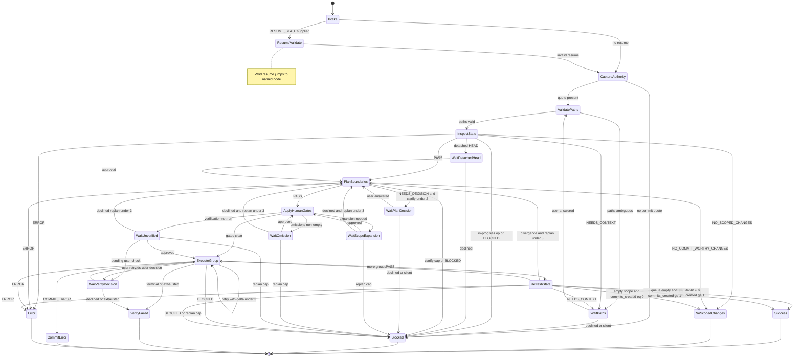

# Flow Diagram

Canonical execution model: finite state machine. Guards, variables, and
terminals are tabulated in [`state-machine.md`](./state-machine.md).

## Gate And Branch Summary

| Gate | Guard | Pass path | Stop / alternate |
| ---- | ----- | --------- | ---------------- |
| Authority | Verbatim commit quote | `ValidatePaths` | `Blocked` |
| Paths | Literal in-scope paths | `InspectState` | `WaitPaths` |
| Preflight | No in-progress git op | Continue | `Blocked` |
| `G_DETACHED_HEAD` | User approves detached HEAD | `PlanBoundaries` | `Blocked` |
| Planner clarify | `clarify_count` < 2 | Redispatch plan | `Blocked` at cap |
| `G_SCOPE_EXPANSION` | Exact paths approved | Grow scope | Replan or `Blocked` |
| `G_IN_SCOPE_OMISSION` | Omissions approved or replan | Continue / replan | `Blocked` at replan cap |
| `G_UNVERIFIED_COMMIT` | Group approved unverified | `ExecuteGroup` | Replan, wait, or `Blocked` |
| Verify retry | `same-scope-same-group-retry` ∧ attempts < 3 | `ExecuteGroup` | `WaitVerifyDecision` or `VerifyFailed` |
| Replan | `replan_count` < 3 | `PlanBoundaries` | `Blocked` |
| Empty refresh | `commits_created` ≥ 1 vs 0 | `Success` vs `NoScopedChanges` | — |

## Terminal States

- `Success` → `COMMIT_SCOPED_CHANGES: SUCCESS`
- `NoScopedChanges` → `COMMIT_SCOPED_CHANGES: NO_SCOPED_CHANGES`
- `Blocked` → `COMMIT_SCOPED_CHANGES: BLOCKED`
- `VerifyFailed` → `COMMIT_SCOPED_CHANGES: VERIFY_FAILED`
- `CommitError` → `COMMIT_SCOPED_CHANGES: COMMIT_ERROR`
- `Error` → `COMMIT_SCOPED_CHANGES: ERROR`
- Wait states end the turn as `COMMIT_SCOPED_CHANGES: NEEDS_CONTEXT` with Resume state
