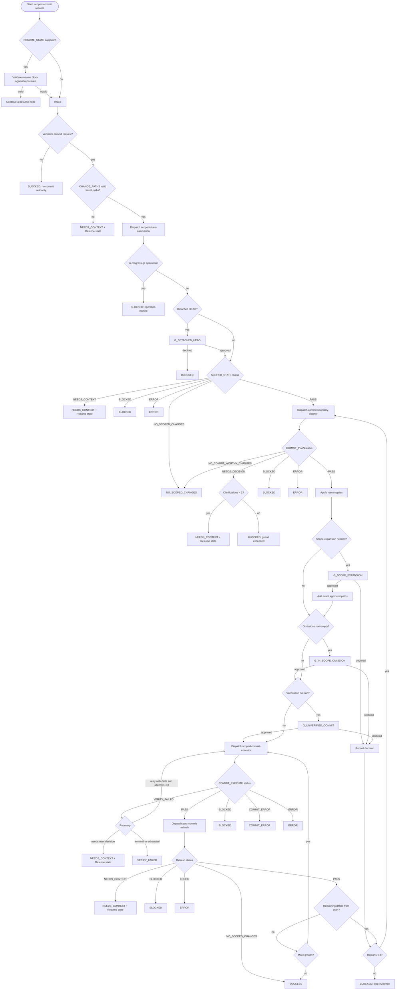

# Committing Scoped Changes Flow Diagram

This diagram is illustrative. `SKILL.md` is the normative source for phase
order, gates, statuses, and routing.

```mermaid
flowchart TD
  START([Start: scoped commit request]) --> RESUME{RESUME_STATE supplied?}
  RESUME -->|yes| VALIDATE[Validate resume block against repo state]
  VALIDATE -->|valid| JUMP[Continue at resume node]
  VALIDATE -->|invalid| INTAKE[Intake]
  RESUME -->|no| INTAKE

  INTAKE --> AUTH{Verbatim commit request?}
  AUTH -->|no| BLOCKED_AUTH[BLOCKED: no commit authority]
  AUTH -->|yes| PATHS{CHANGE_PATHS valid literal paths?}
  PATHS -->|no| WAIT_PATHS[NEEDS_CONTEXT + Resume state]
  PATHS -->|yes| STATE[Dispatch scoped-state-summarizer]

  STATE --> OP{In-progress git operation?}
  OP -->|yes| BLOCKED_OP[BLOCKED: operation named]
  OP -->|no| HEAD{Detached HEAD?}
  HEAD -->|yes| G_HEAD[G_DETACHED_HEAD]
  G_HEAD -->|declined| BLOCKED_HEAD[BLOCKED]
  G_HEAD -->|approved| STATE_STATUS{SCOPED_STATE status}
  HEAD -->|no| STATE_STATUS

  STATE_STATUS -->|NO_SCOPED_CHANGES| NO_CHANGES[NO_SCOPED_CHANGES]
  STATE_STATUS -->|NEEDS_CONTEXT| WAIT_STATE[NEEDS_CONTEXT + Resume state]
  STATE_STATUS -->|BLOCKED| BLOCKED_STATE[BLOCKED]
  STATE_STATUS -->|ERROR| ERROR_STATE[ERROR]
  STATE_STATUS -->|PASS| PLAN[Dispatch commit-boundary-planner]

  PLAN --> PLAN_STATUS{COMMIT_PLAN status}
  PLAN_STATUS -->|NO_COMMIT_WORTHY_CHANGES| NO_CHANGES
  PLAN_STATUS -->|NEEDS_DECISION| CLARIFY{Clarifications < 2?}
  CLARIFY -->|yes| WAIT_PLAN[NEEDS_CONTEXT + Resume state]
  CLARIFY -->|no| BLOCKED_CLARIFY[BLOCKED: guard exceeded]
  PLAN_STATUS -->|BLOCKED| BLOCKED_PLAN[BLOCKED]
  PLAN_STATUS -->|ERROR| ERROR_PLAN[ERROR]
  PLAN_STATUS -->|PASS| GATES[Apply human gates]

  GATES --> EXPAND{Scope expansion needed?}
  EXPAND -->|yes| G_EXPAND[G_SCOPE_EXPANSION]
  G_EXPAND -->|approved| ADD_SCOPE[Add exact approved paths]
  G_EXPAND -->|declined| REPLAN_DECISION[Record decision]
  EXPAND -->|no| OMIT{Omissions non-empty?}
  ADD_SCOPE --> OMIT
  OMIT -->|yes| G_OMIT[G_IN_SCOPE_OMISSION]
  G_OMIT -->|approved| UNVERIFIED{Verification not-run?}
  G_OMIT -->|declined| REPLAN_DECISION
  OMIT -->|no| UNVERIFIED
  UNVERIFIED -->|yes| G_UNVERIFIED[G_UNVERIFIED_COMMIT]
  G_UNVERIFIED -->|approved| EXECUTE[Dispatch scoped-commit-executor]
  G_UNVERIFIED -->|declined| REPLAN_DECISION
  UNVERIFIED -->|no| EXECUTE

  REPLAN_DECISION --> REPLAN_GUARD{Replans < 3?}
  REPLAN_GUARD -->|yes| PLAN
  REPLAN_GUARD -->|no| BLOCKED_REPLAN[BLOCKED: loop evidence]

  EXECUTE --> EXEC_STATUS{COMMIT_EXECUTE status}
  EXEC_STATUS -->|PASS| REFRESH[Dispatch post-commit refresh]
  EXEC_STATUS -->|VERIFY_FAILED| RECOVERY{Recovery}
  RECOVERY -->|retry with delta and attempts < 3| EXECUTE
  RECOVERY -->|needs-user-decision| WAIT_VERIFY[NEEDS_CONTEXT + Resume state]
  RECOVERY -->|terminal or exhausted| VERIFY_FAILED[VERIFY_FAILED]
  EXEC_STATUS -->|BLOCKED| BLOCKED_EXEC[BLOCKED]
  EXEC_STATUS -->|COMMIT_ERROR| COMMIT_ERROR[COMMIT_ERROR]
  EXEC_STATUS -->|ERROR| ERROR_EXEC[ERROR]

  REFRESH --> REFRESH_STATUS{Refresh status}
  REFRESH_STATUS -->|NO_SCOPED_CHANGES| SUCCESS[SUCCESS]
  REFRESH_STATUS -->|NEEDS_CONTEXT| WAIT_REFRESH[NEEDS_CONTEXT + Resume state]
  REFRESH_STATUS -->|BLOCKED| BLOCKED_REFRESH[BLOCKED]
  REFRESH_STATUS -->|ERROR| ERROR_REFRESH[ERROR]
  REFRESH_STATUS -->|PASS| DIFF{Remaining differs from plan?}
  DIFF -->|yes| REPLAN_GUARD
  DIFF -->|no| MORE{More groups?}
  MORE -->|yes| EXECUTE
  MORE -->|no| SUCCESS
```
