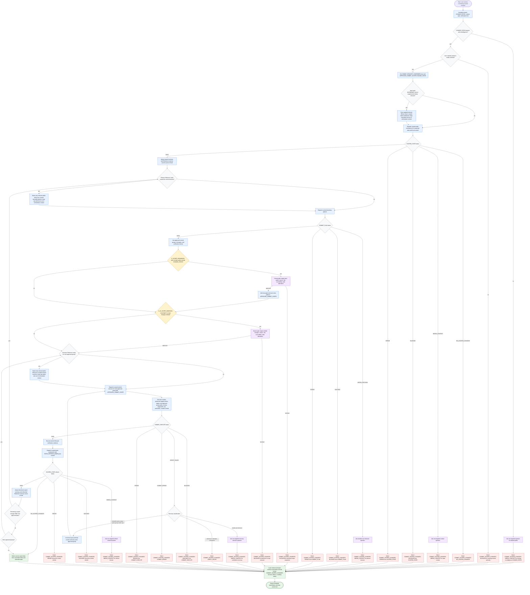

# Committing Scoped Changes

This workflow creates reviewable atomic git commits only after the user explicitly asks to commit. The orchestrator treats `CHANGE_PATHS` as the initial commit allow-list, builds `APPROVED_COMMIT_SCOPE` only from that scope plus exact approved expansions, preserves unrelated work and index entries, and uses specialist subagents for scoped state inspection, commit boundary planning, scoped execution, and post-commit refresh. Existing staged changes are planning facts, not permission to commit. Scope expansion, intentional in-scope omission, ambiguous inputs, unsafe verification recovery, and refresh blockers require one targeted user decision before mutation continues. External references are routed just in time to the active specialist only when they can change that specialist's current decision; initial state inspection may receive only supplied relevant URLs, and raw article text stays out of orchestrator context.

Readiness rule: proceed only when commit authority is explicit, `CHANGE_PATHS` is unambiguous, planned groups stay within `APPROVED_COMMIT_SCOPE`, intentional in-scope omissions receive explicit approval, preserved staged entries can be isolated safely, and every post-commit refresh confirms the next safe action.

Final report/status contract: every success, terminal failure, no-change, blocked, error, or waiting outcome loads `./references/report-contract-orchestrator.md` and emits the required `COMMIT_SCOPED_CHANGES` structure before the run stops. A later user answer to a waiting status starts a new run from the relevant upstream context rather than bypassing the formatting contract.

Facts:

| Item | Detail |
| --- | --- |
| Authority | The orchestrator normalizes authority and delegates git inspection, staging, verification, commit creation, and post-commit refresh to specialists. |
| Scope | User-provided `CHANGE_PATHS` starts the commit allow-list; approved exact expansions become `APPROVED_COMMIT_SCOPE`. |
| Existing staged changes | Treated as facts for planning, not as permission to commit; executor preserves unrelated staged entries or blocks before committing. |
| Just-in-time references | Initial state inspection may receive only supplied relevant `REFERENCE_URLS`; planner and executor reference routing uses only URL(s) relevant to the current specialist decision. |
| Raw external text | Raw article or documentation text stays out of orchestrator context; specialists summarize only decision-relevant findings. |
| Verification retry counter | The orchestrator owns one counter per approved group, counts the initial executor dispatch as attempt 1, increments before each same-group retry, caps at three total attempts, and resets on commit success, replan, or next group. |
| Refresh truth source | After `STATE_REFRESH_MODE=post-commit`, `SCOPED_STATE: PASS` replaces prior state as the source of truth for remaining work, replanning, and refreshed `Reference need`. |

Assumptions:

| Item | Detail |
| --- | --- |
| Commit request | `COMMIT_REQUEST_CONFIRMED=true` is set only after the user asks for commits. |
| Report synthesis | The orchestrator loads the final report/status contract after commit execution, post-commit refresh, or terminal/pause status selection. |
| Subagent set | The existing subagents remain in place: `scoped-state-summarizer`, `commit-boundary-planner`, and `scoped-commit-executor`. |

Risks:

| Risk | Mitigation |
| --- | --- |
| Unrelated work could be staged or committed accidentally | Executor stages only approved groups inside `APPROVED_COMMIT_SCOPE`, isolates preserved staged entries, and reviews staged diff before commit. |
| Hooks or generated files can change the worktree | Orchestrator dispatches `scoped-state-summarizer` for post-commit refresh and adopts the refreshed state before continuing. |
| Verification recovery can repeat unsafe actions | Workflow retries only the retryable same-scope same-group path while under the attempt cap; otherwise it asks one targeted question or returns `COMMIT_SCOPED_CHANGES: VERIFY_FAILED`. |
| Scope ambiguity can cause unsafe commits | Workflow separates `G_SCOPE_EXPANSION` from `G_IN_SCOPE_OMISSION`, records exact approved paths in `APPROVED_COMMIT_SCOPE`, and stops for one targeted user decision. |
| External references can pollute context | Reference routing is specialist-local and just in time; raw article text is not accumulated in orchestrator context. |

Blockers:

| Blocker | Terminal State |
| --- | --- |
| Missing or ambiguous `CHANGE_PATHS` | `COMMIT_SCOPED_CHANGES: NEEDS_CONTEXT` |
| No user commit request | `COMMIT_SCOPED_CHANGES: BLOCKED` |
| No meaningful scoped changes | `COMMIT_SCOPED_CHANGES: NO_SCOPED_CHANGES` |
| State, planning, verification, commit, or post-commit refresh failure without safe recovery | Exact `COMMIT_SCOPED_CHANGES` status selected by the failing branch |
| Verification attempts exhausted | `COMMIT_SCOPED_CHANGES: VERIFY_FAILED` |

Unresolved questions:

| Question | Handling |
| --- | --- |
| Should scope expand beyond `CHANGE_PATHS`? | Use `G_SCOPE_EXPANSION`, ask before expanding, and add only approved exact paths to `APPROVED_COMMIT_SCOPE`. |
| Should meaningful in-scope changes be left uncommitted? | Use `G_IN_SCOPE_OMISSION` and ask before leaving them behind. |
| Should verification recovery alter scope, group boundaries, or commit strategy? | Classify as needs user decision; do not retry automatically. |
| Did post-commit hooks or generated files change the next safe action? | Adopt refreshed `SCOPED_STATE` and refreshed `Reference need` before replanning or continuing. |
