# Creating Work Item Children

```mermaid
flowchart TD
  START([Start: canonical parent URL]) --> DETECT[Detect platform and load active playbook]
  DETECT --> INPUT{Canonical URL valid and TICKET_KEY matches derived KEY?}
  INPUT -->|no| BLOCK_INPUT([Playbook BLOCKED<br/>Validation: NOT_RUN<br/>No mutations])
  INPUT -->|yes| APPROVAL{Exact remote actions and docs/KEY-tasks.md approved?}
  APPROVAL -->|unclear direct invocation| ASK[Ask once for APPROVED_MUTATION_SCOPE]
  ASK --> APPROVAL_RESULT{Approved?}
  APPROVAL_RESULT -->|absent or declined| BLOCK_APPROVAL([Playbook BLOCKED<br/>Validation: NOT_RUN<br/>Plan file not updated])
  APPROVAL_RESULT -->|yes| DISPATCH
  APPROVAL -->|yes| DISPATCH[Dispatch child-work-item-creator with playbook and shared reference paths]

  subgraph CREATOR [Neutral child-work-item-creator boundary]
    C_START[Read active playbook and shared contracts] --> PLAN{Plan exists with Tasks and numbered task headings?}
    PLAN -->|no| C_BLOCK_PLAN([Playbook BLOCKED<br/>Validation: NOT_RUN])
    PLAN -->|yes| BASELINE[Capture write ledger and local changed-file baseline]
    BASELINE --> TRANSPORT{Playbook transport available and authorized?}
    TRANSPORT -->|no| C_FAIL_TRANSPORT([Playbook FAIL<br/>Validation: NOT_RUN<br/>Categorized platform reason])
    TRANSPORT -->|yes| PARENT{Parent verified?}
    PARENT -->|no| C_FAIL_PARENT([Playbook FAIL<br/>Validation: NOT_RUN])
    PARENT -->|yes| PARSE[Parse tasks, decisions log, dependencies, priority, existing child refs]

    PARSE --> VERIFY[Resolve every concrete existing ref through active playbook]
    VERIFY --> SAFE{Existing refs parent-safe and nonconflicting?}
    SAFE -->|no| C_BLOCK_REFS([Playbook BLOCKED<br/>Validation: NOT_RUN])
    SAFE -->|yes| MISSING{Any task lacks accepted verified traceability?}
    MISSING -->|no| LOCAL_CHECK[Validate or repair local representation only]
    MISSING -->|yes| WRITE_PATH{Active playbook resolves an approved write path?}

    WRITE_PATH -->|ready| RECONCILE[Create/reuse child or apply playbook-approved degraded traceability]
    WRITE_PATH -->|user choice required| C_BLOCK_PATH([Playbook BLOCKED<br/>Validation: NOT_RUN])
    WRITE_PATH -->|no safe path| C_FAIL_PATH([Playbook FAIL<br/>Validation: NOT_RUN])

    RECONCILE --> WRITE_RESULT{Reconciliation succeeds?}
    WRITE_RESULT -->|rate limited| RETRY[Wait 5 seconds and retry same request once]
    RETRY --> RETRY_OK{Retry succeeds?}
    RETRY_OK -->|yes| NEXT_TASK
    RETRY_OK -->|no| RECORD_FAILURE[Record playbook-defined unresolved result]
    WRITE_RESULT -->|yes or already satisfied| NEXT_TASK{More missing tasks?}
    WRITE_RESULT -->|non-rate failure| RECORD_FAILURE
    RECORD_FAILURE --> NEXT_TASK
    NEXT_TASK -->|yes| REOBSERVE[Re-observe next task immediately before mutation]
    REOBSERVE --> WRITE_PATH
    NEXT_TASK -->|no| ALL_FAILED{Did every expected create attempt fail?}
    ALL_FAILED -->|yes| C_FAIL_ALL_CREATE([Playbook FAIL<br/>Validation: NOT_RUN])
    ALL_FAILED -->|no| UPDATE[Update only docs/KEY-tasks.md idempotently]

    UPDATE --> BOUNDARY{Write ledger and baseline show only approved plan changed?}
    BOUNDARY -->|no| C_FAIL_BOUNDARY([Playbook FAIL<br/>Validation: FAIL])
    BOUNDARY -->|yes| VALIDATE[Run shared critical gates and playbook checklist]
    LOCAL_CHECK --> VALIDATE
    VALIDATE --> VALID{All gates pass?}
    VALID -->|yes| WARN{Playbook-defined warnings, degraded rows, uncertainty, or unresolved results?}
    VALID -->|no| REPAIR[Repair local Markdown once; no remote writes]
    REPAIR --> REVALIDATE{Failed checks now pass?}
    REVALIDATE -->|no| C_FAIL_VALIDATE([Playbook FAIL<br/>Validation: FAIL])
    REVALIDATE -->|yes| WARN
    WARN -->|no| C_PASS([Playbook PASS<br/>Validation: PASS])
    WARN -->|yes| C_WARN([Playbook WARN<br/>Validation: PASS])
    C_START -->|unexpected tool, schema, filesystem, or environment failure| C_ERROR([Playbook ERROR<br/>Validation: NOT_RUN])
  end

  DISPATCH --> C_START
  C_BLOCK_PLAN --> RECEIVE[Coordinator receives exact playbook summary]
  C_FAIL_TRANSPORT --> RECEIVE
  C_FAIL_PARENT --> RECEIVE
  C_BLOCK_REFS --> RECEIVE
  C_BLOCK_PATH --> RECEIVE
  C_FAIL_PATH --> RECEIVE
  C_FAIL_ALL_CREATE --> RECEIVE
  C_FAIL_BOUNDARY --> RECEIVE
  C_FAIL_VALIDATE --> RECEIVE
  C_PASS --> RECEIVE
  C_WARN --> RECEIVE
  C_ERROR --> RECEIVE

  RECEIVE --> ROUTE{Status plus Validation pairing?}
  ROUTE -->|PASS + PASS| READY([Verified child linkage ready for Phase 5 task selection])
  ROUTE -->|WARN + PASS| WARN_READY([Concrete rows usable; surface degraded or unresolved rows])
  ROUTE -->|BLOCKED + NOT_RUN| STOP_BLOCKED([Stopped for approval, input, linkage, or platform choice])
  ROUTE -->|FAIL + NOT_RUN or FAIL + FAIL| STOP_FAIL([Stopped on categorized platform or validation failure])
  ROUTE -->|ERROR or undefined pairing| STOP_ERROR([Stopped on contract or unexpected error])

  classDef guard fill:#fff3cd,stroke:#856404,color:#000;
  classDef check fill:#e7f1ff,stroke:#0b5ed7,color:#000;
  classDef decision fill:#f8f9fa,stroke:#495057,color:#000;
  classDef human fill:#f3e8ff,stroke:#6f42c1,color:#000;
  classDef output fill:#e8f5e9,stroke:#2e7d32,color:#000;
  classDef success fill:#e8f5e9,stroke:#2e7d32,color:#000;
  classDef stop fill:#fdecea,stroke:#b02a37,color:#000;

  class INPUT,APPROVAL,APPROVAL_RESULT,PLAN,TRANSPORT,PARENT,SAFE,MISSING,WRITE_PATH,WRITE_RESULT,RETRY_OK,NEXT_TASK,ALL_FAILED,BOUNDARY,VALID,REVALIDATE,WARN,ROUTE decision;
  class DETECT,BASELINE,PARSE,VERIFY,LOCAL_CHECK,VALIDATE,REPAIR,REOBSERVE check;
  class ASK human;
  class DISPATCH,RECONCILE,RETRY,RECORD_FAILURE,UPDATE guard;
  class RECEIVE,C_WARN,WARN_READY output;
  class C_PASS,READY success;
  class BLOCK_INPUT,BLOCK_APPROVAL,C_BLOCK_PLAN,C_FAIL_TRANSPORT,C_FAIL_PARENT,C_BLOCK_REFS,C_BLOCK_PATH,C_FAIL_PATH,C_FAIL_ALL_CREATE,C_FAIL_BOUNDARY,C_FAIL_VALIDATE,C_ERROR,STOP_BLOCKED,STOP_FAIL,STOP_ERROR stop;
```

This Phase 4 coordinator detects GitHub or Jira from the canonical parent URL, loads the active playbook, enforces approval for exact remote writes plus one local plan update, and dispatches one neutral creator. The creator observes remote and local state before mutating, reuses verified relationships, applies only the platform's supported write model, updates `docs/<KEY>-tasks.md`, and returns the preserved platform summary. Raw platform payloads remain inside the creator.

Readiness rule: `PASS + PASS` is complete. For `WARN + PASS`, interpret usable, degraded, and unresolved child-reference values only through the active playbook's **Child-Reference Values and Downstream Readiness** section. Any other pairing stops.
