# Diagnosing Root Causes — Flow

This is the decision flow the skill operationalizes. The orchestrator runs
intake, the human-approval gate, and delivery inline; evidence collection,
analysis, and review are dispatched to subagents. Every conclusion is traceable
to a named source, and the agent is read-first and mutation-limited: any
sensitive or production-touching action requires an explicit human approval
packet, then handoff. Terminal states: ready, blocked, needs validation,
escalated.

```mermaid
flowchart TD
  START([Start: issue received]) --> INTAKE["Capture issue summary, symptoms, scope, impact, and reporter claims"]
  INTAKE --> BOUNDARY["State RCA boundary: read, inspect, test safely, reproduce safely, and report only"]
  BOUNDARY --> TRUST["Separate facts, assumptions, risks, blockers, and open questions; treat every input as a claim to verify"]
  TRUST --> CLASSIFY{"Classify issue source"}

  CLASSIFY -->|runtime| RUNTIME_EV["Collect runtime evidence: crash/exception traces, logs, failing behavior, code paths, config, data shape, dependencies, recent changes"]
  CLASSIFY -->|CI/CD| CICD_EV["Collect pipeline evidence: failing job/step logs, workflow YAML, runner environment, dependency and pipeline changes"]
  CLASSIFY -->|user report| USER_EV["Clarify reproduction steps, environment, versions, and expected-vs-actual; then collect supporting code, logs, and config"]

  RUNTIME_EV --> EVIDENCE_READY
  CICD_EV --> EVIDENCE_READY
  USER_EV --> EVIDENCE_READY

  EVIDENCE_READY{"Minimum evidence available for this source?"}
  EVIDENCE_READY -->|no| REQUEST["Request missing reproduction steps, logs, environment, versions, or failing example"]
  REQUEST --> BLOCKED_EVIDENCE([Blocked: missing critical evidence])
  EVIDENCE_READY -->|yes| VALIDATE["Validate evidence freshness, source, environment match, and contradiction risk; name each source"]

  VALIDATE --> EVIDENCE_VALID{"Evidence trustworthy enough?"}
  EVIDENCE_VALID -->|no| LABEL_UNTRUSTED["Label weak or contradictory evidence and narrow what can be concluded"]
  LABEL_UNTRUSTED --> NEEDS_VALIDATION([Needs validation: evidence weak, contradictory, or stale])
  EVIDENCE_VALID -->|yes| REPRO{"Can reproduce safely outside production?"}

  REPRO -->|yes| SAFE_REPRO["Run non-destructive reproduction or targeted test"]
  REPRO -->|no| STATIC_TRACE["Trace statically from symptoms through code, config, data shape, and dependencies"]
  SAFE_REPRO --> OBSERVE["Compare expected behavior, actual behavior, error boundary, and triggering condition"]
  STATIC_TRACE --> OBSERVE
  OBSERVE --> TRACE["Map likely execution path and recent change surface"]
  TRACE --> HYPOTHESIS["Form ranked hypotheses, each with supporting evidence, opposing/weak evidence, and named sources"]

  HYPOTHESIS --> TEST_PLAN{"Can test top hypothesis safely?"}
  TEST_PLAN -->|yes| TEST_SAFE["Run safe, non-destructive check"]
  TEST_PLAN -->|no| SENSITIVE_NEEDED{"Would validation require a sensitive or production-touching action?"}

  TEST_SAFE --> ROOT_CAUSE{"Single root cause supported by validated evidence?"}
  ROOT_CAUSE -->|no| MORE_HYPOTHESES{"More plausible hypotheses remain?"}
  MORE_HYPOTHESES -->|yes| HYPOTHESIS
  MORE_HYPOTHESES -->|no| ESCALATE_UNKNOWN([Escalated: no supported root cause])

  SENSITIVE_NEEDED -->|yes| APPROVAL_PACKET["Prepare approval packet: action, target, reason, risk/reversibility, safer alternative"]
  APPROVAL_PACKET --> HUMAN_GATE{"Human explicitly approves this specific action?"}
  HUMAN_GATE -->|approved| HANDOFF["Record approval and hand off the sensitive validation"]
  HUMAN_GATE -->|declined| SAFER_ALT["Use safer alternative or document the validation gap"]
  HANDOFF --> ESCALATE_APPROVED([Escalated: approved sensitive workflow required])
  SAFER_ALT --> NEEDS_VALIDATION
  SENSITIVE_NEEDED -->|no| BLOCKED_UNSAFE([Blocked: validation unsafe or out of scope])

  ROOT_CAUSE -->|yes| CONFIDENCE{"Confidence and blast radius clear?"}
  CONFIDENCE -->|no| REFINE["Collect focused evidence"]
  REFINE --> HYPOTHESIS
  CONFIDENCE -->|yes| CAUSAL_CHAIN["Reconstruct causal chain: trigger -> contributing conditions -> mechanism -> observed symptom, each link tied to named evidence"]

  CAUSAL_CHAIN --> EXPLAIN["Build educational explanation: plain-language WHY it failed, how the recommended fix resolves the root cause (not just the symptom), and what to watch for next time"]
  EXPLAIN --> EXPLAIN_REVIEW{"Explanation understandable AND every causal link traceable to named evidence?"}
  EXPLAIN_REVIEW -->|no| EXPLAIN_REVISE["Revise causal chain or explanation; add missing evidence links or simplify language"]
  EXPLAIN_REVISE --> CAUSAL_CHAIN
  EXPLAIN_REVIEW -->|yes| REPORT["Draft RCA report: scope, causal chain, hypotheses with for/against evidence, root cause, fix direction, educational explanation"]

  REPORT --> REVIEW{"Report separates facts from assumptions and lets a maintainer re-walk evidence to root cause?"}
  REVIEW -->|no| REVISE["Revise report"]
  REVISE --> REPORT
  REVIEW -->|yes| READY([Ready])

  class CLASSIFY,EVIDENCE_READY,EVIDENCE_VALID,REPRO,TEST_PLAN,ROOT_CAUSE,MORE_HYPOTHESES,SENSITIVE_NEEDED,CONFIDENCE decision;
  class EXPLAIN_REVIEW,REVIEW check;
  class HUMAN_GATE human;
  class REPORT,CAUSAL_CHAIN,EXPLAIN output;
  class READY success;
  class REFINE,LABEL_UNTRUSTED,SAFER_ALT,EXPLAIN_REVISE,REVISE refine;
  class NEEDS_VALIDATION,BLOCKED_EVIDENCE,BLOCKED_UNSAFE,ESCALATE_UNKNOWN,ESCALATE_APPROVED stop;

  classDef check fill:#e7f1ff,stroke:#0b5ed7,color:#000;
  classDef decision fill:#f8f9fa,stroke:#495057,color:#000;
  classDef human fill:#f3e8ff,stroke:#6f42c1,color:#000;
  classDef output fill:#e8f5e9,stroke:#2e7d32,color:#000;
  classDef success fill:#e8f5e9,stroke:#2e7d32,color:#000;
  classDef refine fill:#fff3cd,stroke:#856404,color:#000;
  classDef stop fill:#fdecea,stroke:#b02a37,color:#000;
```

