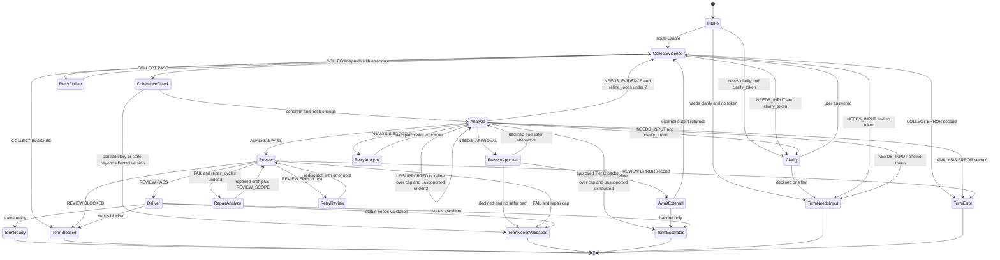

# Flow Diagram

Canonical execution model: finite state machine. Guards, loop caps, and
terminals are tabulated in [`state-machine.md`](./state-machine.md).
`SKILL.md` Execution must match this diagram.

## Gate And Branch Summary

| Gate | Guard | Pass path | Stop / alternate |
| ---- | ----- | --------- | ---------------- |
| Intake usability | `ISSUE`/`RESOURCES` usable; `user-report` minimums when applicable | `CollectEvidence` | `Clarify` if token left; else `TermNeedsInput` |
| Clarify budget | `clarify_token` unused | One batch ≤3 questions | Later `NEEDS_INPUT` → `TermNeedsInput` |
| Collect verdict | `COLLECT: PASS` | `CoherenceCheck` | `Clarify` / `TermNeedsInput` / `TermBlocked` / retry / `TermError` |
| Coherence | Not mutually contradictory **and** not stale beyond affected version | `Analyze` | `TermNeedsValidation` |
| Analyze verdict | `ANALYSIS: PASS` | `Review` | Approval branch, refine, unsupported, clarify, retry, or terminal |
| Approval (conditional) | `ANALYSIS: NEEDS_APPROVAL` only | `AwaitExternal` if approved | Safer alternative → `Analyze`; else `TermNeedsValidation` |
| Tier C rule | Never execute Tier C | Handoff packet only | `TermEscalated` unless external output ingested |
| Review verdict | `REVIEW: PASS` | `Deliver` | Repair (cap 3), `TermNeedsValidation`, `TermBlocked`, retry, or `TermError` |

## Terminal States

| Terminal | Meaning |
| -------- | ------- |
| `TermReady` | Root cause(s) at high or medium confidence; review passed. |
| `TermBlocked` | Material unobtainable without unapproved Tier C, or review inputs missing. |
| `TermNeedsValidation` | Contradictory/stale evidence; declined approval with no safe path; or repair cap. |
| `TermEscalated` | No supported root cause after caps, or approved Tier C handed off. |
| `TermNeedsInput` | Only the user can supply the missing item; no RCA report. |
| `TermError` | Second consecutive tooling failure in the same subagent; no RCA report. |
