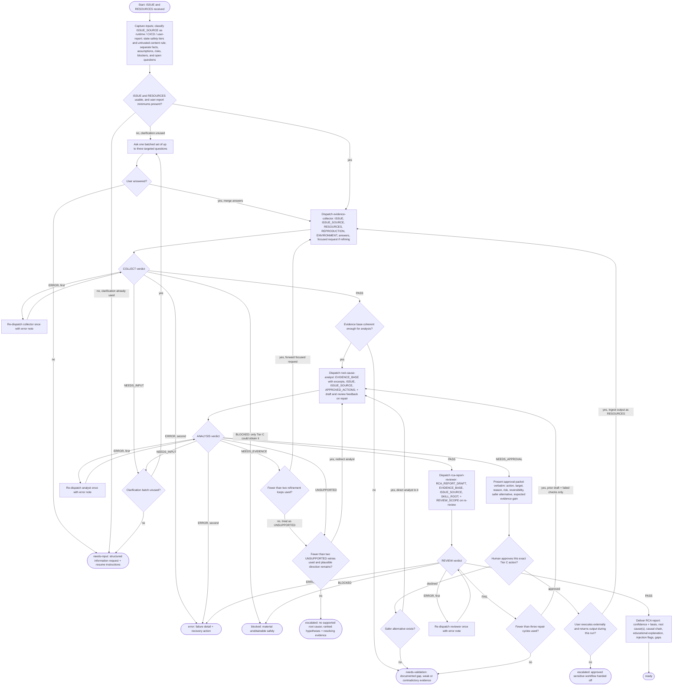

# Diagnosing Root Causes Flow Diagram

Sync note: `SKILL.md` Execution is normative. This diagram is derived from it and must match its phases, gates, loop caps, statuses, and one-way approval branch.

## Terminal-State Reference

| Terminal | Meaning |
| -------- | ------- |
| `ready` | Root cause(s) supported at high or medium confidence; review passed. |
| `blocked` | Material is known but unobtainable without an unapproved Tier C action, or review inputs are missing. |
| `needs-validation` | Evidence is weak, stale, or contradictory; approval was declined with no safe path; or repair cap was reached. |
| `escalated` | No supported root cause after caps, or approved Tier C work was handed off. |
| `needs-input` | Only the user can supply the missing item; no report is delivered. |
| `error` | A second consecutive tooling failure occurred in the same subagent. |
