# executing-work-item-task

Platform-neutral Phase 7 state machine for exactly one planned work-item task. The active playbook supplies identifier derivation, tracker transport, relationship vocabulary, startup and completion actions, reference values, and report labels. `references/pipeline.md` and `references/retry-and-escalation.md` are authoritative when this illustrative diagram is ambiguous.

```mermaid
flowchart TD
  START([Start executing-work-item-task]) --> INPUTS["Read TICKET_KEY alias and TASK_NUMBER"]
  INPUTS --> DETECT["Detect platform and load active playbook"]
  DETECT --> CONTRACTS["Load contracts; derive KEY and Phase 1-6 paths"]
  CONTRACTS --> REQUIRED{"Required artifacts exist and align?"}
  REQUIRED -->|no| REPORT_BLOCKED["FINAL_TASK_REPORT: BLOCKED"]
  REQUIRED -->|yes| READY{"Critique approved, selected task ready, branch consistent, no contradiction?"}
  READY -->|no| REPORT_BLOCKED
  READY -->|yes| CAPABILITY["Assess tracker capability and whether planned actions are optional or mandatory"]
  CAPABILITY --> CAP_REQUIRED{"Mandatory kickoff tracker action unavailable?"}
  CAP_REQUIRED -->|yes| REPORT_BLOCKED
  CAP_REQUIRED -->|no| SCOPE["Set MUTATION_LIMITS: Category A unstaged; Category B task-scoped"]
  SCOPE --> RESTORE["Initialize or restore independent gate counters and passed results"]
  RESTORE --> PIPELINE["Load pipeline and dispatch contracts"]
  PIPELINE --> KICKOFF["Dispatch execution-starter with PLAYBOOK_PATH"]

  KICKOFF --> KICKOFF_STATUS{"KICKOFF_REPORT status"}
  KICKOFF_STATUS -->|READY| EXECUTE["Dispatch task-executor"]
  KICKOFF_STATUS -->|BLOCKED or ERROR| RECOVERY["Load retry-and-escalation; preserve counters and passed results"]

  EXECUTE --> EXEC_STATUS{"EXECUTION_REPORT status"}
  EXEC_STATUS -->|COMPLETE| DOCUMENT["Dispatch documentation-writer UPDATE_TRACKING"]
  EXEC_STATUS -->|NEEDS_CONTEXT, BLOCKED, or ERROR| RECOVERY

  DOCUMENT --> DOC_STATUS{"DOCUMENTATION_REPORT status"}
  DOC_STATUS -->|COMPLETE| VERIFY["Dispatch requirements-verifier"]
  DOC_STATUS -->|BLOCKED or ERROR| RECOVERY

  VERIFY --> VERIFY_STATUS{"VERIFICATION_RESULT"}
  VERIFY_STATUS -->|PASS| CLEAN["Dispatch clean-code-reviewer"]
  VERIFY_STATUS -->|FAIL: in-scope gaps| REQ_ATTEMPTS{"Requirements fix attempts below 3?"}
  VERIFY_STATUS -->|BLOCKED or ERROR| RECOVERY
  REQ_ATTEMPTS -->|yes| REQ_FIX["Build requirements fix brief; increment requirements counter"]
  REQ_ATTEMPTS -->|no| REPORT_ESCALATED["FINAL_TASK_REPORT: ESCALATED"]
  REQ_FIX --> REQ_EXEC["Re-dispatch task-executor with narrowed fix scope"]
  REQ_EXEC --> REQ_DOC["Re-dispatch documentation-writer UPDATE_TRACKING"]
  REQ_DOC --> VERIFY

  CLEAN --> CLEAN_STATUS{"Clean-code verdict"}
  CLEAN_STATUS -->|PASS or PASS WITH SUGGESTIONS| ARCH["Dispatch architecture-reviewer"]
  CLEAN_STATUS -->|NEEDS FIXES| CLEAN_ATTEMPTS{"Clean-code fix attempts below 3?"}
  CLEAN_STATUS -->|BLOCKED or ERROR| RECOVERY
  CLEAN_ATTEMPTS -->|yes| CLEAN_FIX["Build clean-code fix brief; increment clean-code counter"]
  CLEAN_ATTEMPTS -->|no| REPORT_ESCALATED
  CLEAN_FIX --> CLEAN_EXEC["Re-dispatch task-executor with narrowed fix scope"]
  CLEAN_EXEC --> CLEAN_DOC["Re-dispatch documentation-writer UPDATE_TRACKING"]
  CLEAN_DOC --> RERUN_CLEAN["Re-run clean-code-reviewer only"]
  RERUN_CLEAN --> CLEAN_STATUS

  ARCH --> ARCH_STATUS{"Architecture verdict"}
  ARCH_STATUS -->|PASS or PASS WITH SUGGESTIONS| SECURITY["Dispatch security-auditor"]
  ARCH_STATUS -->|NEEDS FIXES| ARCH_ATTEMPTS{"Architecture fix attempts below 3?"}
  ARCH_STATUS -->|BLOCKED or ERROR| RECOVERY
  ARCH_ATTEMPTS -->|yes| ARCH_FIX["Build architecture fix brief; increment architecture counter"]
  ARCH_ATTEMPTS -->|no| REPORT_ESCALATED
  ARCH_FIX --> ARCH_EXEC["Re-dispatch task-executor with narrowed fix scope"]
  ARCH_EXEC --> ARCH_DOC["Re-dispatch documentation-writer UPDATE_TRACKING"]
  ARCH_DOC --> RERUN_ARCH["Re-run architecture-reviewer only"]
  RERUN_ARCH --> ARCH_STATUS

  SECURITY --> SECURITY_STATUS{"Security verdict"}
  SECURITY_STATUS -->|PASS or PASS WITH ADVISORIES| FINAL_GATE{"Requirements and all three quality gates non-blocking?"}
  SECURITY_STATUS -->|NEEDS FIXES| SECURITY_ATTEMPTS{"Security fix attempts below 3?"}
  SECURITY_STATUS -->|BLOCKED or ERROR| RECOVERY
  SECURITY_ATTEMPTS -->|yes| SECURITY_FIX["Build security fix brief; increment security counter"]
  SECURITY_ATTEMPTS -->|no| REPORT_ESCALATED
  SECURITY_FIX --> SECURITY_EXEC["Re-dispatch task-executor with narrowed fix scope"]
  SECURITY_EXEC --> SECURITY_DOC["Re-dispatch documentation-writer UPDATE_TRACKING"]
  SECURITY_DOC --> RERUN_SECURITY["Re-run security-auditor only"]
  RERUN_SECURITY --> SECURITY_STATUS

  FINAL_GATE -->|no| REPORT_BLOCKED
  FINAL_GATE -->|yes| FINALIZE["Dispatch documentation-writer FINALIZE_TRACKER"]
  FINALIZE --> FINALIZE_STATUS{"FINAL_TRACKING_REPORT status"}
  FINALIZE_STATUS -->|COMPLETE| REPORT_COMPLETE["FINAL_TASK_REPORT: COMPLETE"]
  FINALIZE_STATUS -->|BLOCKED or ERROR| RECOVERY

  RECOVERY --> CHANGED{"New context, fix brief, user decision, or restored capability?"}
  CHANGED -->|no| REPORT_USER["FINAL_TASK_REPORT: STOPPED_FOR_USER_INPUT"]
  CHANGED -->|yes| SAFE{"Affected route safe and within its budget?"}
  SAFE -->|no| REPORT_ESCALATED
  SAFE -->|yes| TARGETED["Retry affected step only; retain passed results and independent counters"]
  TARGETED --> AFFECTED{"Affected step"}
  AFFECTED -->|kickoff| KICKOFF
  AFFECTED -->|execution| EXECUTE
  AFFECTED -->|documentation| DOCUMENT
  AFFECTED -->|requirements| VERIFY
  AFFECTED -->|clean-code| CLEAN
  AFFECTED -->|architecture| ARCH
  AFFECTED -->|security| SECURITY
  AFFECTED -->|tracker finalization| FINALIZE

  REPORT_COMPLETE --> STOP(["Stop after requested TASK_NUMBER; never dispatch next task"])
  REPORT_BLOCKED --> STOP
  REPORT_USER --> STOP
  REPORT_ESCALATED --> STOP

  class REQUIRED,READY,CAP_REQUIRED,KICKOFF_STATUS,EXEC_STATUS,DOC_STATUS,VERIFY_STATUS,REQ_ATTEMPTS,CLEAN_STATUS,CLEAN_ATTEMPTS,ARCH_STATUS,ARCH_ATTEMPTS,SECURITY_STATUS,SECURITY_ATTEMPTS,FINAL_GATE,FINALIZE_STATUS,CHANGED,SAFE,AFFECTED decision;
  class INPUTS,DETECT,CONTRACTS,CAPABILITY,SCOPE,RESTORE,PIPELINE,KICKOFF,EXECUTE,DOCUMENT,VERIFY,CLEAN,ARCH,SECURITY,FINALIZE,REQ_EXEC,REQ_DOC,CLEAN_EXEC,CLEAN_DOC,RERUN_CLEAN,ARCH_EXEC,ARCH_DOC,RERUN_ARCH,SECURITY_EXEC,SECURITY_DOC,RERUN_SECURITY,RECOVERY,TARGETED check;
  class REQ_FIX,CLEAN_FIX,ARCH_FIX,SECURITY_FIX refine;
  class REPORT_COMPLETE,REPORT_BLOCKED,REPORT_USER,REPORT_ESCALATED output;
  class STOP stop;
  classDef check fill:#e7f1ff,stroke:#0b5ed7,color:#000;
  classDef decision fill:#f8f9fa,stroke:#495057,color:#000;
  classDef output fill:#e8f5e9,stroke:#2e7d32,color:#000;
  classDef refine fill:#fff3cd,stroke:#856404,color:#000;
  classDef stop fill:#fdecea,stroke:#b02a37,color:#000;
```

Readiness rule: valid Phase 1-6 handoff artifacts, explicit critique approval, resolved or consciously waived questions, a planner-generated branch, and no blocking contradiction are required before kickoff. Tracker capability is assessed explicitly; unavailable transport is a recorded skip for optional mutations and a blocker only for mandatory ones.

Retry rule: requirements, clean-code, architecture, and security counters are independent, capped at three targeted fix attempts each, and preserved with all passed-phase results across recovery. The task-executor context loop is also capped at three re-dispatches per blocker.

Finalization rule: no playbook-defined final completion action occurs during `UPDATE_TRACKING`; final tracker mutation is deferred until requirements and all three quality gates are non-blocking.
