# Fetching Work Item

```mermaid
flowchart TD
  START(["Start: JIRA_URL or ISSUE_URL/OWNER+REPO+ISSUE_NUMBER provided"]) --> DETECT["Detect platform and load matching playbook"]
  DETECT --> INPUT_CHECK{Valid work-item reference?}
  INPUT_CHECK -->|missing or malformed| BAD_INPUT(["FETCH: FAIL - BAD_INPUT - Validation: NOT_RUN"])
  INPUT_CHECK -->|yes| DERIVE["Derive work-item identity per active playbook"]

  DERIVE --> ARTIFACT_ID["Set work-item identifier and target docs/<KEY>.md"]
  ARTIFACT_ID --> DISPATCH["Dispatch work-item-retriever with playbook path, platform inputs, and reference paths"]

  subgraph RETRIEVER [Delegated work-item-retriever boundary]
    RETRIEVER_ENTRY["work-item-retriever starts"] --> PRECHECK{Read path available per active playbook?}
    PRECHECK -->|auth missing| AUTH_STOP(["FETCH: FAIL - AUTH - Validation: NOT_RUN"])
    PRECHECK -->|tools missing| TOOLS_STOP(["FETCH: FAIL - TOOLS_MISSING - Validation: NOT_RUN"])
    PRECHECK -->|rate limited| RATE_HANDLE["Inspect platform rate-limit metadata"]
    PRECHECK -->|unexpected error| ERROR_STOP(["FETCH: ERROR - UNEXPECTED - Validation: NOT_RUN"])
    PRECHECK -->|yes| READ["Run read-only platform queries"]

    RATE_HANDLE --> RATE_META{Playbook-named retry guidance available?}
    RATE_META -->|retry headers present| RATE_WAIT["Honor playbook-named retry timing"]
    RATE_META -->|no explicit timing| LOCAL_RETRY{Local retry budget remains?}
    RATE_WAIT --> LOCAL_RETRY
    LOCAL_RETRY -->|yes| READ
    LOCAL_RETRY -->|no| RATE_STOP(["FETCH: FAIL - RATE_LIMIT - Validation: NOT_RUN"])

    READ --> FOUND{Work item found and readable?}
    FOUND -->|not found| NOT_FOUND(["FETCH: FAIL - NOT_FOUND - Validation: NOT_RUN"])
    FOUND -->|rate limited| RATE_HANDLE
    FOUND -->|unexpected error| ERROR_STOP
    FOUND -->|yes| COLLECT["Collect parent and related items per active playbook capture rules and relationships"]

    COLLECT --> NORMALIZE_MD["Rewrite platform-authored ATX headings levels 1-6 outside code fences before assembly"]
    NORMALIZE_MD --> ASSEMBLE["Assemble docs/<KEY>.md from active playbook snapshot template"]
    ASSEMBLE --> WRITE["Write one unstaged local snapshot"]
    WRITE --> VALIDATE["Validate against fetch contract, shared retrieval playbook, and playbook snapshot sections"]
    VALIDATE --> VALIDATION{Validation pass?}
    VALIDATION -->|no after 3-pass repair loop| VALIDATION_FAIL(["FETCH: ERROR - UNEXPECTED - Validation: FAIL"])
    VALIDATION -->|yes| DISCOVERY{Required discovery complete?}
    DISCOVERY -->|yes| PASS(["FETCH: PASS - Validation: PASS"])
    DISCOVERY -->|partial but valid| PARTIAL(["FETCH: PARTIAL - Validation: PASS"])
  end

  DISPATCH --> RETRIEVER_ENTRY

  BAD_INPUT --> SUMMARY["12-line fetch summary carries FETCH, Validation, Failure category, File written, identifier, status or state, comments, children, linked items, attachments, warnings, and reason"]
  AUTH_STOP --> SUMMARY
  TOOLS_STOP --> SUMMARY
  RATE_STOP --> SUMMARY
  ERROR_STOP --> SUMMARY
  NOT_FOUND --> SUMMARY
  VALIDATION_FAIL --> SUMMARY
  PASS --> SUMMARY
  PARTIAL --> SUMMARY

  SUMMARY --> COORDINATOR["Coordinator interprets structured summary without raw platform payloads"]
  COORDINATOR --> RESULT_STATUS{Result status?}
  RESULT_STATUS -->|FETCH: PASS with Validation: PASS| REPORT["Report path, identity, counts, warnings, and platform-not-modified confirmation"]
  RESULT_STATUS -->|FETCH: PARTIAL with Validation: PASS| DOWNSTREAM{Downstream phase tolerates partial context?}
  RESULT_STATUS -->|FETCH: FAIL with Validation: NOT_RUN| FAILURE_REPORT["Report failure category, reason, recovery action, and platform not modified"]
  RESULT_STATUS -->|FETCH: ERROR or Validation: FAIL| FAILURE_REPORT
  RESULT_STATUS -->|inconsistent status pairing| CONTRACT_CHECK["Consult fetch-contract.md before reporting error"]
  CONTRACT_CHECK --> FAILURE_REPORT
  DOWNSTREAM -->|yes| REPORT
  DOWNSTREAM -->|no| PARTIAL_REPORT["Report partial context warning and stop reason"]
  FAILURE_REPORT --> STOP(["Stopped for user recovery"])
  PARTIAL_REPORT --> STOP
  REPORT --> DONE(["Ready for downstream workflow"])

  classDef check fill:#e7f1ff,stroke:#0b5ed7,color:#000;
  classDef decision fill:#f8f9fa,stroke:#495057,color:#000;
  classDef output fill:#e8f5e9,stroke:#2e7d32,color:#000;
  classDef success fill:#e8f5e9,stroke:#2e7d32,color:#000;
  classDef stop fill:#fdecea,stroke:#b02a37,color:#000;

  class INPUT_CHECK,PRECHECK,RATE_META,LOCAL_RETRY,FOUND,VALIDATION,DISCOVERY,RESULT_STATUS,DOWNSTREAM decision;
  class DETECT,DERIVE,ARTIFACT_ID,DISPATCH,RETRIEVER_ENTRY,RATE_HANDLE,RATE_WAIT,READ,COLLECT,NORMALIZE_MD,ASSEMBLE,WRITE,VALIDATE,COORDINATOR,CONTRACT_CHECK check;
  class SUMMARY,FAILURE_REPORT,REPORT,PARTIAL_REPORT output;
  class PASS,PARTIAL,DONE success;
  class BAD_INPUT,AUTH_STOP,TOOLS_STOP,RATE_STOP,ERROR_STOP,NOT_FOUND,VALIDATION_FAIL,STOP stop;
```

The coordinator is the workflow's Phase 1 fetch-work-item step. It detects the platform from the combined platform input, loads the matching playbook, and derives the work-item identity per that playbook. Its authority is bounded: the coordinator reads this skill package and talks to the user, dispatches a single delegated `work-item-retriever`, interprets only the retriever's structured 12-line summary, and reports handoff state — raw platform payloads stay out of coordinator context. The trust model treats the active playbook as authoritative for platform-specific transport, capture rules, snapshot sections, summary fields, and rate-limit header names; the fetch contract as authoritative for summary semantics and the locked 12-line shape; and the shared retrieval playbook as authoritative for the pipeline and validation gate. Mutation limits are strict: read-only platform queries only, exactly one unstaged `docs/<KEY>.md` written, no platform mutations, no later workflow phases, and no local staging or commits.

Readiness rule: continue only after `FETCH: PASS` with `Validation: PASS`, or after `FETCH: PARTIAL` with `Validation: PASS` when the next workflow phase explicitly tolerates partial context.

Boundary rule: platform mutations, local staging, and commits are out of scope; route them to a separate approved workflow.
