# Generate Handoff Document

This workflow is run by the handoff-document orchestrator. The orchestrator
thinks, decides, and dispatches only; detailed extraction, claim checking,
assembly, and review are delegated to co-located subagents. Working data lives
on disk as structured artifacts, while the orchestrator keeps only verdicts,
paths, counts, warnings, and unresolved questions in context. The workflow may
write the target handoff and sibling resumability artifacts after path and
write checks pass; it does not mutate product code.

```mermaid
flowchart TD
  START(["Start: handoff request"]) --> INTAKE["Collect TARGET_FILE, optional SUBJECT, TRACKING_FILES, CONTEXT_SOURCE, and conversation or transcript"]
  INTAKE --> TARGET_CLEAR{"TARGET_FILE clear?"}
  TARGET_CLEAR -->|no| ASK_TARGET["Ask one short target-path clarification"]
  ASK_TARGET --> BLOCKED_TARGET(["Blocked: unclear target path"])
  TARGET_CLEAR -->|yes| PATH_VALIDATE["Validate readable inputs, writable target, and sibling artifact locations"]

  PATH_VALIDATE --> WRITE_SAFE{"Path and write checks safe?"}
  WRITE_SAFE -->|unsafe| BLOCKED_WRITE(["Blocked: unsafe writes or missing readable/writable path"])
  WRITE_SAFE -->|safe| READ_CONTRACTS["Read bundled data contracts"]

  READ_CONTRACTS --> LOCAL_SUFFICIENT{"Bundled contracts sufficient and current?"}
  LOCAL_SUFFICIENT -->|yes| EXT_SKIPPED["Record EXTERNAL: SKIPPED"]
  LOCAL_SUFFICIENT -->|no| EXT_FETCHABLE{"Can fetch one minimal relevant external source?"}
  EXT_FETCHABLE -->|yes| FETCH_EXTERNAL["Fetch one minimal primary or current source and record EXTERNAL: USED"]
  EXT_FETCHABLE -->|no, optional| EXT_UNAVAILABLE["Record EXTERNAL: UNAVAILABLE and continue local-only"]
  EXT_FETCHABLE -->|no, required| BLOCKED_EXTERNAL(["Blocked: required external dependency unavailable"])

  EXT_SKIPPED --> DERIVE_PATHS["Derive TARGET_FILE, stem.context.json, stem.insights.json, and optional stem.claims.json"]
  FETCH_EXTERNAL --> DERIVE_PATHS
  EXT_UNAVAILABLE --> DERIVE_PATHS

  DERIVE_PATHS --> DISPATCH_CONTEXT["Dispatch context-extractor with CONTEXT_SOURCE and context artifact path"]
  DISPATCH_CONTEXT --> CONTEXT_STATUS{"context-extractor status?"}
  CONTEXT_STATUS -->|PASS| DISPATCH_INSIGHTS["Dispatch insight-documenter with CONTEXT_SOURCE and INSIGHTS_FILE"]
  CONTEXT_STATUS -->|WARN| WARN_CONTEXT["Capture context warning"]
  WARN_CONTEXT --> DISPATCH_INSIGHTS
  CONTEXT_STATUS -->|ERROR or FAIL or SKIPPED| BLOCKED_SUBAGENT(["Blocked: subagent error, failure, or unexpected skip"])

  DISPATCH_INSIGHTS --> INSIGHTS_STATUS{"insight-documenter status?"}
  INSIGHTS_STATUS -->|PASS| TRACKING_EXISTS{"TRACKING_FILES provided?"}
  INSIGHTS_STATUS -->|WARN| WARN_INSIGHTS["Capture insights warning"]
  WARN_INSIGHTS --> TRACKING_EXISTS
  INSIGHTS_STATUS -->|ERROR or FAIL or SKIPPED| BLOCKED_SUBAGENT

  TRACKING_EXISTS -->|yes| DISPATCH_CLAIMS["Dispatch claim-validator with TRACKING_FILES, insights artifact, and claims artifact path"]
  TRACKING_EXISTS -->|no| CLAIMS_SKIPPED["Record CLAIMS: SKIPPED and warning for independent factual verification"]

  DISPATCH_CLAIMS --> CLAIMS_STATUS{"claim-validator status?"}
  CLAIMS_STATUS -->|PASS| CLAIMS_READY["Record claims verdict and counts"]
  CLAIMS_STATUS -->|WARN| WARN_CLAIMS["Capture claims warning"]
  WARN_CLAIMS --> CLAIMS_READY
  CLAIMS_STATUS -->|SKIPPED| CLAIMS_SKIPPED
  CLAIMS_STATUS -->|ERROR or FAIL| BLOCKED_SUBAGENT

  CLAIMS_READY --> ASSEMBLE["Dispatch document-assembler with target path and structured artifacts"]
  CLAIMS_SKIPPED --> ASSEMBLE
  ASSEMBLE --> ASSEMBLY_STATUS{"document-assembler status?"}
  ASSEMBLY_STATUS -->|PASS| REVIEW["Dispatch handoff-reviewer with target handoff and structured artifacts"]
  ASSEMBLY_STATUS -->|WARN| WARN_ASSEMBLY["Capture assembly warning"]
  WARN_ASSEMBLY --> REVIEW
  ASSEMBLY_STATUS -->|ERROR or FAIL or SKIPPED| BLOCKED_SUBAGENT

  REVIEW --> REVIEW_STATUS{"handoff-reviewer verdict?"}
  REVIEW_STATUS -->|PASS| FINAL["Return target path, artifact paths, external status, stage verdicts, review verdict, counts, warnings, and open-question count"]
  REVIEW_STATUS -->|WARN| WARN_REVIEW["Capture nonblocking review warning"]
  WARN_REVIEW --> FINAL
  REVIEW_STATUS -->|ERROR or SKIPPED| BLOCKED_SUBAGENT
  REVIEW_STATUS -->|FAIL| REPAIR_LIMIT{"Fewer than 3 repair cycles?"}

  REPAIR_LIMIT -->|no| BLOCKED_REPAIR(["Blocked: repair limit exhausted"])
  REPAIR_LIMIT -->|yes| COUNT_REPAIR["Increment repair cycle count"]
  COUNT_REPAIR --> PARSE_TARGETS["Parse reviewer rerun targets"]
  PARSE_TARGETS --> NORMALIZE_RERUN["Normalize one or many targets into canonical rerun set"]
  NORMALIZE_RERUN --> EARLIEST_STAGE{"Earliest rerun stage?"}
  EARLIEST_STAGE -->|context| DISPATCH_CONTEXT
  EARLIEST_STAGE -->|insights| DISPATCH_INSIGHTS
  EARLIEST_STAGE -->|claims| TRACKING_EXISTS
  EARLIEST_STAGE -->|assembly| ASSEMBLE
  EARLIEST_STAGE -->|review only| REVIEW

  FINAL --> DONE(["Completed: review pass"])

  class TARGET_CLEAR,WRITE_SAFE,LOCAL_SUFFICIENT,EXT_FETCHABLE,CONTEXT_STATUS,INSIGHTS_STATUS,TRACKING_EXISTS,CLAIMS_STATUS,ASSEMBLY_STATUS,REVIEW_STATUS,REPAIR_LIMIT,EARLIEST_STAGE decision;
  class PATH_VALIDATE,READ_CONTRACTS,FETCH_EXTERNAL,DISPATCH_CONTEXT,DISPATCH_INSIGHTS,DISPATCH_CLAIMS,ASSEMBLE,REVIEW,COUNT_REPAIR,PARSE_TARGETS,NORMALIZE_RERUN check;
  class ASK_TARGET human;
  class EXT_SKIPPED,EXT_UNAVAILABLE,DERIVE_PATHS,WARN_CONTEXT,WARN_INSIGHTS,WARN_CLAIMS,WARN_ASSEMBLY,WARN_REVIEW,CLAIMS_READY,CLAIMS_SKIPPED,FINAL output;
  class DONE success;
  class BLOCKED_TARGET,BLOCKED_WRITE,BLOCKED_EXTERNAL,BLOCKED_SUBAGENT,BLOCKED_REPAIR stop;
  classDef check fill:#e7f1ff,stroke:#0b5ed7,color:#000;
  classDef decision fill:#f8f9fa,stroke:#495057,color:#000;
  classDef human fill:#f3e8ff,stroke:#6f42c1,color:#000;
  classDef output fill:#e8f5e9,stroke:#2e7d32,color:#000;
  classDef success fill:#e8f5e9,stroke:#2e7d32,color:#000;
  classDef stop fill:#fdecea,stroke:#b02a37,color:#000;
```

Readiness rule: the workflow is complete only at the completed review-pass
terminal, or when the orchestrator reports one of the named blocked states:
unclear target path, unsafe writes, required external dependency unavailable,
subagent error or failure, or repair-limit exhaustion. If `TRACKING_FILES` are
absent, completion is allowed with a visible `CLAIMS: SKIPPED` warning.
