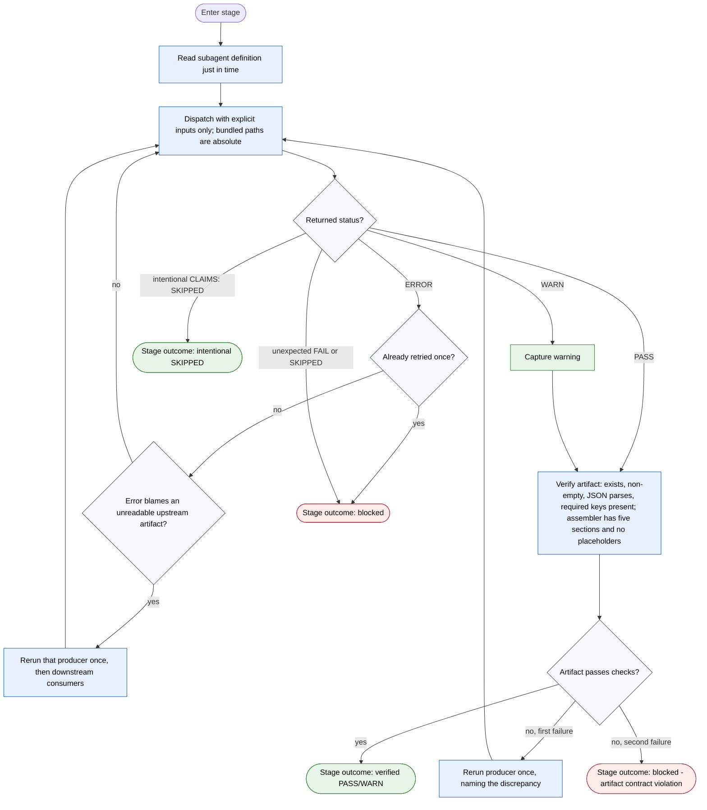

# Generate Handoff Document Flow Diagram

The orchestrator thinks, decides, dispatches, and verifies. Working data lives
on disk as structured artifacts; orchestrator context keeps only verdicts,
paths, counts, warnings, and rerun targets. User questions pause and resume the
run instead of ending it. Blocked states are reached only when an answer cannot
resolve the problem or retries are exhausted.

## Main Flow

```mermaid
flowchart TD
  START(["Start: handoff request"]) --> INTAKE["Collect TARGET_FILE, optional SUBJECT, TRACKING_FILES, CONTEXT_SOURCE, UPDATE_MODE"]
  INTAKE --> TARGET_CLEAR{"TARGET_FILE clear?"}
  TARGET_CLEAR -->|no| ASK_TARGET["Ask one short target-path question, then WAIT"]
  ASK_TARGET --> ANSWER_OK{"Answer resolves to a path?"}
  ANSWER_OK -->|yes| TARGET_CLEAR
  ANSWER_OK -->|"no / abandoned"| BLOCKED_TARGET(["Blocked: unclear target path"])
  TARGET_CLEAR -->|yes| PATH_CHECK["Run path-safety checklist: inside working tree, no traversal, not source/config/lockfile, creatable dir, no sibling collisions"]

  PATH_CHECK --> SAFE{"All criteria pass?"}
  SAFE -->|no| BLOCKED_WRITE(["Blocked: unsafe writes or missing readable/writable path"])
  SAFE -->|yes| EXISTS{"TARGET_FILE already exists?"}

  EXISTS -->|no| CONTRACTS["Read data-contracts.md and derive sibling paths from extension-agnostic stem"]
  EXISTS -->|yes| MODE_KNOWN{"UPDATE_MODE supplied?"}
  MODE_KNOWN -->|yes| BACKUP["Copy existing target to stem.prev.md"]
  MODE_KNOWN -->|no| ASK_MODE["Ask: overwrite, new path, or update? Then WAIT"]
  ASK_MODE --> MODE{"User choice?"}
  MODE -->|"new path"| TARGET_CLEAR
  MODE -->|overwrite| BACKUP
  MODE -->|update| BACKUP_U["Copy to stem.prev.md and record PRIOR_HANDOFF_FILE"]
  MODE -->|abandoned| BLOCKED_TARGET
  BACKUP --> CONTRACTS
  BACKUP_U --> CONTRACTS

  CONTRACTS --> SOURCE{"CONTEXT_SOURCE is a readable file?"}
  SOURCE -->|yes| SIZE["Set TRANSCRIPT_FILE; record line count and CHUNKED flag"]
  SOURCE -->|"no: live conversation"| SNAPSHOT["Write faithful transcript snapshot to stem.transcript.md"]
  SNAPSHOT --> SNAP_OK{"Snapshot faithful?"}
  SNAP_OK -->|yes| SIZE
  SNAP_OK -->|"no: history lost"| ASK_TRANSCRIPT["Ask for transcript file, then WAIT"]
  ASK_TRANSCRIPT --> SOURCE

  SIZE --> EXTERNAL{"Bundled contracts sufficient?"}
  EXTERNAL -->|yes| EXT_SKIP["Record EXTERNAL: SKIPPED"]
  EXTERNAL -->|"no, optional"| EXT_TRY["Fetch one source; record USED or UNAVAILABLE; continue"]
  EXTERNAL -->|"no, required and unreachable"| BLOCKED_EXT(["Blocked: required external dependency unavailable"])
  EXT_SKIP --> S_CONTEXT
  EXT_TRY --> S_CONTEXT

  S_CONTEXT["context-extractor via dispatch-verify"] --> C_OK{"Stage outcome?"}
  C_OK -->|verified PASS/WARN| S_INSIGHTS["insight-documenter via dispatch-verify"]
  C_OK -->|blocked| BLOCKED_STAGE(["Blocked: subagent error or artifact contract violation"])

  S_INSIGHTS --> I_OK{"Stage outcome?"}
  I_OK -->|blocked| BLOCKED_STAGE
  I_OK -->|verified PASS/WARN| EMPTY{"qa_log and insights empty and mandate trivial?"}
  EMPTY -->|yes| ASK_EMPTY["Ask: still want a handoff? Then WAIT"]
  ASK_EMPTY --> EMPTY_ANS{"User answer?"}
  EMPTY_ANS -->|no| DECLINED(["Completed: handoff declined - empty session"])
  EMPTY_ANS -->|yes| TRACKING
  EMPTY -->|no| TRACKING{"TRACKING_FILES provided?"}

  TRACKING -->|yes| S_CLAIMS["claim-validator via dispatch-verify"]
  TRACKING -->|no| CLAIMS_SKIP["Record CLAIMS: SKIPPED plus verification warning"]
  S_CLAIMS --> CL_OK{"Stage outcome?"}
  CL_OK -->|verified PASS/WARN| S_ASSEMBLE
  CL_OK -->|intentional SKIPPED| CLAIMS_SKIP
  CL_OK -->|blocked| BLOCKED_STAGE
  CLAIMS_SKIP --> S_ASSEMBLE

  S_ASSEMBLE["document-assembler via dispatch-verify"] --> A_OK{"Stage outcome?"}
  A_OK -->|blocked| BLOCKED_STAGE
  A_OK -->|verified PASS/WARN| S_REVIEW["handoff-reviewer via dispatch-verify"]

  S_REVIEW --> R_OK{"REVIEW verdict?"}
  R_OK -->|PASS or WARN| FINAL["Report paths, external status, verdicts, counts, warnings, open questions"]
  R_OK -->|blocked| BLOCKED_STAGE
  R_OK -->|FAIL| LIMIT{"Fewer than 3 repair cycles used?"}

  LIMIT -->|no| BLOCKED_REPAIR(["Blocked: repair limit exhausted"])
  LIMIT -->|yes| COUNT["Increment repair cycle"]
  COUNT --> PARSE{"Rerun targets parseable?"}
  PARSE -->|no| DEFAULT_RERUN["Default rerun: assembler then review"]
  DEFAULT_RERUN --> S_ASSEMBLE
  PARSE -->|yes| NORM["Normalize to canonical order and pick earliest stage"]
  NORM --> EARLIEST{"Earliest rerun stage?"}
  EARLIEST -->|context| S_CONTEXT
  EARLIEST -->|insights| S_INSIGHTS
  EARLIEST -->|claims| TRACKING
  EARLIEST -->|assembly| S_ASSEMBLE
  EARLIEST -->|"review only"| S_REVIEW

  FINAL --> DONE(["Completed: review pass"])

  class TARGET_CLEAR,ANSWER_OK,SAFE,EXISTS,MODE_KNOWN,MODE,SOURCE,SNAP_OK,EXTERNAL,C_OK,I_OK,EMPTY,EMPTY_ANS,TRACKING,CL_OK,A_OK,R_OK,LIMIT,PARSE,EARLIEST decision;
  class PATH_CHECK,CONTRACTS,SNAPSHOT,SIZE,EXT_TRY,S_CONTEXT,S_INSIGHTS,S_CLAIMS,S_ASSEMBLE,S_REVIEW,COUNT,NORM,DEFAULT_RERUN check;
  class ASK_TARGET,ASK_MODE,ASK_TRANSCRIPT,ASK_EMPTY human;
  class EXT_SKIP,CLAIMS_SKIP,BACKUP,BACKUP_U,FINAL output;
  class DONE,DECLINED success;
  class BLOCKED_TARGET,BLOCKED_WRITE,BLOCKED_EXT,BLOCKED_STAGE,BLOCKED_REPAIR stop;
  classDef check fill:#e7f1ff,stroke:#0b5ed7,color:#000;
  classDef decision fill:#f8f9fa,stroke:#495057,color:#000;
  classDef human fill:#f3e8ff,stroke:#6f42c1,color:#000;
  classDef output fill:#e8f5e9,stroke:#2e7d32,color:#000;
  classDef success fill:#e8f5e9,stroke:#2e7d32,color:#000;
  classDef stop fill:#fdecea,stroke:#b02a37,color:#000;
```

## Dispatch-Verify Protocol

## Terminal States

| Terminal | Kind | Meaning |
| -------- | ---- | ------- |
| `Completed: review pass` | Success | Reviewer returned pass or warn and the full report is delivered |
| `Completed: handoff declined (empty session)` | Success | User chose not to produce a hollow handoff |
| `Blocked: unclear target path` | Stop | Target question unanswered or unresolvable |
| `Blocked: unsafe writes or missing readable/writable path` | Stop | A named path-safety criterion failed |
| `Blocked: required external dependency unavailable` | Stop | Required current external source is unreachable |
| `Blocked: subagent error, failure, or unexpected skip` | Stop | Stage error after retry, or unexpected fail/skip |
| `Blocked: artifact contract violation` | Stop | Artifact verification failed twice for the same producer |
| `Blocked: repair limit exhausted` | Stop | Three repair cycles were used and review still fails |

Readiness rule: the run is complete only at one of the two success terminals;
every other exit uses the exact blocked string above.
