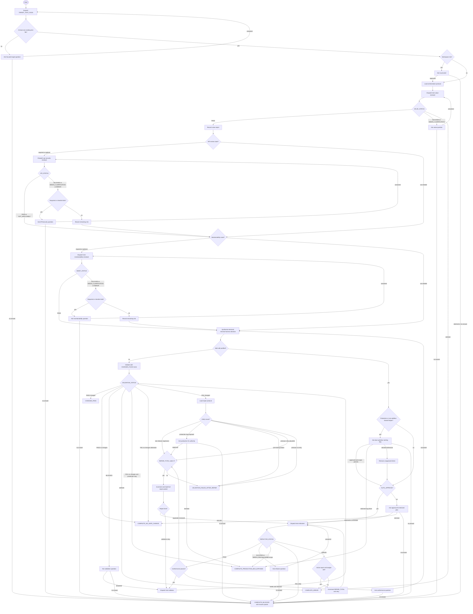

# Improving Test Suites Flow Diagram

This diagram visualizes the workflow. The single normative routing source is
[`references/orchestration-protocol.md`](./references/orchestration-protocol.md).

