# Improving Test Suites Flow

Control-flow source of truth for the `improving-test-suites` orchestrator. The
high-level execution model is a finite-state machine (`stateDiagram-v2`). The
companion transition table is [`state-machine.md`](./state-machine.md).

Detailed routing tables for subagent statuses live in
[`references/orchestration-protocol.md`](./references/orchestration-protocol.md).
This diagram and `state-machine.md` own state names, guards, and terminals;
the protocol must not contradict them.

```mermaid
stateDiagram-v2
  [*] --> Intake

  Intake --> Resume: RESUME_PACKET present
  Intake --> ResolveTargets: fresh run

  Resume --> ResolveTargets: next step resolve
  Resume --> ValueReview: next step value
  Resume --> ApiReview: next step api
  Resume --> MaintReview: next step maint
  Resume --> Synthesis: next step synthesis
  Resume --> DualAuthority: next step dual
  Resume --> WorkspaceRisk: next step workspace
  Resume --> PlanApproval: next step plan
  Resume --> Refactor: next step refactor
  Resume --> Conformance: next step conformance
  Resume --> Validate: next step validate
  Resume --> Repair: next step repair

  ResolveTargets --> ValueReview: at least one existing test file
  ResolveTargets --> AskTarget: zero files
  AskTarget --> ResolveTargets: answered
  AskTarget --> TerminalBlocked: no answer

  ValueReview --> ApiRoute: VALUE PASS
  ValueReview --> AskValue: BLOCKED or NEEDS_CLARIFICATION
  ValueReview --> TerminalError: VALUE ERROR
  AskValue --> ValueReview: answered
  AskValue --> TerminalBlocked: no answer

  ApiRoute --> ApiReview: route required or optional
  ApiRoute --> MaintRoute: route not needed
  ApiReview --> MaintRoute: PASS or NOT_APPLICABLE
  ApiReview --> ApiSufficiency: BLOCKED or NEEDS_CLARIFICATION or ERROR
  ApiSufficiency --> AskApi: required or checklist fails
  ApiSufficiency --> OptionalRisk: optional and checklist passes
  AskApi --> ApiReview: answered
  AskApi --> TerminalBlocked: no answer
  AskApi --> TerminalError: unrecoverable ERROR
  OptionalRisk --> MaintRoute: remaining risk recorded

  MaintRoute --> MaintReview: route required or optional
  MaintRoute --> Synthesis: route not needed
  MaintReview --> Synthesis: PASS
  MaintReview --> MaintSufficiency: BLOCKED or NEEDS_CLARIFICATION or ERROR
  MaintSufficiency --> AskMaint: required or checklist fails
  MaintSufficiency --> OptionalRiskMaint: optional and checklist passes
  AskMaint --> MaintReview: answered
  AskMaint --> TerminalBlocked: no answer
  AskMaint --> TerminalError: unrecoverable ERROR
  OptionalRiskMaint --> Synthesis: remaining risk recorded

  Synthesis --> Validate: no safe edit justified
  Synthesis --> DualAuthority: safe edit and production or non-additive shared helper
  Synthesis --> WorkspaceRisk: safe edit and test-tree only

  DualAuthority --> WorkspaceRisk: approved and SCOPE_LIMITS permits
  DualAuthority --> TerminalBug: declined bug driver
  DualAuthority --> Synthesis: declined otherwise replan
  DualAuthority --> TerminalBlocked: no answer

  WorkspaceRisk --> PlanApproval: clean VCS or dirty approved or no-VCS acknowledged
  WorkspaceRisk --> AskDirty: dirty targets without approval
  WorkspaceRisk --> AskNoVcs: no version control without acknowledgment
  AskDirty --> WorkspaceRisk: approved
  AskDirty --> TerminalBlocked: declined or no answer
  AskNoVcs --> WorkspaceRisk: acknowledged
  AskNoVcs --> TerminalBlocked: declined or no answer

  PlanApproval --> Refactor: AUTO_APPROVE true recorded or plan approved or amended
  PlanApproval --> AskPlan: AUTO_APPROVE false
  AskPlan --> Refactor: approved or amended
  AskPlan --> TerminalNoChange: declined
  AskPlan --> TerminalBlocked: no answer

  Refactor --> Conformance: REFACTOR PASS
  Refactor --> AskRefactor: BLOCKED or NEEDS_CLARIFICATION
  Refactor --> TerminalBug: FAIL production bug outside scope
  Refactor --> TerminalBlocked: FAIL otherwise
  Refactor --> Repair: ERROR and active repair and budget left
  Refactor --> TerminalError: ERROR otherwise
  AskRefactor --> Refactor: answered
  AskRefactor --> TerminalBlocked: no answer

  Conformance --> Validate: conformance passes
  Conformance --> Repair: repairable mismatch and budget left
  Conformance --> AskConform: needs user decision
  AskConform --> Synthesis: answered
  AskConform --> TerminalBlocked: no answer

  Validate --> TerminalChanged: PASS with changed files
  Validate --> TerminalNoChange: PASS with no changes
  Validate --> AskValidate: BLOCKED
  Validate --> TerminalError: ERROR
  Validate --> TerminalBug: FAIL no changes and production bug
  Validate --> TerminalNoChange: FAIL no changes otherwise
  Validate --> Repair: FAIL with changed files
  AskValidate --> Validate: answered
  AskValidate --> TerminalBlocked: no answer

  Repair --> Refactor: test edit and REPAIR_TOTAL under 3
  Repair --> Validate: validation retry and REPAIR_TOTAL under 3
  Repair --> DualAuthority: production bug fix in scope
  Repair --> TerminalFailed: budget exhausted or pre-existing or unknown no retry
  Repair --> TerminalBug: production bug declined or out of scope

  TerminalChanged --> [*]
  TerminalNoChange --> [*]
  TerminalBug --> [*]
  TerminalFailed --> [*]
  TerminalError --> [*]
  TerminalBlocked --> [*]
```

## Canonical Rules

- Safe edit justified: after synthesis, `MINIMAL_HARNESS_DECISION` has at least
  one keep/rewrite/delete/consolidate/add item eligible for mutation.
- Workspace risk runs only on the mutation path (after dual authority when
  needed), with distinct dirty-target and no-VCS guards.
- `AUTO_APPROVE=true` is a recorded headless bypass of the plan gate only;
  dual authority, workspace risk, conformance, and validation still bind.
- Optional-review remaining risk is an explicit transition through
  `ApiSufficiency` / `MaintSufficiency` when the three-part checklist passes.
- Repair: one `REPAIR_TOTAL` budget, maximum three, never reset.
