# Improving Test Suites

This flow models the test-suite improvement orchestrator. The orchestrator
normalizes scope, reads co-located skill, reference, subagent, and template
files, and trusts compact subagent reports for raw project inspection, source
fetching, edits, and validation. It may synthesize decisions and ask focused
questions; mutations stay bounded to tests and directly related test helpers
unless the user explicitly approves production-code fixes.

Paths shown in the diagram are relative to this file. Dispatch packet values
for subagent templates and references use the receiving subagent's input
contract paths.

```mermaid
flowchart TD
  START(["Start: improve target test suite"]) --> NORMALIZE["Normalize dispatch packet: TARGET_TEST_FILES, USER_GOAL, TEST_COMMAND, SCOPE_LIMITS, REFERENCE_NEED"]
  NORMALIZE --> HAS_TARGET{"TARGET_TEST_FILES present or inferable?"}
  HAS_TARGET -->|no| ASK_TARGET["Ask one focused clarification for target test files"]
  ASK_TARGET --> FINAL_BLOCKED
  HAS_TARGET -->|yes| LOAD_ORCH["Load ./references/orchestration-protocol.md"]

  LOAD_ORCH --> VALUE["Dispatch ./subagents/test-value-reviewer.md with heuristics, report template, and allowed source routing if needed"]
  VALUE --> VALUE_STATUS{"VALUE_STATUS: TEST_VALUE_REVIEW status"}
  VALUE_STATUS -->|PASS| VALUE_REPORT["Record value report: protected behaviors, gaps, review routes, fetched URLs, blockers"]
  VALUE_STATUS -->|BLOCKED| ASK_VALUE_BLOCKER["Ask or report required value-review blocker"]
  VALUE_STATUS -->|NEEDS_CLARIFICATION| ASK_VALUE_CLARIFICATION["Ask one focused value or scope decision"]
  VALUE_STATUS -->|ERROR| FINAL_ERROR
  ASK_VALUE_BLOCKER --> FINAL_BLOCKED
  ASK_VALUE_CLARIFICATION --> FINAL_BLOCKED

  VALUE_REPORT --> API_ROUTE{"API/security review route?"}
  API_ROUTE -->|required| API_MARK_REQUIRED["Set API/security route: required"]
  API_ROUTE -->|optional| API_MARK_OPTIONAL["Set API/security route: optional"]
  API_ROUTE -->|not needed| MAINT_ROUTE
  API_MARK_REQUIRED --> API_REVIEW["Dispatch ./subagents/api-security-reviewer.md with prior reports and allowed source routing if needed"]
  API_MARK_OPTIONAL --> API_REVIEW
  API_REVIEW --> API_STATUS{"API_STATUS: API_SECURITY_REVIEW status"}
  API_STATUS -->|PASS| API_REPORT["Record API/security report and fetched URLs"]
  API_STATUS -->|NOT_APPLICABLE| API_NA["Record API_SECURITY_REVIEW: NOT_APPLICABLE"]
  API_STATUS -->|BLOCKED| API_REQUIRED_GATE{"Required review or value evidence insufficient?"}
  API_STATUS -->|NEEDS_CLARIFICATION| API_REQUIRED_GATE
  API_STATUS -->|ERROR| API_ERROR_GATE{"Required review or value evidence insufficient?"}
  API_REQUIRED_GATE -->|yes| ASK_API_DECISION["Ask one focused API/security decision, prerequisite, or unsupported-source approval"]
  API_REQUIRED_GATE -->|no| API_OPTIONAL_RISK["Record skipped optional API/security review as remaining risk"]
  API_ERROR_GATE -->|yes| FINAL_ERROR
  API_ERROR_GATE -->|no| API_OPTIONAL_RISK
  ASK_API_DECISION --> FINAL_BLOCKED
  API_REPORT --> MAINT_ROUTE
  API_NA --> MAINT_ROUTE
  API_OPTIONAL_RISK --> MAINT_ROUTE

  MAINT_ROUTE{"Maintainability review route?"}
  MAINT_ROUTE -->|required| MAINT_MARK_REQUIRED["Set maintainability route: required"]
  MAINT_ROUTE -->|optional| MAINT_MARK_OPTIONAL["Set maintainability route: optional"]
  MAINT_ROUTE -->|not needed| SYNTHESIZE
  MAINT_MARK_REQUIRED --> MAINT_REVIEW["Dispatch ./subagents/test-maintainability-reviewer.md with prior reports and allowed source routing if needed"]
  MAINT_MARK_OPTIONAL --> MAINT_REVIEW
  MAINT_REVIEW --> MAINT_STATUS{"MAINT_STATUS: MAINTAINABILITY_REVIEW status"}
  MAINT_STATUS -->|PASS| MAINT_REPORT["Record maintainability report and fetched URLs"]
  MAINT_STATUS -->|BLOCKED| MAINT_REQUIRED_GATE{"Required review or value evidence insufficient?"}
  MAINT_STATUS -->|NEEDS_CLARIFICATION| MAINT_REQUIRED_GATE
  MAINT_STATUS -->|ERROR| MAINT_ERROR_GATE{"Required review or value evidence insufficient?"}
  MAINT_REQUIRED_GATE -->|yes| ASK_MAINT_DECISION["Ask one focused maintainability decision, prerequisite, or unsupported-source approval"]
  MAINT_REQUIRED_GATE -->|no| MAINT_OPTIONAL_RISK["Record skipped optional maintainability review as remaining risk"]
  MAINT_ERROR_GATE -->|yes| FINAL_ERROR
  MAINT_ERROR_GATE -->|no| MAINT_OPTIONAL_RISK
  ASK_MAINT_DECISION --> FINAL_BLOCKED
  MAINT_REPORT --> SYNTHESIZE
  MAINT_OPTIONAL_RISK --> SYNTHESIZE

  SYNTHESIZE["Synthesize MINIMAL_HARNESS_DECISION from compact reports, optional-review risks, fetched URLs, and ./references/test-quality-heuristics.md"]
  SYNTHESIZE --> SAFE_EDIT{"Safe test or helper edit justified?"}

  SAFE_EDIT -->|no| NO_CHANGE_RECORD["Record no-op rationale, scope limits, optional-review risks, and fetched URLs"]
  NO_CHANGE_RECORD --> VALIDATE_NO_CHANGE["Dispatch ./subagents/test-validator.md with TARGET_TEST_FILES, CHANGED_FILES=none, and supplied, suggested, or inferable command"]
  VALIDATE_NO_CHANGE --> CONTEXT_NO_CHANGE["Set handoff context: no changed files"]
  CONTEXT_NO_CHANGE --> VALIDATION_STATUS

  SAFE_EDIT -->|yes| MUTATION_SCOPE{"Edit stays within tests and directly related helpers?"}
  MUTATION_SCOPE -->|yes| REFACTOR["Dispatch ./subagents/test-refactorer.md with bounded edit packet"]
  MUTATION_SCOPE -->|no| REQUEST_PROD_APPROVAL["Ask user to approve production-code fix with target, reason, risk, reversibility, and safer alternative"]

  REQUEST_PROD_APPROVAL --> PROD_APPROVAL{"User approves production-code fix?"}
  PROD_APPROVAL -->|approved| PROD_ALLOWED["Record approval and approved production scope"]
  PROD_APPROVAL -->|declined| FINAL_BUG
  PROD_ALLOWED --> REFACTOR

  REFACTOR --> REFACTOR_STATUS{"REFACTOR_STATUS: TEST_REFACTOR status"}
  REFACTOR_STATUS -->|PASS| REFACTOR_REPORT["Record changed files, skipped edits, production changes, risks, assumptions, suggested validation command"]
  REFACTOR_STATUS -->|BLOCKED| ASK_REFACTOR_BLOCKER["Ask or report required refactor blocker"]
  REFACTOR_STATUS -->|NEEDS_CLARIFICATION| ASK_REFACTOR_CLARIFICATION["Ask one focused refactor scope or contract decision"]
  REFACTOR_STATUS -->|FAIL| REFACTOR_FAIL_KIND{"Production bug exposed outside approved scope?"}
  REFACTOR_STATUS -->|ERROR| FINAL_ERROR
  ASK_REFACTOR_BLOCKER --> FINAL_BLOCKED
  ASK_REFACTOR_CLARIFICATION --> FINAL_BLOCKED
  REFACTOR_FAIL_KIND -->|yes| FINAL_BUG
  REFACTOR_FAIL_KIND -->|no| FINAL_BLOCKED

  REFACTOR_REPORT --> VALIDATE_CHANGED["Dispatch ./subagents/test-validator.md with changed files and supplied, suggested, or inferable command"]
  VALIDATE_CHANGED --> CONTEXT_CHANGED["Set handoff context: changed files"]
  CONTEXT_CHANGED --> VALIDATION_STATUS

  VALIDATION_STATUS{"VALIDATION_STATUS: TEST_VALIDATION status"}
  VALIDATION_STATUS -->|PASS| HANDOFF_CONTEXT{"Changed files?"}
  VALIDATION_STATUS -->|BLOCKED| ASK_VALIDATION_COMMAND["Ask smallest command, dependency, template, or permission question from TEST_VALIDATION"]
  VALIDATION_STATUS -->|ERROR| FINAL_ERROR
  VALIDATION_STATUS -->|FAIL| VALIDATION_FAIL_CONTEXT{"Changed files?"}
  ASK_VALIDATION_COMMAND --> FINAL_BLOCKED

  HANDOFF_CONTEXT -->|yes| FINAL_CHANGED
  HANDOFF_CONTEXT -->|no| FINAL_NO_CHANGE
  VALIDATION_FAIL_CONTEXT -->|no| FINAL_NO_CHANGE
  VALIDATION_FAIL_CONTEXT -->|yes| INIT_REPAIR["Initialize REPAIR_COUNT=0 if absent; preserve existing count during repair loop"]
  INIT_REPAIR --> LOAD_REPAIR["Load ./references/repair-protocol.md"]

  LOAD_REPAIR --> VALIDATION_CAUSE{"Likely validation cause?"}
  VALIDATION_CAUSE -->|test refactor regression| REPAIR_COUNT{"REPAIR_COUNT under 3?"}
  VALIDATION_CAUSE -->|production bug exposed| REQUEST_PROD_APPROVAL
  VALIDATION_CAUSE -->|pre-existing failure| FINAL_FAILED
  VALIDATION_CAUSE -->|unknown| UNKNOWN_RETRY{"Command or environment retry plausible?"}
  UNKNOWN_RETRY -->|yes| REPAIR_COUNT
  UNKNOWN_RETRY -->|no| FINAL_FAILED
  REPAIR_COUNT -->|yes| INCREMENT_REPAIR["Increment REPAIR_COUNT and keep bounded repair packet"]
  REPAIR_COUNT -->|no| FINAL_FAILED
  INCREMENT_REPAIR --> REPAIR["Dispatch ./subagents/test-refactorer.md with VALIDATION_FAILURE, or retry validation for unknown command/environment failure"]
  REPAIR --> REPAIR_ROUTE{"Repair action type?"}
  REPAIR_ROUTE -->|test edit| REFACTOR_STATUS
  REPAIR_ROUTE -->|validation retry| VALIDATION_STATUS

  FINAL_CHANGED["Load ./references/final-handoff-template.md with status CHANGED_PASS, changed files, validation PASS, fetched URLs, risks, scope limits, approvals"]
  FINAL_NO_CHANGE["Load ./references/final-handoff-template.md with status COMPLETE_NO_SAFE_CHANGE, no-op rationale, validation status, fetched URLs, risks, scope limits"]
  FINAL_BUG["Load ./references/final-handoff-template.md with status COMPLETE_PRODUCTION_BUG_EXPOSED, failing behavior, scope limit, and no production edit"]
  FINAL_FAILED["Load ./references/final-handoff-template.md with status VALIDATION_FAILED_AFTER_REPAIR, failure summary, repair count, changed files, risks"]
  FINAL_ERROR["Load ./references/final-handoff-template.md with status COMPLETE_ERROR, completed work, error source, recovery context"]
  FINAL_BLOCKED["Load ./references/final-handoff-template.md with status COMPLETE_BLOCKED, missing decision, prerequisite, approval, or blocker"]

  FINAL_CHANGED --> DONE_CHANGED(["CHANGED_PASS"])
  FINAL_NO_CHANGE --> DONE_NO_CHANGE(["COMPLETE_NO_SAFE_CHANGE"])
  FINAL_BUG --> DONE_BUG(["COMPLETE_PRODUCTION_BUG_EXPOSED"])
  FINAL_FAILED --> DONE_FAILED(["VALIDATION_FAILED_AFTER_REPAIR"])
  FINAL_ERROR --> DONE_ERROR(["COMPLETE_ERROR"])
  FINAL_BLOCKED --> DONE_BLOCKED(["COMPLETE_BLOCKED"])

  classDef guard fill:#fff3cd,stroke:#856404,color:#000;
  classDef check fill:#e7f1ff,stroke:#0b5ed7,color:#000;
  classDef decision fill:#f8f9fa,stroke:#495057,color:#000;
  classDef human fill:#f3e8ff,stroke:#6f42c1,color:#000;
  classDef output fill:#e8f5e9,stroke:#2e7d32,color:#000;
  classDef success fill:#e8f5e9,stroke:#2e7d32,color:#000;
  classDef stop fill:#fdecea,stroke:#b02a37,color:#000;

  class HAS_TARGET,VALUE_STATUS,API_ROUTE,API_STATUS,API_REQUIRED_GATE,API_ERROR_GATE,MAINT_ROUTE,MAINT_STATUS,MAINT_REQUIRED_GATE,MAINT_ERROR_GATE,SAFE_EDIT,MUTATION_SCOPE,PROD_APPROVAL,REFACTOR_STATUS,REFACTOR_FAIL_KIND,VALIDATION_STATUS,HANDOFF_CONTEXT,VALIDATION_FAIL_CONTEXT,VALIDATION_CAUSE,UNKNOWN_RETRY,REPAIR_COUNT,REPAIR_ROUTE decision;
  class NORMALIZE,LOAD_ORCH,VALUE,API_REVIEW,MAINT_REVIEW,SYNTHESIZE,NO_CHANGE_RECORD,VALIDATE_NO_CHANGE,CONTEXT_NO_CHANGE,REFACTOR,VALIDATE_CHANGED,CONTEXT_CHANGED,INIT_REPAIR,INCREMENT_REPAIR,REPAIR check;
  class ASK_TARGET,ASK_VALUE_BLOCKER,ASK_VALUE_CLARIFICATION,ASK_API_DECISION,ASK_MAINT_DECISION,REQUEST_PROD_APPROVAL,ASK_REFACTOR_BLOCKER,ASK_REFACTOR_CLARIFICATION,ASK_VALIDATION_COMMAND human;
  class VALUE_REPORT,API_MARK_REQUIRED,API_MARK_OPTIONAL,API_REPORT,API_NA,API_OPTIONAL_RISK,MAINT_MARK_REQUIRED,MAINT_MARK_OPTIONAL,MAINT_REPORT,MAINT_OPTIONAL_RISK,PROD_ALLOWED,REFACTOR_REPORT,FINAL_CHANGED,FINAL_NO_CHANGE,FINAL_BUG,FINAL_FAILED output;
  class LOAD_REPAIR guard;
  class DONE_CHANGED,DONE_NO_CHANGE success;
  class FINAL_ERROR,FINAL_BLOCKED,DONE_BUG,DONE_FAILED,DONE_ERROR,DONE_BLOCKED stop;
```

Readiness rule: return a final handoff only after one named status is selected
and the handoff records changed files or no-op rationale, validation status,
fetched URLs, risks, scope limits, and any user approvals or blocked decisions.
External sources are fetched only inside the relevant subagent dispatch from the
source routing table or user-supplied official docs; unsupported sources require
user approval before use.
