# Orchestrating Workflow

The top-level work-item workflow orchestrator detects the platform from input, loads the matching playbook, and routes execution-heavy work to downstream skills and co-located utility subagents. It may derive the workflow key per the active playbook's identifier-derivation rule, read progress through `progress-tracker`, choose resume points, preflight phases, invoke downstream skills named in the active playbook's Phase Skill Map, dispatch utility subagents, surface phase summaries, ask gates, and update progress. It retains only decision-relevant summaries, current workflow state, user confirmations, and failure reports, while treating downstream phase skills and the active playbook as authoritative for per-platform contract. All file, platform, git, code, CI, web, and transport mutations are delegated, and platform writes or task execution happen only through downstream skills after the required human gates.

```mermaid
flowchart TD
  START([Start]) --> INPUTS["Receive platform input (JIRA_URL or ISSUE_URL/OWNER+REPO+ISSUE_NUMBER)"]
  INPUTS --> DETECT["Detect platform and load matching playbook"]
  DETECT --> DERIVE["Derive workflow key via active playbook's identifier-derivation rule"]
  DERIVE --> BOUNDARY["State role, authority, trust model, and mutation limits"]
  BOUNDARY --> PROGRESS["Read local progress summary via progress-tracker"]
  PROGRESS --> RESUME{"Existing progress or resume point found?"}

  RESUME -->|no| NEED_SOURCE_P1{"Platform input available for Phase 1?"}
  NEED_SOURCE_P1 -->|no| BLOCKED_SOURCE([Blocked: platform input required])
  NEED_SOURCE_P1 -->|yes| PREFLIGHT_P1["Preflight Phases 1-7 with active playbook path"]
  RESUME -->|yes| RESUME_POINT["Choose resume point from progress artifacts and verdicts"]
  RESUME_POINT --> RESUME_GATE{"Resume past Phase 1?"}
  RESUME_GATE -->|no| NEED_SOURCE_P1
  RESUME_GATE -->|yes| ASK_RESUME["Ask user to confirm resume point"]
  ASK_RESUME -->|declined| STOPPED([Stopped by user])
  ASK_RESUME -->|confirmed| PREFLIGHT_NEXT["Preflight remaining phases with active playbook path"]
  PREFLIGHT_P1 --> PREFLIGHT_OK{"Preflight verdict passes?"}
  PREFLIGHT_NEXT --> PREFLIGHT_OK
  PREFLIGHT_OK -->|no| BLOCKED_PREFLIGHT([Blocked or escalated: preflight failure])
  PREFLIGHT_OK -->|yes| ROUTE{"Choose next ready phase"}

  ROUTE -->|Phase 1| P1
  ROUTE -->|Phase 2| P2
  ROUTE -->|Phase 3| P3
  ROUTE -->|write approval| WRITE_READY
  ROUTE -->|task selection| TASK_SELECT
  ROUTE -->|Phase 5| P5
  ROUTE -->|Phase 6| P6
  ROUTE -->|execution approval| GATE_EXEC

  P1["Phase 1: fetch work item via active playbook's Phase 1 skill"] --> V1{"Phase 1 artifact validation pass?"}
  V1 -->|no| BLOCKED([Blocked])
  V1 -->|yes| P2["Phase 2: plan tasks via active playbook's Phase 2 skill"]
  P2 --> V2{"Task plan artifact validation pass?"}
  V2 -->|no| BLOCKED
  V2 -->|yes| P3["Phase 3: clarify assumptions and critique upfront plan via clarifying-assumptions"]

  P3 --> V3{"Phase 3 validation pass?"}
  V3 -->|no| BLOCKED
  V3 -->|yes| C3{"Blockers or re-plan needed?"}
  C3 -->|blockers present| BLOCKED
  C3 -->|RE_PLAN_NEEDED| LOOP3{"Phase 3 re-plan count fewer than 3 attempts?"}
  LOOP3 -->|yes| P2
  LOOP3 -->|no| ESCALATED([Escalated])
  C3 -->|ready| WRITE_READY([Ready for platform write approval])
  WRITE_READY --> NEED_WRITE_CONTEXT{"Platform input available for platform writes?"}
  NEED_WRITE_CONTEXT -->|no| BLOCKED_WRITE_CONTEXT([Blocked: platform input required for platform writes])
  NEED_WRITE_CONTEXT -->|yes| GATE_WRITE{"Approve platform writes for child items?"}

  GATE_WRITE -->|declined| RECORD_WRITE_DECLINE["Record declined platform write decision and handoff"]
  RECORD_WRITE_DECLINE --> STOPPED
  GATE_WRITE -->|approved| P4["Phase 4: create child items via active playbook's Phase 4 skill"]
  P4 --> V4{"Child item validation pass?"}
  V4 -->|no| BLOCKED
  V4 -->|yes| TASK_READY([Ready for task selection])
  TASK_READY --> TASK_SELECT{"User selects task?"}

  TASK_SELECT -->|selected| TASK_CONTEXT["Optionally gather platform status, codebase, code reference, and docs context"]
  TASK_SELECT -->|no tasks remain| WORKFLOW_DONE([Workflow complete])
  TASK_SELECT -->|stop| STOPPED
  TASK_CONTEXT --> P5["Phase 5: plan task execution via active playbook's Phase 5 skill"]
  P5 --> V5{"Execution planning artifact validation pass?"}
  V5 -->|no| BLOCKED
  V5 -->|yes| P6["Phase 6: clarify and critique task plan via clarifying-assumptions"]

  P6 --> V6{"Phase 6 validation pass?"}
  V6 -->|no| BLOCKED
  V6 -->|yes| C6{"Blockers or re-plan needed?"}
  C6 -->|blockers present| BLOCKED
  C6 -->|RE_PLAN_NEEDED| LOOP6{"Phase 6 re-plan count fewer than 3 attempts?"}
  LOOP6 -->|yes| P5
  LOOP6 -->|no| ESCALATED
  C6 -->|ready| EXEC_READY([Ready for execution])
  EXEC_READY --> GATE_EXEC{"Confirm critiqued task plan and start real execution?"}

  GATE_EXEC -->|declined| RECORD_EXEC_DECLINE["Record declined execution decision and handoff"]
  RECORD_EXEC_DECLINE --> STOPPED
  GATE_EXEC -->|confirmed| P7["Phase 7: kick off and execute task via active playbook's Phase 7 skill"]
  P7 --> EXEC_RESULT{"Downstream execution result?"}
  EXEC_RESULT -->|internal fixes needed| P7
  EXEC_RESULT -->|blocked or error| BLOCKED_P7([Blocked or escalated: execution failure report])
  EXEC_RESULT -->|task complete| TASK_DONE([Task complete])
  TASK_DONE --> NEXT_TASK{"Choose next task or stop?"}
  NEXT_TASK -->|next task| TASK_SELECT
  NEXT_TASK -->|stop| STOPPED
  NEXT_TASK -->|all tasks complete| WORKFLOW_DONE

  P1 -.evidence.-> EVIDENCE["Evidence: progress artifacts, preflight verdicts, phase summaries, validator verdicts, clarification flags, delegated platform status, and delegated code or docs context"]
  P1 -.updates.-> TRACK["Update progress via progress-tracker"]
  P2 -.updates.-> TRACK
  P3 -.updates.-> TRACK
  P4 -.updates.-> TRACK
  P5 -.updates.-> TRACK
  P6 -.updates.-> TRACK
  P7 -.updates.-> TRACK

  classDef guard fill:#fff3cd,stroke:#856404,color:#000;
  classDef check fill:#e7f1ff,stroke:#0b5ed7,color:#000;
  classDef decision fill:#f8f9fa,stroke:#495057,color:#000;
  classDef human fill:#f3e8ff,stroke:#6f42c1,color:#000;
  classDef output fill:#e8f5e9,stroke:#2e7d32,color:#000;
  classDef success fill:#e8f5e9,stroke:#2e7d32,color:#000;
  classDef refine fill:#fff3cd,stroke:#856404,color:#000;
  classDef stop fill:#fdecea,stroke:#b02a37,color:#000;

  class RESUME,NEED_SOURCE_P1,RESUME_GATE,PREFLIGHT_OK,ROUTE,V1,V2,V3,C3,LOOP3,NEED_WRITE_CONTEXT,GATE_WRITE,V4,TASK_SELECT,V5,V6,C6,LOOP6,GATE_EXEC,EXEC_RESULT,NEXT_TASK decision;
  class PREFLIGHT_P1,PREFLIGHT_NEXT,P1,P2,P3,P4,TASK_CONTEXT,P5,P6,P7 check;
  class ASK_RESUME,GATE_WRITE,TASK_SELECT,GATE_EXEC,NEXT_TASK human;
  class WRITE_READY,TASK_READY,EXEC_READY,TASK_DONE,RECORD_WRITE_DECLINE,RECORD_EXEC_DECLINE,TRACK,EVIDENCE output;
  class WORKFLOW_DONE success;
  class LOOP3,LOOP6 refine;
  class BLOCKED_SOURCE,BLOCKED_PREFLIGHT,BLOCKED,BLOCKED_WRITE_CONTEXT,BLOCKED_P7,ESCALATED,STOPPED stop;
  class BOUNDARY guard;
```

Readiness rule: advance only when the current phase artifact validates and its gate rule is satisfied. Platform writes require explicit approval before Phase 4, task execution requires explicit confirmation before Phase 7, and task choice is always user-controlled after Phase 4 and after each completed task.

Completion states: ready for next phase, ready for platform write approval, ready for task selection, ready for execution, task complete, workflow complete, blocked, needs re-plan, escalated, or stopped by user.
