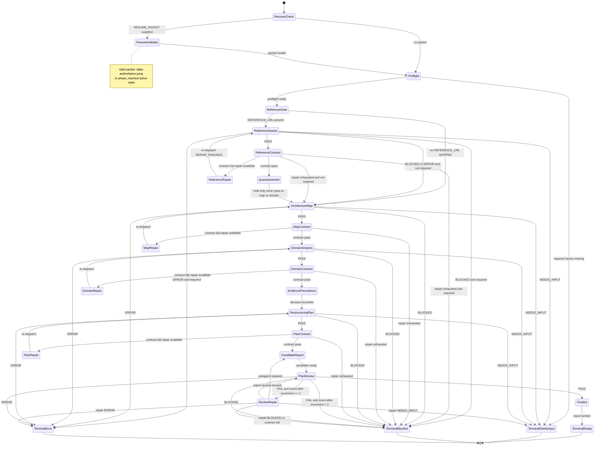

# Planning Codebase Restructuring Flow

Control-flow source of truth for this orchestrator. The high-level execution
model is a finite-state machine (`stateDiagram-v2`). The companion transition
table is [`state-machine.md`](./state-machine.md).

`SKILL.md` must use the same state names, guards, counters, and terminals.
Numeric thresholds live in `state-machine.md` and are restated in `SKILL.md`
Execution; this diagram does not invent a second budget.

## Canonical Rules

- Quarantine: validated reference summaries never reach `ArchitectureMap` or
  `DomainAnalysis`.
- Accessibility vs contract: unfetchable references leave `ReferenceAssess` as
  `BLOCKED` and never enter `ReferenceRepair`.
- Resume: continue at `phase_reached`, not a hardwired early gate.
- Review budget: increment `review_repair_count` on each `FAIL`; block when the
  count exceeds 2 (at most two repair cycles).
- Every `NEEDS_INPUT` stop emits a `RESUME_PACKET`.
