# Planning Codebase Restructuring Flow

This diagram is descriptive. `SKILL.md` is the sole normative source for
thresholds, counters, and routing values.

The flow preserves these properties: reference summaries never reach the
cartographer or domain analyst; every `NEEDS_INPUT` stop emits a resume packet;
inaccessible references return `BLOCKED`, never `PASS`; optional blocked
references degrade to local-only planning; and no decision node has branches
that converge identically.

```mermaid
flowchart TD
  START([Start: restructuring plan request]) --> RESUME{"RESUME_PACKET supplied?"}
  RESUME -->|yes| RESUME_VAL["Re-validate packet summaries<br/>against the summary contract"]
  RESUME_VAL --> RESUME_OK{"Packet valid?"}
  RESUME_OK -->|yes| JUMP["Restore counters, contract notes,<br/>and validated summaries"]
  JUMP --> REF_CHECK
  RESUME_OK -->|"no - discard with stated reason"| PREFLIGHT
  RESUME -->|no| PREFLIGHT

  PREFLIGHT["Preflight: normalize inputs<br/>Initialize review_repair_count<br/>Resolve ARTIFACT_PATH<br/>Disclose temp clone directory when input is a URL"] --> REQ{"All required inputs present<br/>or safely inferable?"}
  REQ -->|no| BATCH_ASK["Ask missing-input questions<br/>within the batch limit<br/>Emit resume packet"]
  BATCH_ASK --> NEEDS_INPUT([Status: NEEDS_INPUT + resume packet])
  REQ -->|yes| ANNOUNCE["State preflight summary<br/>scope, assumptions, constraints,<br/>DISPATCH_MODE, artifact path, clone path"]

  ANNOUNCE --> REF_CHECK{"REFERENCE_URL present?"}
  REF_CHECK -->|no| REF_SKIP["Record REFERENCE_ASSESSMENT: SKIPPED"]
  REF_SKIP --> CARTO
  REF_CHECK -->|yes| REF["Dispatch reference-assessor<br/>untrusted-content rule applies<br/>inaccessible reference returns BLOCKED, never PASS"]
  REF --> REF_STATUS{"REFERENCE_ASSESSMENT status"}
  REF_STATUS -->|PASS| REF_VAL["Validate summary contract<br/>Record CONTRACT_NOTE"]
  REF_VAL --> REF_OK{"Summary usable?"}
  REF_OK -->|yes| QUARANTINE["Quarantine validated reference summary<br/>held by orchestrator only"]
  QUARANTINE --> CARTO
  REF_OK -->|no| REF_BUDGET{"Contract repair available<br/>per SKILL.md repair rule?"}
  REF_BUDGET -->|yes| REF_REPAIR["Re-dispatch reference-assessor<br/>with REPAIR_FINDINGS"]
  REF_REPAIR --> REF_STATUS
  REF_BUDGET -->|no| REF_REQ1{"REFERENCE_REQUIRED?"}
  REF_REQ1 -->|yes| BLOCKED_FINAL
  REF_REQ1 -->|no| REF_DEGRADE["Record optional reference limitation<br/>Continue local-only"]
  REF_DEGRADE --> CARTO
  REF_STATUS -->|NEEDS_INPUT| ASK_ONE["Ask one targeted question<br/>Emit resume packet"]
  ASK_ONE --> NEEDS_INPUT
  REF_STATUS -->|BLOCKED| REF_REQ2{"REFERENCE_REQUIRED?"}
  REF_REQ2 -->|yes| BLOCKED_FINAL
  REF_REQ2 -->|no| REF_DEGRADE
  REF_STATUS -->|ERROR| REF_REQ3{"REFERENCE_REQUIRED?"}
  REF_REQ3 -->|yes| ERROR_FINAL
  REF_REQ3 -->|no| REF_DEGRADE

  CARTO["Dispatch architecture-cartographer<br/>no reference material in inputs<br/>sizes scope first and handles SCOPE_PRESSURE"] --> MAP_STATUS{"ARCHITECTURE_MAP status"}
  MAP_STATUS -->|PASS| MAP_VAL["Validate summary contract<br/>Record CONTRACT_NOTE"]
  MAP_VAL --> MAP_OK{"Summary usable?"}
  MAP_OK -->|yes| MAP_KEEP["Keep validated architecture map"]
  MAP_OK -->|no| MAP_BUDGET{"Contract repair available<br/>per SKILL.md repair rule?"}
  MAP_BUDGET -->|yes| MAP_REPAIR["Re-dispatch architecture-cartographer<br/>with REPAIR_FINDINGS"]
  MAP_REPAIR --> MAP_STATUS
  MAP_BUDGET -->|no| BLOCKED_FINAL
  MAP_STATUS -->|NEEDS_INPUT| ASK_ONE
  MAP_STATUS -->|BLOCKED| BLOCKED_FINAL
  MAP_STATUS -->|ERROR| ERROR_FINAL

  MAP_KEEP --> DOMAIN["Dispatch domain-analyst<br/>no reference material in inputs"]
  DOMAIN --> DOM_STATUS{"DOMAIN_ANALYSIS status"}
  DOM_STATUS -->|PASS| DOM_VAL["Validate summary contract<br/>Record CONTRACT_NOTE"]
  DOM_VAL --> DOM_OK{"Summary usable?"}
  DOM_OK -->|yes| DOM_KEEP["Keep validated domain analysis"]
  DOM_OK -->|no| DOM_BUDGET{"Contract repair available<br/>per SKILL.md repair rule?"}
  DOM_BUDGET -->|yes| DOM_REPAIR["Re-dispatch domain-analyst<br/>with REPAIR_FINDINGS"]
  DOM_REPAIR --> DOM_STATUS
  DOM_BUDGET -->|no| BLOCKED_FINAL
  DOM_STATUS -->|NEEDS_INPUT| ASK_ONE
  DOM_STATUS -->|BLOCKED| BLOCKED_FINAL
  DOM_STATUS -->|ERROR| ERROR_FINAL

  DOM_KEEP --> GATE["Evidence precedence gate<br/>compare quarantined reference patterns against<br/>reference-free map and domain analysis"]
  GATE --> GATE_ANY{"Validated reference summary exists?"}
  GATE_ANY -->|no| DEC_NA["EVIDENCE_PRECEDENCE_DECISION: not-applicable"]
  GATE_ANY -->|yes| GATE_FIT{"Pattern fit confirmed<br/>against local evidence?"}
  GATE_FIT -->|yes| DEC_AUTH["EVIDENCE_PRECEDENCE_DECISION: reference-authorized<br/>Pass confirmed patterns only"]
  GATE_FIT -->|no| DEC_LIM["EVIDENCE_PRECEDENCE_DECISION: limitations-only<br/>Pass limitation notes only"]

  DEC_NA --> STRAT
  DEC_AUTH --> STRAT
  DEC_LIM --> STRAT
  STRAT["Dispatch restructuring-strategist<br/>validated evidence and gate-allowed reference content"] --> STRAT_STATUS{"RESTRUCTURING_PLAN status"}
  STRAT_STATUS -->|PASS| STRAT_VAL["Validate summary contract<br/>Record CONTRACT_NOTE"]
  STRAT_VAL --> STRAT_OK{"Summary usable?"}
  STRAT_OK -->|yes| STRAT_KEEP["Keep validated restructuring plan"]
  STRAT_OK -->|no| STRAT_BUDGET{"Contract repair available<br/>per SKILL.md repair rule?"}
  STRAT_BUDGET -->|yes| STRAT_REPAIR["Re-dispatch restructuring-strategist<br/>with REPAIR_FINDINGS"]
  STRAT_REPAIR --> STRAT_STATUS
  STRAT_BUDGET -->|no| BLOCKED_FINAL
  STRAT_STATUS -->|NEEDS_INPUT| ASK_ONE
  STRAT_STATUS -->|BLOCKED| BLOCKED_FINAL
  STRAT_STATUS -->|ERROR| ERROR_FINAL

  STRAT_KEEP --> CANDIDATE["Synthesize candidate report<br/>from validated summaries only"]
  CANDIDATE --> REVIEW["Dispatch plan-reviewer<br/>summaries, CONTRACT_NOTEs, gate decision,<br/>candidate report, review_repair_count"]
  REVIEW --> REV_STATUS{"PLAN_REVIEW status"}
  REV_STATUS -->|PASS| WRITE["Write full reviewed report to ARTIFACT_PATH"]
  WRITE --> CHAT["Deliver compact chat summary<br/>status, artifact path, top findings"]
  CHAT --> READY([Status: READY])
  REV_STATUS -->|FAIL| INC["Increment review_repair_count once"]
  INC --> REV_BUDGET{"Review repair budget remaining<br/>per SKILL.md repair rule?"}
  REV_BUDGET -->|no| BLOCKED_FINAL
  REV_BUDGET -->|yes| OWNER{"Smallest responsible owner?"}
  OWNER -->|"subagent summary"| REDISPATCH["Re-dispatch smallest responsible subagent<br/>with REPAIR_FINDINGS only"]
  REDISPATCH --> RSTAT{"Targeted repair status"}
  RSTAT -->|PASS| RVAL["Validate repaired summary contract<br/>Record CONTRACT_NOTE"]
  RVAL --> ROK{"Repaired summary usable?"}
  ROK -->|yes| CANDIDATE
  ROK -->|no| BLOCKED_FINAL
  RSTAT -->|NEEDS_INPUT| ASK_ONE
  RSTAT -->|BLOCKED| BLOCKED_FINAL
  RSTAT -->|ERROR| ERROR_FINAL
  OWNER -->|"candidate report section"| REVISE["Revise only the named report section<br/>from existing validated summaries"]
  REVISE --> REVIEW
  REV_STATUS -->|BLOCKED| BLOCKED_FINAL
  REV_STATUS -->|ERROR| ERROR_FINAL

  BLOCKED_FINAL["Blocked handoff: smallest stopping reason,<br/>completed phases, contract notes, repair counts,<br/>next decision, safe partial findings"] --> BLOCKED([Status: BLOCKED])
  ERROR_FINAL["Error handoff: failed condition,<br/>completed phases, known context, recovery action"] --> ERROR([Status: ERROR])
```

## Named Rules

- Readiness, repair, quarantine, resume, and mutation rule values are defined in
  `SKILL.md`.
- This diagram avoids restating numeric thresholds so future rule edits have one
  normative source.
