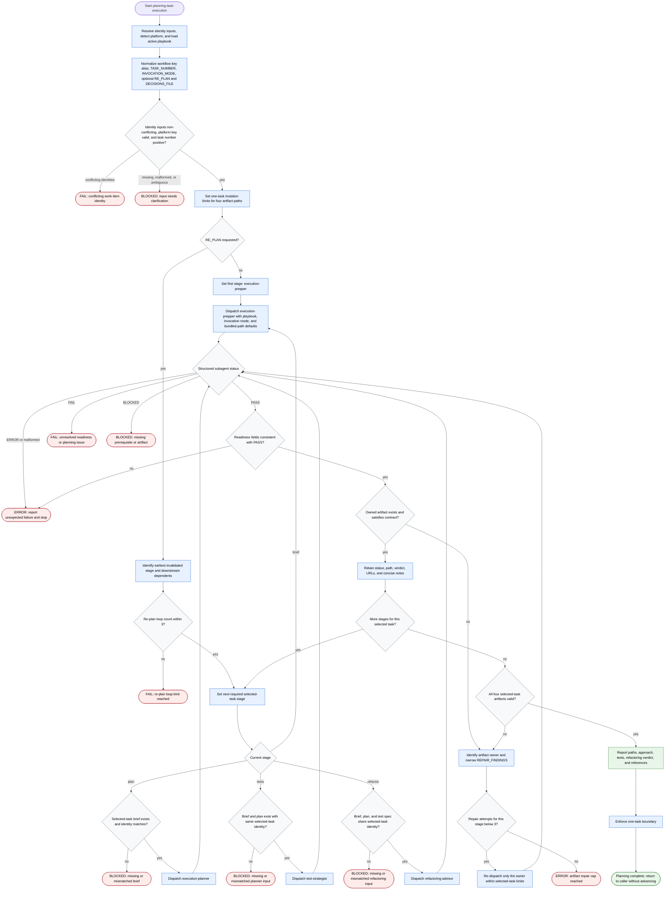

# Planning Task Execution

This platform-neutral state-machine diagram is illustrative. The routing, status, retry, and re-plan rules in `./references/pipeline.md` and `SKILL.md` are authoritative if prose and diagram ever drift.

The coordinator plans exactly one selected `TASK_NUMBER`. The active playbook derives `<KEY>` and supplies platform-specific terminology and readiness semantics. No route advances to another task, implements code, or mutates the work-item platform.

Completion requires four valid artifacts for the original `<KEY>` and `TASK_NUMBER`, with every owner returning `PASS`. Every other terminal reports `BLOCKED`, `FAIL`, or `ERROR` without modifying product code, git, another task, or the platform.
