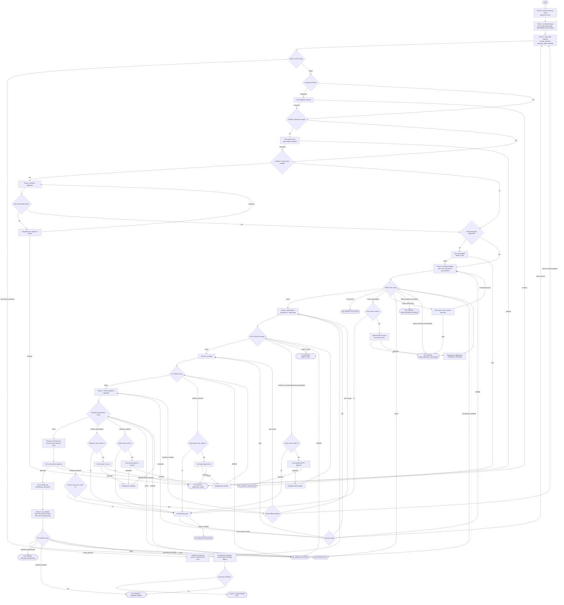

# PR Creator v2 Workflow

The workflow resolves dispatch mode, inspects fork-aware topology, preflights
with idempotency and pinned SHAs, enforces scope and metadata gates, freezes an
approved preview, and verifies the created or found PR/MR with platform-returned
fields and body digests.

## Terminal States

| State | Meaning | Terminal? |
| ----- | ------- | --------- |
| `Success` | PR/MR exists and platform-returned fields match the frozen preview. | yes |
| `AWAITING_USER` | A focused question is pending and the run is suspended. | no |
| `PR_EXISTS` | An open PR/MR already targets the same base from the same head. | yes |
| `AUTH`, `BASE_BRANCH_MISSING`, `HEAD_BRANCH_UNPUSHED`, `EMPTY_DIFF`, `BLOCKED` | A precondition or execution step cannot proceed. | yes |
| `CANCELLED` | User declined a scope, state-fallback, or preview gate. | yes |
| `CREATE_ERROR` | Create or verification failed, naming the mismatched field. | yes |
| `CREATE_UNCERTAIN` | Outcome remains unknown after check-then-retry protocol. | yes |
| `ESCALATED` | Three non-converging cycles at one gate without usable recovery. | yes |

## Invariants

- `pr-submitter` runs only after safe platform path, `PREFLIGHT: PASS`,
  `DIFF_ANALYSIS: PASS`, `PR_DRAFT: PASS`, `REVIEW_METADATA: PASS`, exact
  preview approval, and a matching approval record.
- Push, scope, type/scope, reviewer, label, and preview-edit gates each have an
  independent three-cycle counter. Submission has only the bounded retry inside
  `pr-submitter`.
- Every terminal failure uses the shared envelope with status, stopped-at,
  evidence, reason, and one next step.
- Pushes are plain `git push <head_remote> <branch>`; force variants never run.
