# pr-creator Workflow

Finite-state control flow for the `pr-creator` orchestrator
(`stateDiagram-v2`). Companion transition table:
[`state-machine.md`](./state-machine.md).

Resolves dispatch mode, inspects fork-aware topology, preflights with
idempotency and pinned SHAs, enforces scope and metadata gates, freezes an
approved preview, and verifies the created or found PR/MR with
platform-returned fields and body digests.

```mermaid
stateDiagram-v2
  [*] --> ResolveMode

  ResolveMode --> NormalizeInputs: mode recorded
  NormalizeInputs --> InspectRepo: inputs normalized

  InspectRepo --> TerminalBlocked: REPO_STATE BLOCKED or ERROR
  InspectRepo --> GateTopology: PASS and topology ambiguous
  InspectRepo --> GateTargetBranch: PASS and target missing
  InspectRepo --> AdaptPlatform: PASS and adapter needed
  InspectRepo --> GateStateFallback: PASS and draft unsupported
  InspectRepo --> RunPreflight: PASS and ready

  GateTopology --> TerminalAwaitingUser: pending
  GateTopology --> GateTargetBranch: remotes chosen target missing
  GateTopology --> AdaptPlatform: remotes chosen adapter needed
  GateTopology --> RunPreflight: remotes chosen ready

  GateTargetBranch --> TerminalAwaitingUser: pending
  GateTargetBranch --> AdaptPlatform: target chosen adapter needed
  GateTargetBranch --> GateStateFallback: target chosen draft unsupported
  GateTargetBranch --> RunPreflight: target chosen ready

  AdaptPlatform --> GatePlatformTooling: safe path unknown
  AdaptPlatform --> GateStateFallback: path known draft unsupported
  AdaptPlatform --> RunPreflight: path known state supported

  GatePlatformTooling --> TerminalAwaitingUser: pending
  GatePlatformTooling --> AdaptPlatform: tooling answered

  GateStateFallback --> TerminalCancelled: stop
  GateStateFallback --> RunPreflight: proceed as ready

  RunPreflight --> AnalyzeDiff: PREFLIGHT PASS
  RunPreflight --> TerminalPrExists: PR_EXISTS
  RunPreflight --> GatePush: PUSH_REQUIRED cycles under 3
  RunPreflight --> GatePushRejected: PUSH_REJECTED
  RunPreflight --> TerminalAuth: AUTH
  RunPreflight --> TerminalBaseMissing: BASE_BRANCH_MISSING
  RunPreflight --> TerminalHeadUnpushed: HEAD_BRANCH_UNPUSHED
  RunPreflight --> TerminalBlocked: BLOCKED or ERROR
  RunPreflight --> FinalDecision: PUSH_REQUIRED cycles at 3

  GatePush --> RunPreflight: plain push approved
  GatePush --> TerminalHeadUnpushed: push declined

  GatePushRejected --> RunPreflight: manual resolution confirmed
  GatePushRejected --> TerminalHeadUnpushed: stop

  AnalyzeDiff --> DraftPr: DIFF_ANALYSIS PASS
  AnalyzeDiff --> GateScope: LARGE_PR cycles under 3
  AnalyzeDiff --> TerminalEmptyDiff: EMPTY_DIFF
  AnalyzeDiff --> TerminalBlocked: ERROR
  AnalyzeDiff --> FinalDecision: scope cycles at 3

  GateScope --> AnalyzeDiff: large PR approved
  GateScope --> TerminalCancelled: scope declined

  DraftPr --> SuggestMetadata: PR_DRAFT PASS
  DraftPr --> GateTypeScope: NEEDS_CHOICE cycles under 3
  DraftPr --> TerminalBlocked: ERROR or unresolved
  DraftPr --> FinalDecision: type scope cycles at 3

  GateTypeScope --> TerminalAwaitingUser: pending
  GateTypeScope --> DraftPr: choice answered

  SuggestMetadata --> ShowPreview: REVIEW_METADATA PASS
  SuggestMetadata --> GateReviewer: NEEDS_REVIEWER cycles under 3
  SuggestMetadata --> GateLabels: INVALID_LABELS cycles under 3
  SuggestMetadata --> TerminalAuth: AUTH
  SuggestMetadata --> TerminalBlocked: ERROR
  SuggestMetadata --> FinalDecision: reviewer or label cycles at 3

  GateReviewer --> TerminalAwaitingUser: pending
  GateReviewer --> SuggestMetadata: reviewers or none

  GateLabels --> TerminalAwaitingUser: pending
  GateLabels --> SuggestMetadata: labels resolved

  ShowPreview --> GatePreview: preview shown

  GatePreview --> FreezeApproval: exact preview approved
  GatePreview --> TerminalCancelled: declined without edits
  GatePreview --> InspectRepo: edits earliest repo
  GatePreview --> AnalyzeDiff: edits earliest diff
  GatePreview --> DraftPr: edits earliest draft
  GatePreview --> SuggestMetadata: edits earliest metadata
  GatePreview --> FinalDecision: preview-edit cycles at 3

  FreezeApproval --> SubmitPr: APPROVAL_RECORD ready

  SubmitPr --> AnalyzeDiff: HEAD_MOVED
  SubmitPr --> VerifySubmit: PR_SUBMIT PASS
  SubmitPr --> TerminalCreateUncertain: CREATE_UNCERTAIN
  SubmitPr --> TerminalCreateError: CREATE_ERROR
  SubmitPr --> TerminalAuth: AUTH
  SubmitPr --> TerminalBlocked: BLOCKED or ERROR

  VerifySubmit --> TerminalSuccess: fields and digests match
  VerifySubmit --> TerminalCreateError: mismatch

  FinalDecision --> InspectRepo: recovery repo
  FinalDecision --> RunPreflight: recovery preflight
  FinalDecision --> AnalyzeDiff: recovery diff
  FinalDecision --> DraftPr: recovery draft
  FinalDecision --> SuggestMetadata: recovery metadata
  FinalDecision --> TerminalEscalated: stop or unusable

  TerminalSuccess --> [*]
  TerminalAwaitingUser --> [*]
  TerminalPrExists --> [*]
  TerminalAuth --> [*]
  TerminalBaseMissing --> [*]
  TerminalHeadUnpushed --> [*]
  TerminalEmptyDiff --> [*]
  TerminalBlocked --> [*]
  TerminalCancelled --> [*]
  TerminalCreateError --> [*]
  TerminalCreateUncertain --> [*]
  TerminalEscalated --> [*]
```

## Terminal States

| State | Envelope / meaning | Terminal? |
| ----- | ------------------ | --------- |
| `TerminalSuccess` | Verified PR/MR URL; platform fields match freeze | yes |
| `TerminalAwaitingUser` | `AWAITING_USER` — focused question pending | suspend |
| `TerminalPrExists` | `PR_EXISTS` | yes |
| `TerminalAuth` | `AUTH` | yes |
| `TerminalBaseMissing` | `BASE_BRANCH_MISSING` | yes |
| `TerminalHeadUnpushed` | `HEAD_BRANCH_UNPUSHED` | yes |
| `TerminalEmptyDiff` | `EMPTY_DIFF` | yes |
| `TerminalBlocked` | `BLOCKED` | yes |
| `TerminalCancelled` | `CANCELLED` | yes |
| `TerminalCreateError` | `CREATE_ERROR` | yes |
| `TerminalCreateUncertain` | `CREATE_UNCERTAIN` | yes |
| `TerminalEscalated` | `ESCALATED` | yes |

## Invariants

- `SubmitPr` runs only after safe platform path, `PREFLIGHT: PASS`,
  `DIFF_ANALYSIS: PASS`, `PR_DRAFT: PASS`, `REVIEW_METADATA: PASS`, exact
  preview approval, and a matching approval record.
- Push, scope, type/scope, reviewer, label, and preview-edit gates each have an
  independent three-cycle counter. Submission has only the bounded retry inside
  `pr-submitter`.
- Every terminal failure uses the shared envelope with status, stopped-at,
  evidence, reason, and one next step.
- Pushes are plain `git push <head_remote> <branch>`; force variants never run.
