# PR Creator Skill Flow

The PR Creator orchestrator creates a review-ready PR or MR from the current
branch. It may normalize inputs, delegate repository inspection, preflight, diff
analysis, drafting, metadata, and submission, ask focused user questions, and
fetch docs only for exact platform behavior. The trust model is compact subagent
status blocks, comparable refs on the recorded remote, exact changed-file paths,
platform metadata, trusted compare diff, and exact user approvals. It may push
the current branch only after explicit approval, may create a PR or MR only
after exact preview approval, freezes approved preview fields after approval,
and keeps local uncommitted changes outside the PR until committed.

```mermaid
flowchart TD
  START([Start: create review-ready PR or MR from current branch]) --> INTAKE["Normalize inputs<br/>TARGET_BRANCH, PR_STATE, REMOTE_NAME, REVIEWERS, TITLE_OVERRIDE, BODY_OVERRIDE, LABELS_OVERRIDE, current branch, remote refs, auth, trusted compare diff, CODEOWNERS, platform labels"]
  INTAKE --> BOUNDARY["State authority boundary<br/>delegate inspection, preflight, diff, drafting, metadata, and submission; ask before sensitive actions"]
  BOUNDARY --> TARGET_CHECK{TARGET_BRANCH provided?}

  TARGET_CHECK -->|no| ASK_TARGET["Human gate: ask missing TARGET_BRANCH<br/>one focused question"]
  ASK_TARGET -->|provided| REPO_STATE["Dispatch repo-state-inspector<br/>contract: REPO_STATE"]
  ASK_TARGET -->|waiting| FAIL_TARGET([Failure envelope: BLOCKED<br/>waiting for TARGET_BRANCH])

  TARGET_CHECK -->|yes| REPO_STATE
  REPO_STATE --> REPO_STATUS{REPO_STATE status}
  REPO_STATUS -->|PASS| LOCAL_CHANGES{Uncommitted local changes?}
  REPO_STATUS -->|BLOCKED| FAIL_BLOCKED([Failure envelope: BLOCKED])
  REPO_STATUS -->|ERROR| FAIL_BLOCKED

  LOCAL_CHANGES -->|yes| RECORD_LOCAL["Record boundary<br/>uncommitted local changes stay outside PR until committed"]
  LOCAL_CHANGES -->|no| PLATFORM_ROUTE{Platform adapter needed or platform unknown?}
  RECORD_LOCAL --> PLATFORM_ROUTE

  PLATFORM_ROUTE -->|yes| ADAPT_PLATFORM["Load platform-adaptation.md<br/>map GitLab, Bitbucket, GitHub Enterprise, or unknown behavior"]
  PLATFORM_ROUTE -->|no| PREFLIGHT["Dispatch preflight-validator<br/>contract: PREFLIGHT"]
  ADAPT_PLATFORM --> PLATFORM_DOCS{Exact active-platform syntax known?}
  PLATFORM_DOCS -->|no| FETCH_PLATFORM_DOCS["Fetch docs only for exact platform behavior"]
  PLATFORM_DOCS -->|yes| PLATFORM_READY{Safe platform path determined?}
  FETCH_PLATFORM_DOCS --> PLATFORM_READY
  PLATFORM_READY -->|yes| PREFLIGHT
  PLATFORM_READY -->|no, unknown tool| ASK_PLATFORM["Human gate: ask hosting platform or approved tooling"]
  ASK_PLATFORM -->|provided| ADAPT_PLATFORM
  ASK_PLATFORM -->|waiting| FAIL_PLATFORM([Failure envelope: BLOCKED<br/>waiting for platform path])

  PREFLIGHT --> PREFLIGHT_STATUS{PREFLIGHT status}
  PREFLIGHT_STATUS -->|PASS| TRUSTED_DIFF["Use trusted compare diff<br/>&lt;remote_name&gt;/&lt;target_branch&gt;...&lt;remote_name&gt;/&lt;current_branch&gt;<br/>only after remote refs are comparable"]
  PREFLIGHT_STATUS -->|PUSH_REQUIRED| PREFLIGHT_CYCLE{Preflight recovery cycles &lt; 3?}
  PREFLIGHT_STATUS -->|AUTH| FAIL_AUTH([Failure envelope: AUTH])
  PREFLIGHT_STATUS -->|BASE_BRANCH_MISSING| FAIL_BASE([Failure envelope: BASE_BRANCH_MISSING])
  PREFLIGHT_STATUS -->|HEAD_BRANCH_UNPUSHED| FAIL_HEAD([Failure envelope: HEAD_BRANCH_UNPUSHED])
  PREFLIGHT_STATUS -->|BLOCKED| FAIL_BLOCKED
  PREFLIGHT_STATUS -->|ERROR| FAIL_BLOCKED

  PREFLIGHT_CYCLE -->|no| FINAL_DECISION["Human gate: final decision after three non-converging cycles<br/>ask for exact recovery values or permission to stop"]
  PREFLIGHT_CYCLE -->|yes| PUSH_GATE["Human gate: approve pushing current branch<br/>action: git push current branch<br/>target: &lt;remote_name&gt;/&lt;current_branch&gt;<br/>reason: make compare ref available<br/>risk: publishes commits; alternative: stop and user pushes manually"]
  PUSH_GATE -->|declined| FAIL_HEAD
  PUSH_GATE -->|approved| PREFLIGHT_PUSH["Redispatch preflight-validator only<br/>PUSH_APPROVED=true; reuse recorded repo-state facts"]
  PREFLIGHT_PUSH --> PREFLIGHT_STATUS

  TRUSTED_DIFF --> DIFF_ANALYSIS["Dispatch diff-analyzer<br/>contract: DIFF_ANALYSIS"]
  DIFF_ANALYSIS --> DIFF_STATUS{DIFF_ANALYSIS status}
  DIFF_STATUS -->|PASS| PR_DRAFT["Dispatch pr-drafter<br/>contract: PR_DRAFT"]
  DIFF_STATUS -->|LARGE_PR_CONFIRMATION_REQUIRED| SCOPE_CYCLE{Scope recovery cycles &lt; 3?}
  DIFF_STATUS -->|EMPTY_DIFF| FAIL_EMPTY([Failure envelope: EMPTY_DIFF])
  DIFF_STATUS -->|ERROR| FAIL_BLOCKED

  SCOPE_CYCLE -->|no| FINAL_DECISION
  SCOPE_CYCLE -->|yes| SCOPE_GATE["Human gate: approve large or mixed-purpose PR<br/>action: proceed as one PR<br/>target: trusted compare diff<br/>reason: review risk is elevated<br/>risk: lower review quality; alternative: split or stop"]
  SCOPE_GATE -->|declined| FAIL_SCOPE([Failure envelope: CANCELLED<br/>scope declined])
  SCOPE_GATE -->|approved| DIFF_APPROVED["Redispatch diff-analyzer only<br/>LARGE_PR_APPROVED=true"]
  DIFF_APPROVED --> DIFF_STATUS

  PR_DRAFT --> DRAFT_STATUS{PR_DRAFT status}
  DRAFT_STATUS -->|PASS| REVIEW_METADATA["Dispatch review-metadata-suggester<br/>contract: REVIEW_METADATA<br/>inputs: remote name and exact changed-file paths"]
  DRAFT_STATUS -->|NEEDS_CHOICE| DRAFT_CYCLE{Draft choice cycles &lt; 3?}
  DRAFT_STATUS -->|ERROR| FAIL_BLOCKED

  DRAFT_CYCLE -->|no| FINAL_DECISION
  DRAFT_CYCLE -->|yes| TYPE_SCOPE_GATE["Human gate: ask one type/scope choice<br/>use exact answer as TYPE_CHOICE or SCOPE_CHOICE"]
  TYPE_SCOPE_GATE -->|chosen| DRAFT_RETRY["Redispatch pr-drafter only<br/>preserve overrides and diff facts"]
  TYPE_SCOPE_GATE -->|waiting| FAIL_CHOICE([Failure envelope: BLOCKED<br/>waiting for type or scope choice])
  DRAFT_RETRY --> DRAFT_STATUS

  REVIEW_METADATA --> METADATA_STATUS{REVIEW_METADATA status}
  METADATA_STATUS -->|PASS| PREVIEW["Load execution-contracts.md<br/>show exact PR Preview fields"]
  METADATA_STATUS -->|NEEDS_REVIEWER| REVIEWER_CYCLE{Reviewer cycles &lt; 3?}
  METADATA_STATUS -->|INVALID_LABELS| LABEL_CYCLE{Label cycles &lt; 3?}
  METADATA_STATUS -->|AUTH| FAIL_AUTH
  METADATA_STATUS -->|ERROR| FAIL_BLOCKED

  REVIEWER_CYCLE -->|no| FINAL_DECISION
  REVIEWER_CYCLE -->|yes| REVIEWER_GATE["Human gate: ask for required reviewer<br/>one focused reviewer question"]
  REVIEWER_GATE -->|provided| METADATA_RETRY["Redispatch review-metadata-suggester only<br/>with reviewer answer"]
  REVIEWER_GATE -->|waiting| FAIL_REVIEWER([Failure envelope: BLOCKED<br/>waiting for reviewer])
  METADATA_RETRY --> METADATA_STATUS

  LABEL_CYCLE -->|no| FINAL_DECISION
  LABEL_CYCLE -->|yes| LABEL_GATE["Human gate: label fix choice<br/>choose valid existing labels or remove labels"]
  LABEL_GATE -->|chosen| LABEL_RETRY["Redispatch review-metadata-suggester only<br/>with label fix"]
  LABEL_GATE -->|waiting| FAIL_LABEL([Failure envelope: BLOCKED<br/>waiting for label fix])
  LABEL_RETRY --> METADATA_STATUS

  PREVIEW --> PREVIEW_GATE["Human gate: exact preview approval<br/>action: create PR or MR<br/>target: branch, state, title, body, reviewers, labels<br/>reason: submission is sensitive<br/>risk: visible platform artifact; alternative: revise preview or stop"]
  PREVIEW_GATE -->|approved| FREEZE["Freeze approved preview fields<br/>branch, state, title, body, reviewers, and labels change only through reapproval"]
  PREVIEW_GATE -->|declined with field changes| PREVIEW_CHANGES{Earliest affected phase}
  PREVIEW_GATE -->|declined without changes| FAIL_CANCELLED([Failure envelope: CANCELLED])
  PREVIEW_CHANGES -->|title, body, type, or scope| PR_DRAFT
  PREVIEW_CHANGES -->|reviewers or labels| REVIEW_METADATA
  PREVIEW_CHANGES -->|diff or scope evidence| DIFF_ANALYSIS
  PREVIEW_CHANGES -->|branch or platform| REPO_STATE

  FINAL_DECISION -->|exact recovery values| RECOVERY_PHASE{Earliest affected phase}
  FINAL_DECISION -->|stop or no usable values| FAIL_ESCALATED([Failure envelope: ESCALATED<br/>three non-converging cycles])
  RECOVERY_PHASE -->|branch, platform, or refs| REPO_STATE
  RECOVERY_PHASE -->|preflight or push| PREFLIGHT
  RECOVERY_PHASE -->|diff or scope| DIFF_ANALYSIS
  RECOVERY_PHASE -->|title, body, type, or scope| PR_DRAFT
  RECOVERY_PHASE -->|reviewers or labels| REVIEW_METADATA

  FREEZE --> SUBMIT["Dispatch pr-submitter<br/>contract: PR_SUBMIT<br/>use remote name and frozen approved values only"]
  SUBMIT --> SUBMIT_STATUS{PR_SUBMIT status}
  SUBMIT_STATUS -->|PASS| VERIFY_FINAL["Verify URL, base, head, title, body, state, reviewers, and labels<br/>against frozen preview"]
  SUBMIT_STATUS -->|BLOCKED| FAIL_BLOCKED
  SUBMIT_STATUS -->|CREATE_ERROR| FAIL_CREATE([Failure envelope: CREATE_ERROR])
  SUBMIT_STATUS -->|AUTH| FAIL_AUTH
  SUBMIT_STATUS -->|ERROR| FAIL_BLOCKED

  VERIFY_FINAL --> VERIFY_STATUS{URL, base, head, title, body, state, reviewers, and labels verified?}
  VERIFY_STATUS -->|yes| FINAL["Load final output contract<br/>return verified PR/MR URL block"]
  VERIFY_STATUS -->|no| FAIL_CREATE
  FINAL --> SUCCESS([Success: verified PR/MR URL])

  classDef guard fill:#fff3cd,stroke:#856404,color:#000;
  classDef check fill:#e7f1ff,stroke:#0b5ed7,color:#000;
  classDef decision fill:#f8f9fa,stroke:#495057,color:#000;
  classDef human fill:#f3e8ff,stroke:#6f42c1,color:#000;
  classDef output fill:#e8f5e9,stroke:#2e7d32,color:#000;
  classDef success fill:#e8f5e9,stroke:#2e7d32,color:#000;
  classDef refine fill:#fff3cd,stroke:#856404,color:#000;
  classDef stop fill:#fdecea,stroke:#b02a37,color:#000;

  class TARGET_CHECK,REPO_STATUS,LOCAL_CHANGES,PLATFORM_ROUTE,PLATFORM_DOCS,PLATFORM_READY,PREFLIGHT_STATUS,PREFLIGHT_CYCLE,DIFF_STATUS,SCOPE_CYCLE,DRAFT_STATUS,DRAFT_CYCLE,METADATA_STATUS,REVIEWER_CYCLE,LABEL_CYCLE,PREVIEW_CHANGES,RECOVERY_PHASE,SUBMIT_STATUS,VERIFY_STATUS decision;
  class REPO_STATE,PREFLIGHT,PREFLIGHT_PUSH,TRUSTED_DIFF,DIFF_ANALYSIS,DIFF_APPROVED,PR_DRAFT,DRAFT_RETRY,REVIEW_METADATA,METADATA_RETRY,LABEL_RETRY,SUBMIT,VERIFY_FINAL check;
  class INTAKE,BOUNDARY,RECORD_LOCAL,ADAPT_PLATFORM,FETCH_PLATFORM_DOCS,FREEZE guard;
  class ASK_TARGET,ASK_PLATFORM,PUSH_GATE,SCOPE_GATE,TYPE_SCOPE_GATE,REVIEWER_GATE,LABEL_GATE,PREVIEW_GATE,FINAL_DECISION human;
  class PREVIEW,FINAL output;
  class SUCCESS success;
  class FAIL_TARGET,FAIL_BLOCKED,FAIL_PLATFORM,FAIL_AUTH,FAIL_BASE,FAIL_HEAD,FAIL_EMPTY,FAIL_SCOPE,FAIL_CHOICE,FAIL_REVIEWER,FAIL_LABEL,FAIL_CANCELLED,FAIL_ESCALATED,FAIL_CREATE stop;
```

Readiness rule: dispatch `pr-submitter` only after `REPO_STATE: PASS`, platform
routing is safe, `PREFLIGHT: PASS`, trusted diff analysis includes exact changed
file paths, draft and metadata statuses are `PASS`, exact preview approval is
recorded, and approved preview fields are frozen.

Failure envelope rule: every `AUTH`, `BASE_BRANCH_MISSING`,
`HEAD_BRANCH_UNPUSHED`, `EMPTY_DIFF`, `BLOCKED`, `CANCELLED`, `CREATE_ERROR`, or
`ESCALATED` terminal returns one status, the gate or subagent status that stopped
progress, evidence used, and one clear next step.
