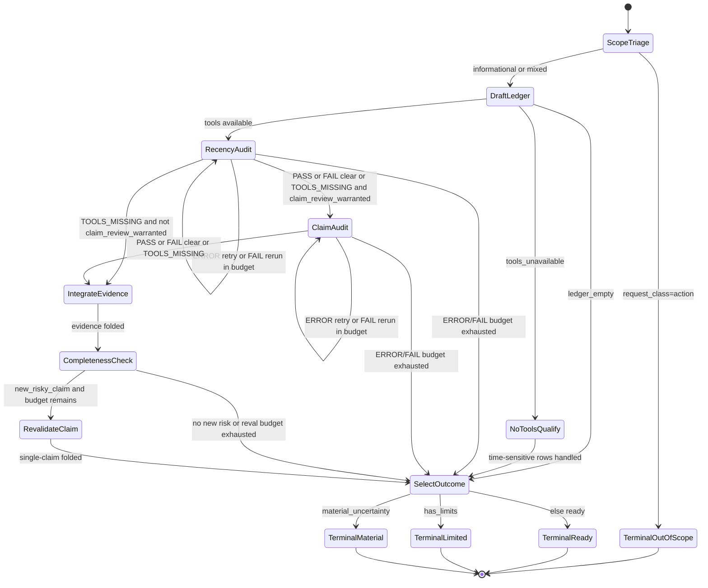

# Recency Guard Flow Diagram

Control-flow source of truth for `recency-guard` as a finite-state machine
(`stateDiagram-v2`). Companion transition table:
[`state-machine.md`](./state-machine.md).

Canonical dispatch-budget numbers live only in
[`references/repair-and-integration.md`](./references/repair-and-integration.md).

## Terminal States

| Terminal | Meaning |
| -------- | ------- |
| `TerminalReady` | Every risky ledger row is verified or cleanly removed; no recorded limits |
| `TerminalLimited` | Direct answer naming qualified, unverifiable, unreviewed, tool, freshness, or routing limits |
| `TerminalMaterial` | Conservative answer naming the unresolved material item |
| `TerminalOutOfScope` | Entire request was a high-impact action; action not performed. Mixed requests continue informationally and surface the routing limit via `TerminalLimited` |
