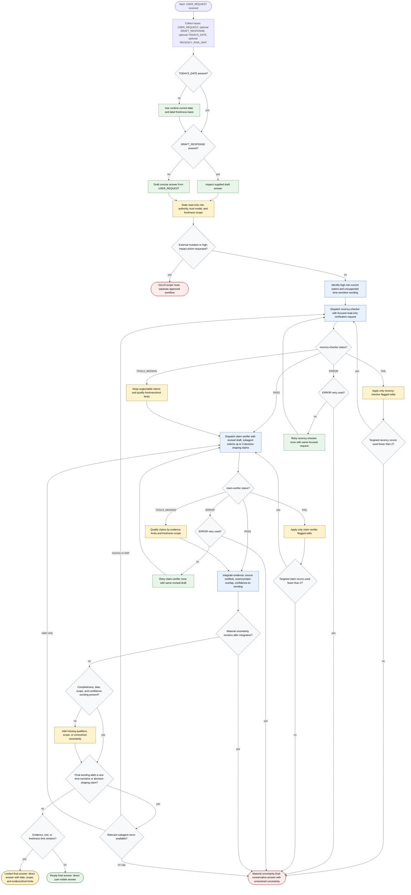

# Recency Guard

Recency Guard is a read-only response-validation workflow. The orchestrator may draft or inspect an answer, identify high-risk current or decision-shaping claims, and dispatch only the `recency-checker` and `claim-verifier` subagents for focused read-only verification. It may apply only subagent-flagged wording edits within the repair limits; it may not mutate external systems, post, purchase, deploy, change policy, or perform high-impact actions.

Readiness rule: Produce the user-visible final answer, not a verification report, unless the user asks for verification details. Final output must include date and scope qualifiers, unresolved material uncertainty, or conservative wording when evidence or tools are limited.

Repair limit: Each subagent gets one initial review plus at most two targeted FAIL reruns. An ERROR retry is separate and allowed once per subagent; a second ERROR or exhausted rerun capacity yields a material uncertainty final.

Mutation boundary: External mutations and high-impact actions stay outside Recency Guard and route to a separate approved workflow.
