# Recency Guard Flow Diagram

Recency Guard is a read-only response-validation workflow. The orchestrator
classifies scope before drafting, maintains a claim ledger, dispatches
`recency-checker` and `claim-verifier`, screens suggested revisions, and selects
the terminal outcome from the ledger decision table.

The canonical dispatch-budget numbers live only in
[`references/repair-and-integration.md`](./references/repair-and-integration.md).

```mermaid
flowchart TD
  START(["Start: USER_REQUEST received"]) --> TRIAGE["Phase 0: collect inputs, default TODAYS_DATE, probe verification tools"]
  TRIAGE --> CLASS{"Request class against high-impact-action list?"}
  CLASS -->|action| OUT_OF_SCOPE(["Out-of-scope route: action not performed, separate user-approved workflow"])
  CLASS -->|mixed| SPLIT["Strip action part and record routing disclosure"]
  CLASS -->|informational| DRAFT_CHECK{"DRAFT_RESPONSE supplied?"}
  SPLIT --> DRAFT_CHECK

  DRAFT_CHECK -->|yes| INSPECT["Inspect supplied draft"]
  DRAFT_CHECK -->|no| DRAFT["Draft concise answer"]
  INSPECT --> LEDGER["Build claim ledger: one unreviewed row per risky claim"]
  DRAFT --> LEDGER

  LEDGER --> ZERO{"Ledger has rows?"}
  ZERO -->|no| FASTPATH["Fast path: note no current-fact dependencies"]
  FASTPATH --> COMPLETE
  ZERO -->|yes| TOOLS{"Verification tools available?"}

  TOOLS -->|no| NOTOOLS["Remove or label time-sensitive claims as unverified model knowledge; mark rows unverifiable"]
  NOTOOLS --> MAT_TEST
  TOOLS -->|yes| REC_DISPATCH["Dispatch recency-checker"]

  REC_DISPATCH --> REC_CONF{"RECENCY_CHECK conforms?"}
  REC_CONF -->|no| REC_ERR{"ERROR retry remains?"}
  REC_CONF -->|yes| REC_STATUS{"RECENCY_CHECK status?"}
  REC_STATUS -->|PASS| CLAIM_DISPATCH
  REC_STATUS -->|FAIL| REC_SCREEN["Screen edits, apply accepted changes, update ledger"]
  REC_STATUS -->|TOOLS_MISSING| REC_TM["Apply no-tools rule to unresolved time-sensitive rows"]
  REC_STATUS -->|ERROR| REC_ERR
  REC_SCREEN --> REC_BUDGET{"Recency budget remains?"}
  REC_BUDGET -->|yes| REC_DISPATCH
  REC_BUDGET -->|no| REC_OPEN["Mark still-flagged rows unverifiable"]
  REC_OPEN --> MAT_TEST
  REC_ERR -->|yes| REC_RETRY["Retry with conformance reminder when malformed"]
  REC_RETRY --> REC_CONF
  REC_ERR -->|no| REC_DEAD["Mark open rows unverifiable"]
  REC_DEAD --> MAT_TEST
  REC_TM --> TM_CONT{"Claim review plausible?"}
  TM_CONT -->|yes| CLAIM_DISPATCH
  TM_CONT -->|no| TM_MARK["Mark decision-shaping candidates unverifiable"]
  TM_MARK --> INTEGRATE

  CLAIM_DISPATCH["Dispatch claim-verifier"] --> CLAIM_CONF{"CLAIM_REVIEW conforms?"}
  CLAIM_CONF -->|no| CLAIM_ERR{"ERROR retry remains?"}
  CLAIM_CONF -->|yes| CLAIM_STATUS{"CLAIM_REVIEW status?"}
  CLAIM_STATUS -->|PASS| RECORD_UNREV["Record every unreviewed candidate as ledger row"]
  CLAIM_STATUS -->|FAIL| CLAIM_SCREEN["Screen edits, apply accepted changes, update ledger"]
  CLAIM_STATUS -->|TOOLS_MISSING| CLAIM_TM["Mark candidates unverifiable and qualify limits"]
  CLAIM_STATUS -->|ERROR| CLAIM_ERR
  CLAIM_SCREEN --> CLAIM_BUDGET{"Claim budget remains?"}
  CLAIM_BUDGET -->|yes| CLAIM_DISPATCH
  CLAIM_BUDGET -->|no| CLAIM_OPEN["Mark still-flagged rows unverifiable"]
  CLAIM_OPEN --> MAT_TEST
  CLAIM_ERR -->|yes| CLAIM_RETRY["Retry with conformance reminder when malformed"]
  CLAIM_RETRY --> CLAIM_CONF
  CLAIM_ERR -->|no| CLAIM_DEAD["Mark open rows unverifiable"]
  CLAIM_DEAD --> MAT_TEST
  CLAIM_TM --> INTEGRATE
  RECORD_UNREV --> INTEGRATE

  INTEGRATE["Integrate: stricter overlap, highest-tier conflicts, confidence to wording, qualify or remove unreviewed claims"] --> COMPLETE{"All deliverables and qualifiers covered?"}
  COMPLETE -->|no| COMPLETE_FIX["Add missing date, scope, evidence, tool-limit, or uncertainty wording"]
  COMPLETE -->|yes| NEW_RISK{"Final wording adds new risky claim?"}
  COMPLETE_FIX --> NEW_RISK

  NEW_RISK -->|yes| REVAL_BUDGET{"Relevant subagent budget remains?"}
  NEW_RISK -->|no| MAT_TEST
  REVAL_BUDGET -->|yes| REVALIDATE["Single-claim revalidation; fold result into ledger"]
  REVAL_BUDGET -->|no| REVAL_MARK["Mark new row unverifiable"]
  REVALIDATE --> MAT_TEST
  REVAL_MARK --> MAT_TEST

  MAT_TEST{"Any material uncertainty condition holds?"}
  MAT_TEST -->|yes| MATERIAL_FINAL(["Material uncertainty final"])
  MAT_TEST -->|no| LIM_TEST{"Any qualified, unverifiable, unreviewed, tool, freshness, or routing limit?"}
  LIM_TEST -->|yes| LIMITED_FINAL(["Limited final answer"])
  LIM_TEST -->|no| READY_FINAL(["Ready final answer"])

  class CLASS,DRAFT_CHECK,ZERO,TOOLS,REC_CONF,REC_STATUS,REC_BUDGET,REC_ERR,TM_CONT,CLAIM_CONF,CLAIM_STATUS,CLAIM_BUDGET,CLAIM_ERR,COMPLETE,NEW_RISK,REVAL_BUDGET,MAT_TEST,LIM_TEST decision;
  class TRIAGE,REC_DISPATCH,CLAIM_DISPATCH,INTEGRATE,REVALIDATE check;
  class SPLIT,NOTOOLS,REC_SCREEN,REC_TM,REC_OPEN,REC_DEAD,TM_MARK,CLAIM_SCREEN,CLAIM_TM,CLAIM_OPEN,CLAIM_DEAD,RECORD_UNREV,COMPLETE_FIX,REVAL_MARK guard;
  class INSPECT,DRAFT,LEDGER,FASTPATH,REC_RETRY,CLAIM_RETRY output;
  class READY_FINAL success;
  class LIMITED_FINAL refine;
  class MATERIAL_FINAL,OUT_OF_SCOPE stop;

  classDef decision fill:#f8f9fa,stroke:#495057,color:#000;
  classDef check fill:#e7f1ff,stroke:#0b5ed7,color:#000;
  classDef guard fill:#fff3cd,stroke:#856404,color:#000;
  classDef output fill:#e8f5e9,stroke:#2e7d32,color:#000;
  classDef success fill:#e8f5e9,stroke:#2e7d32,color:#000;
  classDef refine fill:#fff3cd,stroke:#856404,color:#000;
  classDef stop fill:#fdecea,stroke:#b02a37,color:#000;
```

## Terminal States

| Terminal | Meaning |
| -------- | ------- |
| Ready final answer | Every risky ledger row is verified or cleanly removed; no recorded limits |
| Limited final answer | Direct answer naming qualified, unverifiable, unreviewed, tool, freshness, or routing limits |
| Material uncertainty final | Conservative answer naming the unresolved material item |
| Out-of-scope route | High-impact action not performed and routed to a separate approved workflow |
