# Refactoring Code Flow Diagram

This diagram maps one consent-gated, evidence-isolated, behavior-preserving
refactor cycle per approved target. Human gates are no-change confirmation, web
fetch approval, size-waiver approval, validation-safety approval, and plan
approval. Each dispatched subagent may be retried once for a plausibly transient
`ERROR`.

```mermaid
flowchart TD
  START([Start: refactoring request]) --> INPUTS[Collect inputs: target, goal, command, scope, max lines, reference hint, auto approve, web access]
  INPUTS --> HAS_TARGET{Specific TARGET_PATH?}
  HAS_TARGET -->|no| END_NEEDS_TARGET([NEEDS_CLARIFICATION: target required])
  HAS_TARGET -->|yes| BOUNDARY[Set one-cycle boundary and protected-surfaces reference]

  BOUNDARY --> MAP[Dispatch behavior-mapper: facts, candidates, sizes, risks, baseline]
  MAP --> MAP_STATUS{BEHAVIOR_MAP status}
  MAP_STATUS -->|NEEDS_CLARIFICATION| END_NEEDS_MAP([NEEDS_CLARIFICATION])
  MAP_STATUS -->|ERROR| MAP_RETRY{Transient and retry unused?}
  MAP_RETRY -->|yes| MAP
  MAP_RETRY -->|no| END_ERR_MAP([ERROR])
  MAP_STATUS -->|NO_CHANGE_CANDIDATE| NC_GATE[Present evidence and recommend stopping]
  NC_GATE --> NC_DECIDE{User accepts?}
  NC_DECIDE -->|yes| END_NO_CHANGE([NO_CHANGE])
  NC_DECIDE -->|no| REF_DECIDE
  MAP_STATUS -->|PASS| REF_DECIDE[Resolve reference need from hint and map]

  REF_DECIDE --> REF_PUBLIC{Public source needed?}
  REF_PUBLIC -->|no| REF_LOCAL[Record local or not-needed status]
  REF_PUBLIC -->|yes| WEB_MODE{WEB_ACCESS}
  WEB_MODE -->|pre-approved| FETCH[Fetch smallest URL set]
  WEB_MODE -->|deny| REF_SAFE{Safe from local evidence?}
  WEB_MODE -->|ask| WEB_GATE[Ask once before first fetch]
  WEB_GATE --> WEB_OK{Approved?}
  WEB_OK -->|yes| FETCH
  WEB_OK -->|no| REF_SAFE
  FETCH --> FETCH_OK{Sources available?}
  FETCH_OK -->|yes| REF_FETCHED[Record fetched status]
  FETCH_OK -->|no| REF_SAFE
  REF_SAFE -->|yes| REF_SAFE_STATUS[Record declined or unavailable but safe]
  REF_SAFE -->|no| END_BLOCK_REF([BLOCKED])

  REF_LOCAL --> STRATEGY
  REF_FETCHED --> STRATEGY
  REF_SAFE_STATUS --> STRATEGY
  STRATEGY[Dispatch refactor-strategist] --> STRAT_STATUS{STRATEGY status}
  STRAT_STATUS -->|NO_CHANGE| END_NO_CHANGE
  STRAT_STATUS -->|NEEDS_CLARIFICATION| END_NEEDS_STRAT([NEEDS_CLARIFICATION])
  STRAT_STATUS -->|ERROR| STRAT_RETRY{Transient and retry unused?}
  STRAT_RETRY -->|yes| STRATEGY
  STRAT_RETRY -->|no| END_ERR_STRAT([ERROR])
  STRAT_STATUS -->|PASS| SCOPE_CHECK{Scope checklist passes?}

  SCOPE_CHECK -->|no| END_BLOCK_SCOPE([BLOCKED])
  SCOPE_CHECK -->|yes| WAIVER{Size waiver beyond mechanical exemption?}
  WAIVER -->|yes| WAIVER_GATE[Ask size-waiver approval]
  WAIVER_GATE --> WAIVER_OK{Approved?}
  WAIVER_OK -->|no| END_BLOCK_SIZE([BLOCKED])
  WAIVER_OK -->|yes| VAL_SELECT
  WAIVER -->|no| VAL_SELECT[Select validation contract]

  VAL_SELECT --> VAL_AVAILABLE{Command available?}
  VAL_AVAILABLE -->|no| VAL_WARN[Record validation warning]
  VAL_AVAILABLE -->|yes| CLASSIFY[Classify command safety]
  CLASSIFY --> SAFE_CLASS{Safe?}
  SAFE_CLASS -->|yes| APPROVE_MODE
  SAFE_CLASS -->|no| VAL_GATE[Ask validation approval]
  VAL_GATE --> VAL_OK{Approved?}
  VAL_OK -->|yes| APPROVE_MODE
  VAL_OK -->|no| VAL_FALLBACK{Use warning path?}
  VAL_FALLBACK -->|yes| VAL_WARN
  VAL_FALLBACK -->|no| END_BLOCK_VAL([BLOCKED])
  VAL_WARN --> APPROVE_MODE{AUTO_APPROVE true?}

  APPROVE_MODE -->|yes| IMPLEMENT
  APPROVE_MODE -->|no| PLAN_CARD[Present compact plan card]
  PLAN_CARD --> PLAN_DECIDE{User decision}
  PLAN_DECIDE -->|approve| IMPLEMENT
  PLAN_DECIDE -->|decline| END_NEEDS_PLAN([NEEDS_CLARIFICATION])
  PLAN_DECIDE -->|adjust| ADJ_USED{First adjustment?}
  ADJ_USED -->|yes| STRATEGY
  ADJ_USED -->|no| END_NEEDS_PLAN

  IMPLEMENT[Dispatch refactor-implementer] --> IMPL_STATUS{IMPLEMENTATION status}
  IMPL_STATUS -->|BLOCKED| WT_BLOCK[Build worktree-state block]
  WT_BLOCK --> END_BLOCK_IMPL([BLOCKED])
  IMPL_STATUS -->|ERROR| IMPL_RETRY{Transient and retry unused?}
  IMPL_RETRY -->|yes| IMPLEMENT
  IMPL_RETRY -->|no| WT_ERR[Build worktree-state block]
  WT_ERR --> END_ERR_IMPL([ERROR])
  IMPL_STATUS -->|PASS or PASS_WITH_WARNINGS| REVIEW

  REVIEW[Dispatch refactor-reviewer] --> REV_STATUS{REFACTOR_REVIEW status}
  REV_STATUS -->|ERROR| REV_RETRY{Transient and retry unused?}
  REV_RETRY -->|yes| REVIEW
  REV_RETRY -->|no| END_ERR_REV([ERROR])
  REV_STATUS -->|PASS| WARN_CHECK{Validation warning recorded?}
  WARN_CHECK -->|no| END_PASS([PASS])
  WARN_CHECK -->|yes| END_PASS_WARN([PASS_WITH_WARNINGS])
  REV_STATUS -->|FAIL| LEDGER{Fewer than two fix cycles?}
  LEDGER -->|no| WT_FIX[Build unresolved worktree-state block]
  WT_FIX --> END_BLOCK_LIMIT([BLOCKED])
  LEDGER -->|yes| FIX_SCOPE{Fix stays in strategy and boundary?}
  FIX_SCOPE -->|no| END_BLOCK_FIXSCOPE([BLOCKED])
  FIX_SCOPE -->|yes| FIX_WAIVER{New size waiver?}
  FIX_WAIVER -->|yes| FIX_GATE[Ask fix-waiver approval]
  FIX_GATE --> FIX_OK{Approved?}
  FIX_OK -->|no| END_BLOCK_FIXSIZE([BLOCKED])
  FIX_OK -->|yes| FIX_CONTRACT
  FIX_WAIVER -->|no| FIX_CONTRACT[Increment written ledger and reclassify validation]
  FIX_CONTRACT --> IMPLEMENT

  class NC_GATE,WEB_GATE,WAIVER_GATE,VAL_GATE,PLAN_CARD,FIX_GATE human;
  class END_PASS,END_PASS_WARN success;
  class END_NO_CHANGE,END_NEEDS_TARGET,END_NEEDS_MAP,END_ERR_MAP,END_BLOCK_REF,END_NEEDS_STRAT,END_ERR_STRAT,END_BLOCK_SCOPE,END_BLOCK_SIZE,END_BLOCK_VAL,END_NEEDS_PLAN,END_BLOCK_IMPL,END_ERR_IMPL,END_ERR_REV,END_BLOCK_LIMIT,END_BLOCK_FIXSCOPE,END_BLOCK_FIXSIZE stop;
  classDef human fill:#f3e8ff,stroke:#6f42c1,color:#000;
  classDef success fill:#e8f5e9,stroke:#2e7d32,color:#000;
  classDef stop fill:#fdecea,stroke:#b02a37,color:#000;
```

## Terminal States

| Terminal | Status | Meaning |
| -------- | ------ | ------- |
| `END_PASS` | `PASS` | Reviewed refactor with executed validation and coverage evidence. |
| `END_PASS_WARN` | `PASS_WITH_WARNINGS` | Reviewed refactor completed with validation warning evidence. |
| `END_NO_CHANGE` | `NO_CHANGE` | Evidence-backed stop because no useful refactor is justified. |
| `END_NEEDS_*` | `NEEDS_CLARIFICATION` | One user decision is required. |
| `END_BLOCK_*` | `BLOCKED` | Boundary, gate, approval, implementation, or fix limit stopped the run. |
| `END_ERR_*` | `ERROR` | A subagent failed after its single transient retry. |

Readiness rule: `PASS` only after the implementer ran the approved validation
contract with coverage evidence and the reviewer returned `REFACTOR_REVIEW:
PASS`. Any recorded validation warning caps the run at `PASS_WITH_WARNINGS`.
