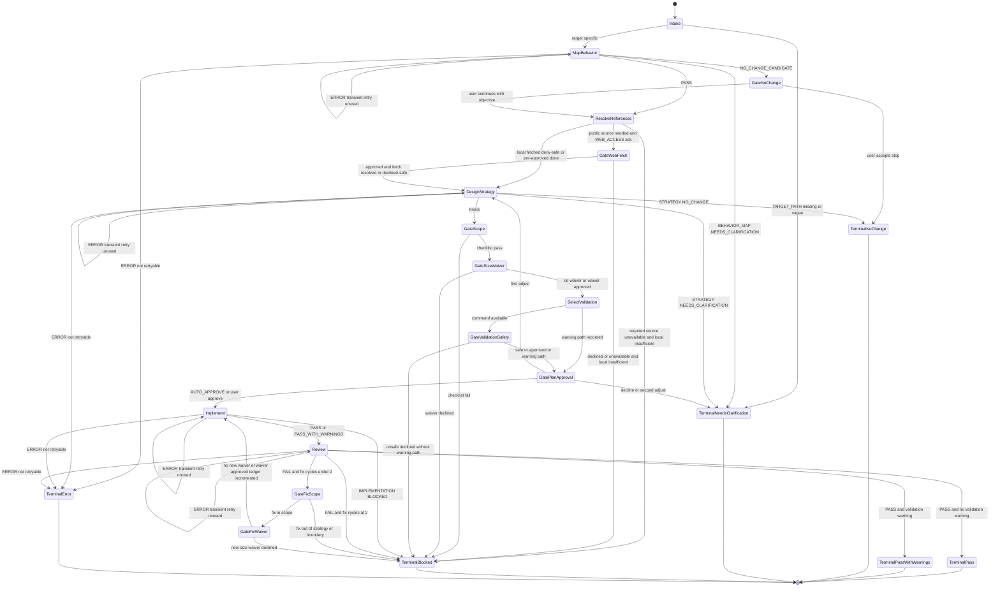

# Refactoring Code Flow

Finite-state control flow for the `refactoring-code` orchestrator
(`stateDiagram-v2`). Companion transition table:
[`state-machine.md`](./state-machine.md).

One FSM instance runs per approved target. Human gates: no-change confirmation,
web fetch, size waiver, validation safety, plan approval, and fix waiver.
Each dispatched subagent may be retried once for a plausibly transient `ERROR`.

## Canonical Rules

- Multi-target: user-enumerated targets only; each target is one FSM run;
  aggregate status is the worst per the order in `state-machine.md`.
- `PASS` requires executed validation with coverage evidence and
  `REFACTOR_REVIEW: PASS`. Any validation warning caps at `PASS_WITH_WARNINGS`.
- Plan mutation starts only after plan approval unless `AUTO_APPROVE=true` was
  supplied and recorded.
- Fix loop: at most two ledgered cycles; fix-waiver is a first-class human gate.
- Transient retry: one retry only when the failure matches the operational
  criteria in `SKILL.md` / `state-machine.md`.
- Never auto-revert; failure handoffs include worktree-state when edits occurred.
