# Refactoring Code

This workflow coordinates one deterministic, behavior-preserving refactor cycle for a required `TARGET_PATH`. The orchestrator owns phase routing, evidence handoffs, permission gates, and final status; `behavior-mapper`, `refactor-strategist`, `refactor-implementer`, and `refactor-reviewer` keep inspection, strategy, implementation plus validation, and review isolated. The workflow may inspect code, delegate safe validation, apply mechanical test import/path/name updates required by an approved refactor, and fetch optional public references only for concrete strategy or review decisions when allowed; it must stop instead of normalizing behavior, public API, test intent, scope, state, unrelated worktree, destructive validation, public web, or file-size waiver changes outside the approved behavior-preserving refactor boundary.

```mermaid
flowchart TD
  START([Start: refactoring request]) --> INPUTS["Collect inputs: TARGET_PATH, USER_GOAL, TEST_COMMAND, SCOPE_LIMITS, MAX_LINES, REFERENCE_NEED"]
  INPUTS --> HAS_TARGET{TARGET_PATH provided?}
  HAS_TARGET -->|no| ASK_PATH["Ask one focused question for target path"]
  ASK_PATH --> STOP_NEEDS_TARGET([NEEDS_CLARIFICATION: TARGET_PATH required])
  HAS_TARGET -->|yes| BOUNDARY["Set behavior-preserving boundary: one target cycle, stable public surface, stable test intent, no unrelated worktree changes"]

  BOUNDARY --> MAP["Dispatch behavior-mapper: inspect target, callers, dependencies, tests, behavior, side effects, risks, and file sizes"]
  MAP --> MAP_STATUS{BEHAVIOR_MAP status}
  MAP_STATUS -->|NEEDS_CLARIFICATION| MAP_QUESTION["Return mapper question and stop"]
  MAP_QUESTION --> STOP_NEEDS_MAP([NEEDS_CLARIFICATION: mapper decision required])
  MAP_STATUS -->|ERROR| STOP_ERROR_MAP([ERROR: behavior mapping failed])
  MAP_STATUS -->|PASS or NO_CHANGE_CANDIDATE| MAP_REPORT["Receive BEHAVIOR_MAP report: facts, uncertainty, validation option, file sizes, risk notes"]

  MAP_REPORT --> REF_PLAN["Resolve REFERENCE_NEED: none, bundled/local only, or concrete public source for strategy/review decision"]
  REF_PLAN --> REF_PUBLIC{Public source needed now?}
  REF_PUBLIC -->|no| REF_LOCAL["Record reference status: not needed or bundled-local-only"]
  REF_PUBLIC -->|yes| WEB_ALLOWED{Public web access already allowed by runtime and user?}
  WEB_ALLOWED -->|yes| FETCH_REFS["Fetch smallest matching public sources and record URLs"]
  WEB_ALLOWED -->|no| WEB_GATE["Ask approval for public web fetch: sources, target decision, reason, risk, bundled-only alternative, audit note"]
  WEB_GATE --> WEB_APPROVED{User approves?}
  WEB_APPROVED -->|approved| FETCH_REFS
  WEB_APPROVED -->|declined| REF_DECLINED["Record reference event: public source declined"]
  FETCH_REFS --> REF_FETCHED{Sources available?}
  REF_FETCHED -->|yes| REF_FETCHED_STATUS["Record reference status: fetched URLs"]
  REF_FETCHED -->|no| REF_UNAVAILABLE["Record reference event: public source unavailable"]
  REF_DECLINED --> REF_DECLINED_SAFE_CHECK{Can decide safely from local evidence after declined source?}
  REF_UNAVAILABLE --> REF_UNAVAILABLE_SAFE_CHECK{Can decide safely from local evidence after unavailable source?}
  REF_DECLINED_SAFE_CHECK -->|yes| REF_DECLINED_SAFE["Record reference status: declined-but-safe"]
  REF_DECLINED_SAFE_CHECK -->|no| STOP_BLOCKED_REFERENCE([BLOCKED: required reference unavailable or declined])
  REF_UNAVAILABLE_SAFE_CHECK -->|yes| REF_UNAVAILABLE_SAFE["Record reference status: unavailable-but-safe"]
  REF_UNAVAILABLE_SAFE_CHECK -->|no| STOP_BLOCKED_REFERENCE

  REF_LOCAL --> STRATEGY
  REF_FETCHED_STATUS --> STRATEGY
  REF_DECLINED_SAFE --> STRATEGY
  REF_UNAVAILABLE_SAFE --> STRATEGY
  STRATEGY["Dispatch refactor-strategist: choose smallest useful behavior-preserving plan; report diagnosis, non-goals, file-size plan, and reference status"] --> STRATEGY_STATUS{STRATEGY status}
  STRATEGY_STATUS -->|NO_CHANGE| STOP_NO_CHANGE([NO_CHANGE: report behavior, diagnosis, reason no refactor is useful, and validation if run])
  STRATEGY_STATUS -->|NEEDS_CLARIFICATION| STRATEGY_QUESTION["Return smallest required strategy decision"]
  STRATEGY_QUESTION --> STOP_NEEDS_STRATEGY([NEEDS_CLARIFICATION: strategy decision required])
  STRATEGY_STATUS -->|ERROR| STOP_ERROR_STRATEGY([ERROR: strategy failed])
  STRATEGY_STATUS -->|PASS| SCOPE_DRIFT{Plan requires behavior, public API, test-intent, scope, state, or unrelated worktree change?}

  SCOPE_DRIFT -->|yes| STOP_BLOCKED_SCOPE([BLOCKED: out-of-scope change; reframe outside this behavior-preserving workflow])
  SCOPE_DRIFT -->|no| SIZE_WAIVER{Strategy records file-size waiver?}
  SIZE_WAIVER -->|yes| SIZE_GATE["Ask approval for file-size waiver: target file, reason, risk, split alternative, audit note"]
  SIZE_GATE --> SIZE_APPROVED{User approves?}
  SIZE_APPROVED -->|declined| STOP_BLOCKED_SIZE([BLOCKED: file-size waiver declined or missing])
  SIZE_APPROVED -->|approved| VALIDATION_SELECT
  SIZE_WAIVER -->|no| VALIDATION_SELECT["Choose validation contract for implementer: TEST_COMMAND, mapper command, smallest safe check, or warning"]

  VALIDATION_SELECT --> VALIDATION_AVAILABLE{Safe validation command available?}
  VALIDATION_AVAILABLE -->|no| VALIDATION_WARNING["Record validation warning for implementer: not run, unavailable, or pre-existing failure as residual risk"]
  VALIDATION_WARNING --> IMPLEMENT
  VALIDATION_AVAILABLE -->|yes| VALIDATION_DESTRUCTIVE{Validation command destructive or state-mutating?}
  VALIDATION_DESTRUCTIVE -->|yes| VALIDATION_GATE["Ask approval for validation command: action, target state, reason, risk, reversibility, safer alternative, audit note"]
  VALIDATION_GATE --> VALIDATION_APPROVED{User approves?}
  VALIDATION_APPROVED -->|declined| STOP_BLOCKED_VALIDATION([BLOCKED: validation approval declined or missing])
  VALIDATION_APPROVED -->|approved| IMPLEMENT
  VALIDATION_DESTRUCTIVE -->|no| IMPLEMENT["Dispatch refactor-implementer: apply approved plan or review fixes, run approved safe validation, and return IMPLEMENTATION report"]

  IMPLEMENT --> IMPLEMENT_STATUS{IMPLEMENTATION status}
  IMPLEMENT_STATUS -->|BLOCKED| STOP_BLOCKED_IMPLEMENT([BLOCKED: implementation stopped; report reason, files touched, recovery])
  IMPLEMENT_STATUS -->|ERROR| STOP_ERROR_IMPLEMENT([ERROR: implementation failed])
  IMPLEMENT_STATUS -->|PASS or PASS_WITH_WARNINGS| IMPLEMENT_REPORT["Consume IMPLEMENTATION report: changes, behavior preservation, file sizes, validation summary, deviations"]

  IMPLEMENT_REPORT --> REVIEW["Dispatch refactor-reviewer with behavior map, strategy, implementation report, MAX_LINES, policy paths, and reference status"]
  REVIEW --> REVIEW_STATUS{REFACTOR_REVIEW status}
  REVIEW_STATUS -->|ERROR| STOP_ERROR_REVIEW([ERROR: review failed])
  REVIEW_STATUS -->|PASS| HANDOFF["Build final handoff: behavior summary, design diagnosis, code changes, validation note, review outcome, file-size compliance, improvement summary"]
  HANDOFF --> DONE([PASS: final user handoff])

  REVIEW_STATUS -->|FAIL| FIX_COUNT{Fewer than two targeted fix cycles used?}
  FIX_COUNT -->|no| STOP_BLOCKED_REVIEW([BLOCKED: unresolved review findings after two fix cycles])
  FIX_COUNT -->|yes| FIX_SCOPE{Reviewer-required fix stays behavior-preserving, preserves test intent, and remains within approved strategy?}
  FIX_SCOPE -->|no| STOP_BLOCKED_FIX_SCOPE([BLOCKED: required fix is out of scope for behavior-preserving refactor])
  FIX_SCOPE -->|yes| FIX_WAIVER{Fix needs new file-size waiver?}
  FIX_WAIVER -->|yes| FIX_SIZE_GATE["Ask approval for file-size waiver: target file, reason, risk, split alternative, audit note"]
  FIX_SIZE_GATE --> FIX_SIZE_APPROVED{User approves?}
  FIX_SIZE_APPROVED -->|declined| STOP_BLOCKED_FIX_SIZE([BLOCKED: fix waiver declined or missing])
  FIX_SIZE_APPROVED -->|approved| FIX_VALIDATION_SELECT
  FIX_WAIVER -->|no| FIX_VALIDATION_SELECT["Update validation contract for targeted reviewer fixes"]
  FIX_VALIDATION_SELECT --> VALIDATION_AVAILABLE

  class HAS_TARGET,MAP_STATUS,REF_PUBLIC,WEB_ALLOWED,WEB_APPROVED,REF_FETCHED,REF_DECLINED_SAFE_CHECK,REF_UNAVAILABLE_SAFE_CHECK,STRATEGY_STATUS,SCOPE_DRIFT,SIZE_WAIVER,SIZE_APPROVED,VALIDATION_AVAILABLE,VALIDATION_DESTRUCTIVE,VALIDATION_APPROVED,IMPLEMENT_STATUS,REVIEW_STATUS,FIX_COUNT,FIX_SCOPE,FIX_WAIVER,FIX_SIZE_APPROVED decision;
  class MAP,MAP_REPORT,FETCH_REFS,STRATEGY,VALIDATION_SELECT,FIX_VALIDATION_SELECT,IMPLEMENT,IMPLEMENT_REPORT,REVIEW check;
  class WEB_GATE,SIZE_GATE,VALIDATION_GATE,FIX_SIZE_GATE human;
  class BOUNDARY,REF_PLAN,REF_LOCAL,REF_DECLINED,REF_UNAVAILABLE,REF_FETCHED_STATUS,REF_DECLINED_SAFE,REF_UNAVAILABLE_SAFE,VALIDATION_WARNING guard;
  class HANDOFF output;
  class DONE success;
  class ASK_PATH,MAP_QUESTION,STRATEGY_QUESTION refine;
  class STOP_NEEDS_TARGET,STOP_NEEDS_MAP,STOP_NEEDS_STRATEGY,STOP_NO_CHANGE,STOP_BLOCKED_REFERENCE,STOP_BLOCKED_SCOPE,STOP_BLOCKED_SIZE,STOP_BLOCKED_VALIDATION,STOP_BLOCKED_IMPLEMENT,STOP_BLOCKED_REVIEW,STOP_BLOCKED_FIX_SCOPE,STOP_BLOCKED_FIX_SIZE,STOP_ERROR_MAP,STOP_ERROR_STRATEGY,STOP_ERROR_IMPLEMENT,STOP_ERROR_REVIEW stop;

  classDef guard fill:#fff3cd,stroke:#856404,color:#000;
  classDef check fill:#e7f1ff,stroke:#0b5ed7,color:#000;
  classDef decision fill:#f8f9fa,stroke:#495057,color:#000;
  classDef human fill:#f3e8ff,stroke:#6f42c1,color:#000;
  classDef output fill:#e8f5e9,stroke:#2e7d32,color:#000;
  classDef success fill:#e8f5e9,stroke:#2e7d32,color:#000;
  classDef refine fill:#fff3cd,stroke:#856404,color:#000;
  classDef stop fill:#fdecea,stroke:#b02a37,color:#000;
```

Final user-facing status rule: start with `Status: PASS`, `Status: NO_CHANGE`, `Status: NEEDS_CLARIFICATION`, `Status: BLOCKED`, or `Status: ERROR`. Build the final handoff only after the implementer has run validation or recorded a validation warning and `refactor-reviewer` returns `PASS`; otherwise stop with the smallest reason, next decision needed, validation already completed, and remaining risks.
