# Responding to PR Review Comments

This workflow covers a PR review-response orchestrator that treats PR review
comments as proposals to evaluate, not instructions to accept by default. The
agent may normalize inputs, derive and validate a report path, collect complete
GitHub and repository evidence, dispatch focused subagents, classify comments,
draft replies, verify evidence and tone, write a local Markdown report, and
optionally post exact user-approved replies to supported GitHub review-comment
threads. Raw payloads, long diffs, long docs, and command output stay out of
compact orchestrator state. Mutations are bounded: the verified local report
path is the only write target before posting, and posting requires explicit
approval of the exact final preview.

```mermaid
flowchart TD
  START([Start: PR comment-response run]) --> INTAKE["Normalize PR_URL, POSTING_MODE, LANGUAGE_STYLE, COMMENT_SCOPE, and RESPONDER_LOGIN; no writes or posts"]

  INTAKE --> PRURL{PR_URL present and unambiguous?}
  PRURL -->|no| PRURL_LIMIT{PR_URL question cycles fewer than 3?}
  PRURL_LIMIT -->|yes| ASK_PR[Ask one focused question for PR_URL]
  ASK_PR --> INTAKE
  PRURL_LIMIT -->|no| NEEDS_DECISION(["PR_COMMENT_RESPONSE: NEEDS_USER_DECISION"])

  PRURL -->|yes| DERIVE_OUTPUT["Derive deterministic default OUTPUT_FILE from PR number when omitted; preserve unresolved user-supplied paths as pending"]
  DERIVE_OUTPUT --> OUTPUT_PRECHECK{OUTPUT_FILE safe and resolved before report writing?}
  OUTPUT_PRECHECK -->|safe default or resolved path| COLLECT["Dispatch review-comment-collector: fetch PR metadata, review comments, review summaries, issue comments, existing replies, pagination status, unresolved/thread metadata, and compact reply-target metadata"]
  OUTPUT_PRECHECK -->|unsafe, ambiguous, or unresolved user path| OUTPUT_LIMIT{OUTPUT_FILE question cycles fewer than 3?}
  OUTPUT_LIMIT -->|yes| ASK_OUTPUT[Ask for safe OUTPUT_FILE or approval of default local report path]
  ASK_OUTPUT --> DERIVE_OUTPUT
  OUTPUT_LIMIT -->|no| NEEDS_DECISION

  COLLECT --> COLLECT_STATUS{COLLECT status?}
  COLLECT_STATUS -->|AUTH| AUTH(["PR_COMMENT_RESPONSE: AUTH"])
  COLLECT_STATUS -->|NOT_FOUND| NOT_FOUND(["PR_COMMENT_RESPONSE: NOT_FOUND"])
  COLLECT_STATUS -->|ERROR| RESPONSE_ERROR(["PR_COMMENT_RESPONSE: RESPONSE_ERROR"])
  COLLECT_STATUS -->|NO_COMMENTS| NO_COMMENTS(["PR_COMMENT_RESPONSE: NO_COMMENTS"])
  COLLECT_STATUS -->|PASS| COLLECTION_COMPLETE{Collection completeness gate passed?}

  COLLECTION_COMPLETE -->|paginated sources complete or limitations recorded| TAXONOMY[Normalize deterministic target taxonomy]
  COLLECTION_COMPLETE -->|missing required pages or unrecorded limitation| COLLECT_REPAIR_USED{Collection completeness repair already used?}
  COLLECT_REPAIR_USED -->|no| COLLECT_REPAIR["Repair collector request with pagination or gh api --paginate; record unresolved-thread metadata limitations explicitly"]
  COLLECT_REPAIR --> COLLECT
  COLLECT_REPAIR_USED -->|yes| RESPONSE_ERROR

  TAXONOMY --> TARGET_TYPE{Comment or target type?}
  TARGET_TYPE -->|pull request review comment| REVIEW_COMMENT["Mark supported target as review-comment-reply:<root-id>; <root-id> is the root top-level review-comment ID"]
  TARGET_TYPE -->|reply to review comment| REVIEW_REPLY_ROOT{Root top-level review-comment ID exists?}
  TARGET_TYPE -->|review summary| REVIEW_SUMMARY["Mark target requires-user-choice:review-summary and disposition unsupported-or-needs-user-choice"]
  TARGET_TYPE -->|issue or top-level PR comment| ISSUE_COMMENT["Mark target requires-user-choice:issue-comment and disposition unsupported-or-needs-user-choice"]
  TARGET_TYPE -->|unresolved metadata unavailable| UNRESOLVED_UNKNOWN["Mark target requires-user-choice:unresolved-metadata and disposition unsupported-or-needs-user-choice; do not infer thread resolution"]

  REVIEW_COMMENT --> RESOLVED_THREAD
  REVIEW_REPLY_ROOT -->|yes| REVIEW_REPLY["Map to review-comment-reply:<root-id> using the root top-level review-comment ID, not the reply ID"]
  REVIEW_REPLY_ROOT -->|no| UNSUPPORTED_REVIEW_REPLY["Mark target requires-user-choice:unsupported-review-reply and disposition unsupported-or-needs-user-choice"]
  REVIEW_REPLY --> RESOLVED_THREAD
  REVIEW_SUMMARY --> UNSUPPORTED_DISPOSITION
  ISSUE_COMMENT --> UNSUPPORTED_DISPOSITION
  UNRESOLVED_UNKNOWN --> UNSUPPORTED_DISPOSITION
  UNSUPPORTED_REVIEW_REPLY --> UNSUPPORTED_DISPOSITION
  UNSUPPORTED_DISPOSITION[Preserve disposition unsupported-or-needs-user-choice] --> ASSESS

  RESOLVED_THREAD{Review-comment thread resolved?}
  RESOLVED_THREAD -->|yes| SKIP_RESOLVED[Mark disposition skipped-resolved; capture resolution evidence]
  RESOLVED_THREAD -->|no| EXISTING_REPLY{Existing reply by RESPONDER_LOGIN?}
  RESOLVED_THREAD -->|metadata unavailable| UNSUPPORTED_DISPOSITION
  EXISTING_REPLY -->|no| REPLY_READY[Mark disposition reply-ready]
  EXISTING_REPLY -->|yes| FOLLOWUP_WARRANTED{Follow-up warranted by reviewer clarification or new material information?}
  FOLLOWUP_WARRANTED -->|no| SKIP_REPLIED[Mark disposition skipped-already-replied; capture existing reply evidence]
  FOLLOWUP_WARRANTED -->|yes| FOLLOWUP_RECORD[Mark disposition follow-up-ready; record follow-up reason and evidence in report]
  SKIP_RESOLVED --> ASSESS
  SKIP_REPLIED --> ASSESS
  REPLY_READY --> ASSESS
  FOLLOWUP_RECORD --> ASSESS

  ASSESS["Dispatch review-comment-assessor: evaluate evidence, risk, action intent, support level, target support, and reply path"] --> ASSESS_STATUS{ASSESS status?}
  ASSESS_STATUS -->|NEEDS_CONTEXT| ASSESS_CONTEXT{Narrow context redispatch already used for this item?}
  ASSESS_CONTEXT -->|no| NARROW_LOOKUP[Run one focused repository, GitHub, CI, issue, or diff lookup; keep compact evidence only]
  NARROW_LOOKUP --> ASSESS
  ASSESS_CONTEXT -->|yes| RESPONSE_ERROR
  ASSESS_STATUS -->|NEEDS_USER_DECISION| DECISION_KIND{Decision type?}
  ASSESS_STATUS -->|ERROR| RESPONSE_ERROR
  ASSESS_STATUS -->|PASS| SOURCE_NEEDED{Recency-sensitive source-backed claim needed?}

  DECISION_KIND -->|product or team preference| PRODUCT_LIMIT{Product or team-preference cycles fewer than 3?}
  PRODUCT_LIMIT -->|yes| ASK_PRODUCT[Ask one focused product or team-preference question; record answer as evidence]
  ASK_PRODUCT --> ASSESS
  PRODUCT_LIMIT -->|no| NEEDS_DECISION
  DECISION_KIND -->|unsupported target choice| TARGET_LIMIT{Target-choice cycles fewer than 3?}
  TARGET_LIMIT -->|yes| ASK_TARGET[Ask whether to keep draft-only, convert to report-only note, or provide manual posting guidance]
  ASK_TARGET --> ASSESS
  TARGET_LIMIT -->|no| NEEDS_DECISION

  SOURCE_NEEDED -->|yes| FETCH_SOURCE[Fetch the smallest current official source needed for the claim]
  SOURCE_NEEDED -->|no| DRAFT
  FETCH_SOURCE --> SOURCE_STATUS{Source status?}
  SOURCE_STATUS -->|available| SOURCE_RECORD[Record claim, source, date, and reason]
  SOURCE_RECORD --> DRAFT
  SOURCE_STATUS -->|fetch failure| SOURCE_FAILURE[Remove or qualify the source-backed claim, or ask for user-provided source when needed]
  SOURCE_FAILURE --> SOURCE_RECOVERED{Claim still usable?}
  SOURCE_RECOVERED -->|yes| DRAFT
  SOURCE_RECOVERED -->|no| NEEDS_DECISION
  SOURCE_STATUS -->|source conflict| SOURCE_CONFLICT[Record conflict, prefer official current source, and ask user when policy or product intent decides]
  SOURCE_CONFLICT --> CONFLICT_DECISION{Conflict requires user decision?}
  CONFLICT_DECISION -->|yes| NEEDS_DECISION
  CONFLICT_DECISION -->|no| DRAFT

  DRAFT["Dispatch reply-drafter: draft natural replies, action intents, unsupported-target handling, and required phase status blocks"] --> DRAFT_STATUS{DRAFT status?}
  DRAFT_STATUS -->|NEEDS_USER_DECISION| WORDING_LIMIT{Wording-choice cycles fewer than 3?}
  WORDING_LIMIT -->|yes| ASK_WORDING[Ask one focused wording or response-choice question]
  ASK_WORDING --> DRAFT
  WORDING_LIMIT -->|no| NEEDS_DECISION
  DRAFT_STATUS -->|ERROR| RESPONSE_ERROR
  DRAFT_STATUS -->|PASS| VERIFY

  VERIFY["Dispatch response-verifier: verify evidence, tone, action intent, skipped/report-only reasons, follow-up warrants, scope, target support, status blocks, report readiness, and posting safety"] --> VERIFY_STATUS{VERIFY status?}
  VERIFY_STATUS -->|NEEDS_CONTEXT| VERIFY_CONTEXT{Targeted verification context cycles fewer than 2 for this item?}
  VERIFY_CONTEXT -->|yes| VERIFY_LOOKUP[Repair only named collector, assessor, or drafter context gap]
  VERIFY_LOOKUP --> VERIFY
  VERIFY_CONTEXT -->|no| VERIFY_FAIL(["PR_COMMENT_RESPONSE: VERIFY_FAIL"])
  VERIFY_STATUS -->|FAIL with fix target| VERIFY_REPAIR{Targeted verification fix cycles fewer than 2 for this item?}
  VERIFY_REPAIR -->|yes| REPAIR[Repair only the named collector, assessor, or drafter target]
  REPAIR --> VERIFY
  VERIFY_REPAIR -->|no| VERIFY_FAIL
  VERIFY_STATUS -->|ERROR| RESPONSE_ERROR
  VERIFY_STATUS -->|PASS| OUTPUT_STILL_SAFE{Prevalidated OUTPUT_FILE still known and safe?}

  OUTPUT_STILL_SAFE -->|no| OUTPUT_LIMIT
  OUTPUT_STILL_SAFE -->|yes| WRITE_REPORT["Dispatch response-report-writer: write verified Markdown report following references/report-template.md with Posting Status not-posted or pending-confirmation"]
  WRITE_REPORT --> WRITE_STATUS{WRITE status?}
  WRITE_STATUS -->|ERROR| WRITE_ERROR(["PR_COMMENT_RESPONSE: WRITE_ERROR"])
  WRITE_STATUS -->|PASS| READ_BACK[Read back report and verify path, status blocks, drafts, evidence, skipped/report-only items, residual risks, blocking user-decision items, action intents, and posting status]
  READ_BACK --> READBACK_OK{Read-back verification passes?}
  READBACK_OK -->|no| WRITE_ERROR
  READBACK_OK -->|yes| POST_MODE{POSTING_MODE value?}

  POST_MODE -->|draft-only| NOT_POSTED(["PR_COMMENT_RESPONSE: PASS<br/>Posting: not-posted"])
  POST_MODE -->|post-after-confirmation| BUILD_PREVIEW["Build exact final posting preview only for supported review-comment-reply:<root-id> targets with reply-ready or follow-up-ready disposition"]
  POST_MODE -->|unsupported or ambiguous| NEEDS_DECISION

  BUILD_PREVIEW --> PREVIEW_READY{Preview can be built?}
  PREVIEW_READY -->|yes| PREVIEW[Show exact reply text, target thread, root ID, reason, risk, reversibility, skipped unsupported or report-only targets, and safer draft-only alternative]
  PREVIEW_READY -->|unsupported target detected| CONTRACT_REPAIR_LIMIT{Unsupported-target contract repair cycles fewer than 2?}
  PREVIEW_READY -->|no supported targets remain| OUTCOME_NOT_POSTED[Set posting outcome record: not-posted with unsupported or report-only reason]
  PREVIEW_READY -->|GitHub auth unavailable| OUTCOME_AUTH[Set posting outcome record: auth failure with reason and next action]
  PREVIEW_READY -->|error| OUTCOME_PREVIEW_ERROR[Set posting outcome record: preview-failed with reason and next action]

  CONTRACT_REPAIR_LIMIT -->|yes| CONTRACT_REPAIR["Contract repair: remove unsupported target from poster package, preserve requires-user-choice target and unsupported-or-needs-user-choice disposition in report, then reverify"]
  CONTRACT_REPAIR --> VERIFY
  CONTRACT_REPAIR_LIMIT -->|no| OUTCOME_POST_ERROR[Set posting outcome record: failed contract repair with reason and next action]

  PREVIEW --> APPROVAL{User explicitly approves exact final preview?}
  APPROVAL -->|declined| OUTCOME_CANCELLED[Set posting outcome record: cancelled by user]
  APPROVAL -->|needs wording change| APPROVAL_LIMIT{Posting-preview decision cycles fewer than 3?}
  APPROVAL_LIMIT -->|yes| ASK_PREVIEW[Ask one focused preview-change question, then redraft affected replies]
  ASK_PREVIEW --> DRAFT
  APPROVAL_LIMIT -->|no| NEEDS_DECISION
  APPROVAL -->|approved| POST["Dispatch thread-reply-poster: post exact approved replies only to supported review-comment-reply:<root-id> targets not skipped/report-only"]

  POST --> POST_STATUS{POST status?}
  POST_STATUS -->|PASS| OUTCOME_POSTED[Set posting outcome record: posted with posted reply IDs and URLs]
  POST_STATUS -->|AUTH| OUTCOME_AUTH
  POST_STATUS -->|TARGET_UNSUPPORTED| CONTRACT_REPAIR_LIMIT
  POST_STATUS -->|PREVIEW_REQUIRED| POST_PREVIEW_LIMIT{Posting-preview repair cycles fewer than 2?}
  POST_PREVIEW_LIMIT -->|yes| BUILD_PREVIEW
  POST_PREVIEW_LIMIT -->|no| NEEDS_DECISION
  POST_STATUS -->|ERROR| OUTCOME_POST_ERROR

  OUTCOME_NOT_POSTED --> SYNC_REPORT["Dispatch response-report-writer to sync report posting status, posted/skipped counts, terminal reason, and final envelope intent"]
  OUTCOME_AUTH --> SYNC_REPORT
  OUTCOME_PREVIEW_ERROR --> SYNC_REPORT
  OUTCOME_CANCELLED --> SYNC_REPORT
  OUTCOME_POSTED --> SYNC_REPORT
  OUTCOME_POST_ERROR --> SYNC_REPORT

  SYNC_REPORT --> SYNC_STATUS{Sync write and orchestrator read-back pass?}
  SYNC_STATUS -->|no| WRITE_ERROR
  SYNC_STATUS -->|yes| OUTCOME_KIND{Posting outcome kind?}
  OUTCOME_KIND -->|not-posted| NOT_POSTED
  OUTCOME_KIND -->|auth| AUTH
  OUTCOME_KIND -->|preview-failed or post-error| POST_ERROR(["PR_COMMENT_RESPONSE: POST_ERROR"])
  OUTCOME_KIND -->|cancelled| CANCELLED(["PR_COMMENT_RESPONSE: CANCELLED<br/>Posting: cancelled"])
  OUTCOME_KIND -->|posted| POSTED(["PR_COMMENT_RESPONSE: PASS<br/>Posting: posted"])

  classDef check fill:#e7f1ff,stroke:#0b5ed7,color:#000;
  classDef decision fill:#f8f9fa,stroke:#495057,color:#000;
  classDef human fill:#f3e8ff,stroke:#6f42c1,color:#000;
  classDef success fill:#e8f5e9,stroke:#2e7d32,color:#000;
  classDef stop fill:#fdecea,stroke:#b02a37,color:#000;

  class PRURL,PRURL_LIMIT,OUTPUT_PRECHECK,OUTPUT_LIMIT,COLLECT_STATUS,COLLECTION_COMPLETE,COLLECT_REPAIR_USED,TARGET_TYPE,REVIEW_REPLY_ROOT,RESOLVED_THREAD,EXISTING_REPLY,FOLLOWUP_WARRANTED,ASSESS_STATUS,ASSESS_CONTEXT,DECISION_KIND,PRODUCT_LIMIT,TARGET_LIMIT,SOURCE_NEEDED,SOURCE_STATUS,SOURCE_RECOVERED,CONFLICT_DECISION,DRAFT_STATUS,WORDING_LIMIT,VERIFY_STATUS,VERIFY_CONTEXT,VERIFY_REPAIR,OUTPUT_STILL_SAFE,WRITE_STATUS,READBACK_OK,POST_MODE,PREVIEW_READY,CONTRACT_REPAIR_LIMIT,APPROVAL,APPROVAL_LIMIT,POST_STATUS,POST_PREVIEW_LIMIT,SYNC_STATUS,OUTCOME_KIND decision;
  class INTAKE,DERIVE_OUTPUT,COLLECT,COLLECT_REPAIR,TAXONOMY,REVIEW_COMMENT,REVIEW_REPLY,UNSUPPORTED_REVIEW_REPLY,REVIEW_SUMMARY,ISSUE_COMMENT,UNRESOLVED_UNKNOWN,UNSUPPORTED_DISPOSITION,SKIP_RESOLVED,SKIP_REPLIED,REPLY_READY,FOLLOWUP_RECORD,ASSESS,NARROW_LOOKUP,FETCH_SOURCE,SOURCE_RECORD,SOURCE_FAILURE,SOURCE_CONFLICT,DRAFT,VERIFY,VERIFY_LOOKUP,REPAIR,WRITE_REPORT,READ_BACK,BUILD_PREVIEW,CONTRACT_REPAIR,POST,OUTCOME_NOT_POSTED,OUTCOME_AUTH,OUTCOME_PREVIEW_ERROR,OUTCOME_CANCELLED,OUTCOME_POSTED,OUTCOME_POST_ERROR,SYNC_REPORT check;
  class ASK_PR,ASK_OUTPUT,ASK_PRODUCT,ASK_TARGET,ASK_WORDING,PREVIEW,ASK_PREVIEW human;
  class NOT_POSTED,POSTED success;
  class AUTH,NOT_FOUND,NO_COMMENTS,NEEDS_DECISION,RESPONSE_ERROR,VERIFY_FAIL,WRITE_ERROR,POST_ERROR,CANCELLED stop;
```

Report shape: the written report follows
[`references/report-template.md`](./references/report-template.md). Status
blocks and terminal response envelopes follow
[`references/status-contracts.md`](./references/status-contracts.md).

Target rule: `review-comment-reply:<root-id>` is the only supported posting
target for automated replies. `<root-id>` must be the root top-level pull
request review-comment ID. Review summaries, issue or top-level PR comments,
unsupported review replies, and unavailable unresolved-thread metadata stay as
`requires-user-choice:*` targets and are preserved in the report unless a later
user decision changes the response strategy.

Collection rule: `COLLECT: PASS` is actionable only after required paginated
sources are complete or explicit limitations are recorded. The workflow must
not infer unresolved-thread completeness from missing metadata.

Readiness rule: the run is complete only when it emits `PR_COMMENT_RESPONSE:
PASS` with a verified report path and `Posting: not-posted` or `Posting:
posted`, or when it emits one documented terminal envelope with the reason and
next action. Posting is allowed only after the user approves the exact final
preview. Declined posting is terminal as `PR_COMMENT_RESPONSE: CANCELLED` with
`Posting: cancelled`. Any posting, preview, cancellation, or posting failure
branch that happens after report writing must synchronize the report posting
status before the final terminal envelope is emitted.
