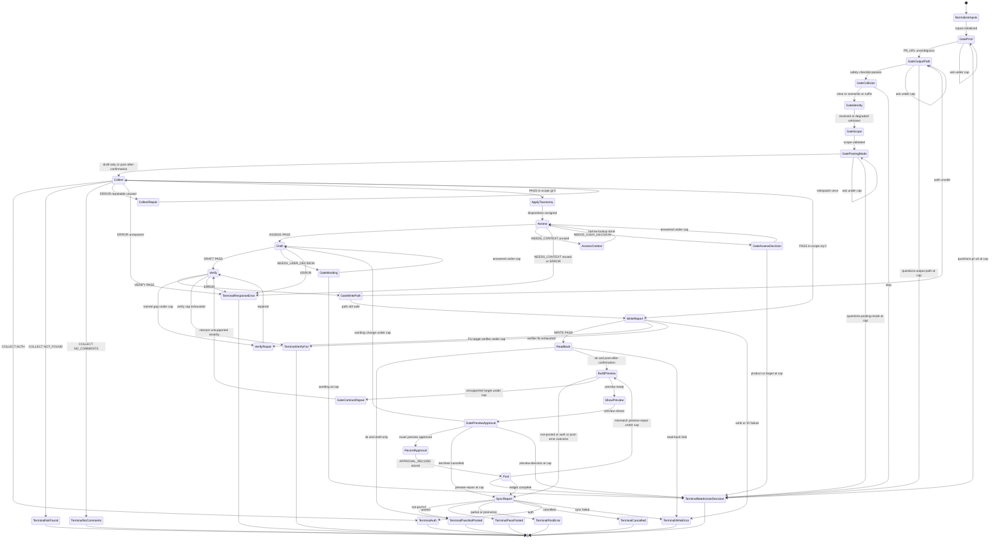

# Responding to PR Review Comments Flow

Finite-state control flow for the PR review-response orchestrator
(`stateDiagram-v2`). Companion transition table:
[`state-machine.md`](./state-machine.md).

Normalize inputs, collect and classify review comments, draft and verify
replies, write one local report, and optionally post exact approved replies with
freshness checks and a per-reply ledger. Report + declared inventory are the
only local writes; approved review-comment replies are the only GitHub mutation.

## Invariants

- Report and inventory working file are the only local writes; approved
  review-comment replies are the only GitHub mutations.
- Posting requires exact preview approval, verbatim `APPROVAL_RECORD` match, and
  per-thread freshness checks inside the poster.
- Every loop edge names the counter it increments; caps route to terminals.
- The report is re-synced after every posting-related outcome before the
  terminal envelope is emitted.
