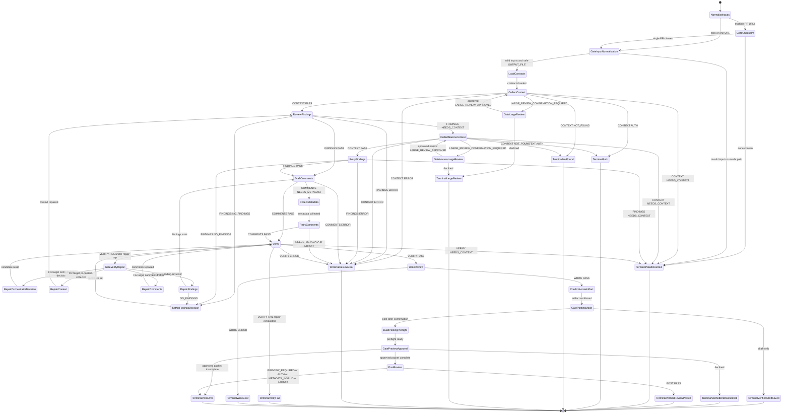

# review-pull-request single-PR review workflow

Finite-state control flow for the single-PR review orchestrator
(`stateDiagram-v2`). Companion transition table:
[`state-machine.md`](./state-machine.md).

Normalize one GitHub PR, collect compact context, surface evidence-backed
findings, draft GitHub-ready comments, verify, write a local Markdown review,
and optionally post the exact verified preview after human approval. Raw diffs,
logs, API payloads, and fetched pages stay inside phase subagents. The workflow
never merges, deploys, bypasses CI, or posts without the final preview gate.

## Canonical rules

- Readiness: local artifact only after `VERIFY: PASS` and `WRITE: PASS`.
- Input normalization: invalid inputs stop before phase subagent dispatch.
- Safe `OUTPUT_FILE`: relative `.md` path inside the workspace; no `..`, no
  absolute paths, no non-Markdown extensions (see `SKILL.md` intake).
- Large-review: shortstat, changed-file groups, and trigger criterion required
  on `CONTEXT: LARGE_REVIEW_CONFIRMATION_REQUIRED`.
- Verify repair: exactly one `Fix target`; cascades per
  [`state-machine.md`](./state-machine.md); max two repair cycles.
- Posting: only when `POSTING_MODE=post-after-confirmation`, exact verified
  preview approved, `PREVIEW_APPROVED=true`, `REVIEW_DECISION` present, and
  comments/metadata verified.

## Terminal outcomes

- `PR_REVIEW: VERIFIED_DRAFT_SAVED`
- `PR_REVIEW: VERIFIED_DRAFT_SAVED_POSTING_CANCELLED`
- `PR_REVIEW: VERIFIED_REVIEW_POSTED`
- `PR_REVIEW: NEEDS_CONTEXT`
- `PR_REVIEW: AUTH`
- `PR_REVIEW: NOT_FOUND`
- `PR_REVIEW: LARGE_REVIEW`
- `PR_REVIEW: VERIFY_FAIL`
- `PR_REVIEW: WRITE_ERROR`
- `PR_REVIEW: POST_ERROR`
- `PR_REVIEW: REVIEW_ERROR`

## Source-backed rationale

- GitHub review creation requires owner, repo, and pull number and supports
  `APPROVE`, `REQUEST_CHANGES`, and `COMMENT`: [GitHub REST create
  review](https://docs.github.com/en/rest/pulls/reviews#create-a-review-for-a-pull-request).
- Line comments need precise diff metadata: [GitHub REST review
  comments](https://docs.github.com/en/rest/pulls/comments#create-a-review-comment-for-a-pull-request).
- Constrain user-supplied paths: [OWASP Path
  Traversal](https://owasp.org/www-community/attacks/Path_Traversal).
- Large changes are reviewed less thoroughly: [Google Engineering Practices:
  Small CLs](https://google.github.io/eng-practices/review/developer/small-cls.html).
- Quality-critical workflows need steps, guardrails, and feedback loops:
  [Anthropic skill best
  practices](https://platform.claude.com/docs/en/agents-and-tools/agent-skills/best-practices).
- Staged disclosure should be task-driven: [Nielsen Norman Group progressive
  disclosure](https://www.nngroup.com/articles/progressive-disclosure/).
