# review-pull-request single-PR review workflow

This workflow reviews exactly one GitHub pull request from `PR_URL`. The
orchestrator may normalize inputs, dispatch phase subagents, carry compact
state, verify evidence-backed findings and GitHub-ready comments, write a local
Markdown review artifact, preview the exact verified file, and optionally post
to GitHub only after explicit final preview approval. Raw diffs, logs, API
payloads, fetched pages, and large source contents stay inside phase subagents.
The workflow never merges, deploys, bypasses CI, or posts without the final
gate.

```mermaid
flowchart TD
  START([Start: review exactly one GitHub PR]) --> INPUTS["Receive PR_URL; optional OUTPUT_FILE, POSTING_MODE, LANGUAGE_STYLE, REVIEW_FOCUS"]
  INPUTS --> GATE_INPUT{"GATE_INPUT_NORMALIZATION: one parseable GitHub PR URL, valid enums, safe workspace-relative Markdown OUTPUT_FILE?"}

  GATE_INPUT -->|"multiple PR URLs"| GATE_CHOOSE_PR["HUMAN_GATE_CHOOSE_ONE_PR: ask user to choose exactly one PR"]
  GATE_CHOOSE_PR --> CHOSEN{"Single PR chosen?"}
  CHOSEN -->|"yes"| DEFAULTS["Apply defaults: OUTPUT_FILE=pr-number-review.md; POSTING_MODE=draft-only; LANGUAGE_STYLE=natural English for a non-native speaker; REVIEW_FOCUS=full"]
  CHOSEN -->|"no"| FAIL_NEEDS_CONTEXT([Terminal: PR_REVIEW: NEEDS_CONTEXT])

  GATE_INPUT -->|"valid"| DEFAULTS
  GATE_INPUT -->|"no PR, unparseable URL, invalid enum, or unsafe output path"| FAIL_NEEDS_CONTEXT

  DEFAULTS --> CONTRACTS["Load workflow contracts and status mappings"]
  CONTRACTS --> CONTEXT["Dispatch pr-context-collector with compact request"]

  CONTEXT --> CONTEXT_STATUS{"pr-context-collector status"}
  CONTEXT_STATUS -->|"CONTEXT: PASS"| FINDINGS["Dispatch finding-reviewer"]
  CONTEXT_STATUS -->|"CONTEXT: LARGE_REVIEW_CONFIRMATION_REQUIRED"| GATE_LARGE["HUMAN_GATE_LARGE_REVIEW: show shortstat, changed-file groups, trigger criterion, scope, risk, and safer draft-only alternative"]
  CONTEXT_STATUS -->|"CONTEXT: AUTH"| FAIL_AUTH([Terminal: PR_REVIEW: AUTH])
  CONTEXT_STATUS -->|"CONTEXT: NOT_FOUND"| FAIL_NOT_FOUND([Terminal: PR_REVIEW: NOT_FOUND])
  CONTEXT_STATUS -->|"CONTEXT: NEEDS_CONTEXT"| FAIL_NEEDS_CONTEXT
  CONTEXT_STATUS -->|"CONTEXT: ERROR"| FAIL_REVIEW_ERROR([Terminal: PR_REVIEW: REVIEW_ERROR])

  GATE_LARGE --> LARGE_OK{"Large review approved?"}
  LARGE_OK -->|"approved"| CONTEXT_LARGE["Dispatch pr-context-collector with LARGE_REVIEW_APPROVED=true"]
  LARGE_OK -->|"declined"| FAIL_LARGE([Terminal: PR_REVIEW: LARGE_REVIEW])
  CONTEXT_LARGE --> CONTEXT_STATUS

  FINDINGS --> FINDINGS_STATUS{"finding-reviewer status"}
  FINDINGS_STATUS -->|"FINDINGS: PASS"| COMMENTS["Dispatch comment-drafter"]
  FINDINGS_STATUS -->|"FINDINGS: NO_FINDINGS"| NO_FINDINGS["Set REVIEW_DECISION_CANDIDATE: approve only if no blocking residual risk; otherwise comment"]
  FINDINGS_STATUS -->|"FINDINGS: NEEDS_CONTEXT"| NARROW_CONTEXT["Dispatch pr-context-collector once with narrow context request"]
  FINDINGS_STATUS -->|"FINDINGS: ERROR"| FAIL_REVIEW_ERROR

  NARROW_CONTEXT --> NARROW_STATUS{"Narrow context status"}
  NARROW_STATUS -->|"CONTEXT: PASS"| RETRY_FINDINGS["Retry finding-reviewer once"]
  NARROW_STATUS -->|"CONTEXT: LARGE_REVIEW_CONFIRMATION_REQUIRED"| GATE_NARROW_LARGE["HUMAN_GATE_NARROW_LARGE_REVIEW: show shortstat, changed-file groups, trigger criterion, narrow scope, risk, and safer draft-only alternative"]
  NARROW_STATUS -->|"CONTEXT: AUTH"| FAIL_AUTH
  NARROW_STATUS -->|"CONTEXT: NOT_FOUND"| FAIL_NOT_FOUND
  NARROW_STATUS -->|"CONTEXT: NEEDS_CONTEXT"| FAIL_NEEDS_CONTEXT
  NARROW_STATUS -->|"CONTEXT: ERROR"| FAIL_REVIEW_ERROR

  GATE_NARROW_LARGE --> NARROW_LARGE_OK{"Narrow large context approved?"}
  NARROW_LARGE_OK -->|"approved"| NARROW_CONTEXT_LARGE["Dispatch pr-context-collector with narrow request and LARGE_REVIEW_APPROVED=true"]
  NARROW_LARGE_OK -->|"declined"| FAIL_LARGE
  NARROW_CONTEXT_LARGE --> NARROW_STATUS

  RETRY_FINDINGS --> RETRY_FINDINGS_STATUS{"Retry finding-reviewer status"}
  RETRY_FINDINGS_STATUS -->|"FINDINGS: PASS"| COMMENTS
  RETRY_FINDINGS_STATUS -->|"FINDINGS: NO_FINDINGS"| NO_FINDINGS
  RETRY_FINDINGS_STATUS -->|"FINDINGS: NEEDS_CONTEXT"| FAIL_NEEDS_CONTEXT
  RETRY_FINDINGS_STATUS -->|"FINDINGS: ERROR"| FAIL_REVIEW_ERROR

  COMMENTS --> COMMENTS_STATUS{"comment-drafter status"}
  COMMENTS_STATUS -->|"COMMENTS: PASS"| VERIFY["Dispatch review-verifier with findings, comments, metadata, and REVIEW_DECISION_CANDIDATE"]
  COMMENTS_STATUS -->|"COMMENTS: NEEDS_METADATA"| METADATA["Collect requested diff line metadata once"]
  COMMENTS_STATUS -->|"COMMENTS: ERROR"| FAIL_REVIEW_ERROR

  METADATA --> RETRY_COMMENTS["Retry comment-drafter once"]
  RETRY_COMMENTS --> RETRY_COMMENTS_STATUS{"Retry comment-drafter status"}
  RETRY_COMMENTS_STATUS -->|"COMMENTS: PASS"| VERIFY
  RETRY_COMMENTS_STATUS -->|"COMMENTS: NEEDS_METADATA"| FAIL_REVIEW_ERROR
  RETRY_COMMENTS_STATUS -->|"COMMENTS: ERROR"| FAIL_REVIEW_ERROR

  NO_FINDINGS --> VERIFY

  VERIFY --> VERIFY_STATUS{"review-verifier status"}
  VERIFY_STATUS -->|"VERIFY: PASS"| WRITE["Dispatch review-writer using verified payload and review-file template"]
  VERIFY_STATUS -->|"VERIFY: FAIL with Fix target"| REPAIR_LIMIT{"GATE_VERIFY_REPAIR: repair cycles fewer than two?"}
  VERIFY_STATUS -->|"VERIFY: NEEDS_CONTEXT"| FAIL_NEEDS_CONTEXT
  VERIFY_STATUS -->|"VERIFY: ERROR"| FAIL_REVIEW_ERROR

  REPAIR_LIMIT -->|"no"| FAIL_VERIFY([Terminal: PR_REVIEW: VERIFY_FAIL])
  REPAIR_LIMIT -->|"yes; orchestrator-decision"| REPAIR_ORCH["Repair orchestrator decision state"]
  REPAIR_LIMIT -->|"yes; pr-context-collector"| REPAIR_CONTEXT["Repair context request or evidence packet"]
  REPAIR_LIMIT -->|"yes; finding-reviewer"| REPAIR_FINDINGS["Repair finding analysis"]
  REPAIR_LIMIT -->|"yes; comment-drafter"| REPAIR_COMMENTS["Repair comment drafts or line metadata"]

  REPAIR_ORCH --> VERIFY
  REPAIR_CONTEXT --> FINDINGS
  REPAIR_FINDINGS --> COMMENTS
  REPAIR_COMMENTS --> VERIFY

  WRITE --> WRITE_STATUS{"review-writer status"}
  WRITE_STATUS -->|"WRITE: PASS"| LOCAL_CHECK["Confirm exact Markdown file exists, is workspace-relative, and has required sections"]
  WRITE_STATUS -->|"WRITE: ERROR"| FAIL_WRITE([Terminal: PR_REVIEW: WRITE_ERROR])

  LOCAL_CHECK --> PREVIEW["Preview exact verified file; report Review file, Findings, Review decision, Posting, Notes"]
  PREVIEW --> GATE_POST_MODE{"GATE_POSTING_MODE: POSTING_MODE=post-after-confirmation?"}
  GATE_POST_MODE -->|"no; draft-only"| SUCCESS_DRAFT([Success: PR_REVIEW: VERIFIED_DRAFT_SAVED])
  GATE_POST_MODE -->|"yes"| PREFLIGHT["Build posting preflight packet: exact verified preview, REVIEW_DECISION, verified comments, verified metadata, PREVIEW_APPROVED=false"]

  PREFLIGHT --> GATE_PREVIEW["HUMAN_GATE_FINAL_PREVIEW_APPROVAL: ask approval to post exact verified preview to target PR"]
  GATE_PREVIEW --> PREVIEW_OK{"PREVIEW_APPROVED=true?"}
  PREVIEW_OK -->|"declined"| SUCCESS_CANCELLED([Success: PR_REVIEW: VERIFIED_DRAFT_SAVED_POSTING_CANCELLED])
  PREVIEW_OK -->|"approved"| POST_PACKET{"Posting packet complete?"}
  POST_PACKET -->|"yes"| POST["Dispatch review-poster"]
  POST_PACKET -->|"no"| FAIL_POST([Terminal: PR_REVIEW: POST_ERROR])

  POST --> POST_STATUS{"review-poster status"}
  POST_STATUS -->|"POST: PASS"| SUCCESS_POSTED([Success: PR_REVIEW: VERIFIED_REVIEW_POSTED])
  POST_STATUS -->|"POST: PREVIEW_REQUIRED"| FAIL_POST
  POST_STATUS -->|"POST: AUTH"| FAIL_POST
  POST_STATUS -->|"POST: METADATA_INVALID"| FAIL_POST
  POST_STATUS -->|"POST: ERROR"| FAIL_POST

  class GATE_INPUT,CHOSEN,CONTEXT_STATUS,LARGE_OK,FINDINGS_STATUS,NARROW_STATUS,NARROW_LARGE_OK,RETRY_FINDINGS_STATUS,COMMENTS_STATUS,RETRY_COMMENTS_STATUS,VERIFY_STATUS,REPAIR_LIMIT,WRITE_STATUS,GATE_POST_MODE,PREVIEW_OK,POST_PACKET,POST_STATUS decision;
  class DEFAULTS,CONTRACTS,CONTEXT,CONTEXT_LARGE,FINDINGS,NARROW_CONTEXT,NARROW_CONTEXT_LARGE,RETRY_FINDINGS,COMMENTS,METADATA,RETRY_COMMENTS,NO_FINDINGS,VERIFY,REPAIR_ORCH,REPAIR_CONTEXT,REPAIR_FINDINGS,REPAIR_COMMENTS,WRITE,LOCAL_CHECK,PREFLIGHT,POST check;
  class GATE_CHOOSE_PR,GATE_LARGE,GATE_NARROW_LARGE,GATE_PREVIEW human;
  class PREVIEW output;
  class SUCCESS_DRAFT,SUCCESS_CANCELLED,SUCCESS_POSTED success;
  class FAIL_NEEDS_CONTEXT,FAIL_AUTH,FAIL_NOT_FOUND,FAIL_REVIEW_ERROR,FAIL_LARGE,FAIL_VERIFY,FAIL_WRITE,FAIL_POST stop;
  classDef check fill:#e7f1ff,stroke:#0b5ed7,color:#000;
  classDef decision fill:#f8f9fa,stroke:#495057,color:#000;
  classDef human fill:#f3e8ff,stroke:#6f42c1,color:#000;
  classDef output fill:#e8f5e9,stroke:#2e7d32,color:#000;
  classDef success fill:#e8f5e9,stroke:#2e7d32,color:#000;
  classDef stop fill:#fdecea,stroke:#b02a37,color:#000;
```

Readiness rule: the review is ready for a local artifact only after
`review-verifier` returns `VERIFY: PASS` and `review-writer` returns
`WRITE: PASS`.

Input normalization rule: invalid inputs stop before phase subagent dispatch.
The orchestrator requires exactly one parseable GitHub PR URL, valid
`POSTING_MODE` and `REVIEW_FOCUS` enum values, and a safe workspace-relative
Markdown `OUTPUT_FILE`.

Large-review rule: `pr-context-collector` must include shortstat, changed-file
groups, and the trigger criterion when returning
`CONTEXT: LARGE_REVIEW_CONFIRMATION_REQUIRED`. Approval and decline routes are
explicit for both full and narrow context requests.

Verifier repair rule: `VERIFY: FAIL` must include a `Fix target`. Repairs to
`pr-context-collector` cascade back through `finding-reviewer`,
`comment-drafter`, and `review-verifier`; repairs to `finding-reviewer` cascade
through `comment-drafter` and `review-verifier`; repairs to `comment-drafter`
return to `review-verifier`; orchestrator-decision repairs return directly to
`review-verifier`.

Posting rule: `review-poster` may run only when
`POSTING_MODE=post-after-confirmation`, the exact verified preview has been
approved, `PREVIEW_APPROVED=true`, `REVIEW_DECISION` is present, and all comments
plus metadata are verified.

Terminal outcomes:

- `PR_REVIEW: VERIFIED_DRAFT_SAVED`
- `PR_REVIEW: VERIFIED_DRAFT_SAVED_POSTING_CANCELLED`
- `PR_REVIEW: VERIFIED_REVIEW_POSTED`
- `PR_REVIEW: NEEDS_CONTEXT`
- `PR_REVIEW: AUTH`
- `PR_REVIEW: NOT_FOUND`
- `PR_REVIEW: LARGE_REVIEW`
- `PR_REVIEW: VERIFY_FAIL`
- `PR_REVIEW: WRITE_ERROR`
- `PR_REVIEW: POST_ERROR`
- `PR_REVIEW: REVIEW_ERROR`

Source-backed rationale:

- GitHub review creation requires owner, repo, and pull number path parameters
  and supports `APPROVE`, `REQUEST_CHANGES`, and `COMMENT`: [GitHub REST create
  review](https://docs.github.com/en/rest/pulls/reviews#create-a-review-for-a-pull-request).
- GitHub line comments require precise diff metadata such as `path`, `line`,
  `side`, `start_line`, and `start_side`: [GitHub REST review
  comments](https://docs.github.com/en/rest/pulls/comments#create-a-review-comment-for-a-pull-request).
- User-supplied paths should be constrained and allow-listed: [OWASP Path
  Traversal](https://owasp.org/www-community/attacks/Path_Traversal).
- Large changes are reviewed less thoroughly and may be rejected for size
  alone: [Google Engineering Practices: Small
  CLs](https://google.github.io/eng-practices/review/developer/small-cls.html).
- Quality-critical workflows need clear steps, guardrails, validation, and
  feedback loops: [Anthropic skill best
  practices](https://platform.claude.com/docs/en/agents-and-tools/agent-skills/best-practices).
- Staged disclosure should be task-driven and avoid unclear staging: [Nielsen
  Norman Group progressive
  disclosure](https://www.nngroup.com/articles/progressive-disclosure/).
