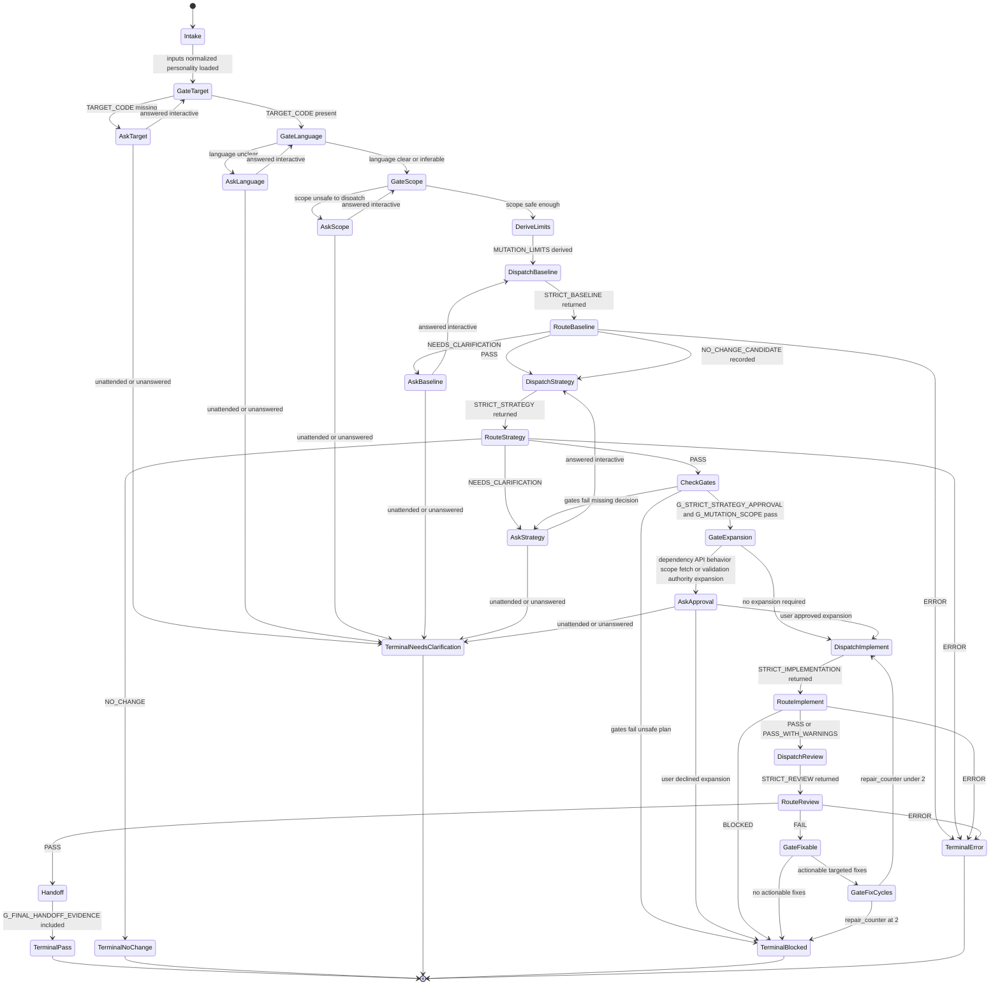

# Rewriting Code Strictly Flow

Finite-state execution model for `rewriting-code-strictly`. Companion transition
table: [`state-machine.md`](./state-machine.md). The orchestrator loads
personality, derives `MUTATION_LIMITS`, dispatches one subagent at a time, and
mutates only after strategy gates and any required expansion approval succeed.

## Invariants

- Baseline `NO_CHANGE_CANDIDATE` continues to Strategy; only strategist
  `NO_CHANGE` reaches `TerminalNoChange` before edits.
- Approval is a gate, not a sink: approved expansion resumes
  `DispatchImplement`; decline → `TerminalBlocked`; no reply →
  `TerminalNeedsClarification`.
- Clarification Ask* states resume the prior gate when answered; they do not
  permanently terminate an interactive run.
- Reviewer `FAIL` re-enters `DispatchImplement` with `REVIEW_FIXES` only, at most
  two cycles, then `TerminalBlocked`.
- `PASS` requires personality loaded, `MUTATION_LIMITS` derived, mid-pipeline
  gates checked, and `G_FINAL_HANDOFF_EVIDENCE` in the handoff.
