# Rewriting Code Strictly Workflow

This workflow is run by a strict-rewrite orchestrator for behavior-preserving rewrites of Python, TypeScript/JavaScript, or Go code. The orchestrator loads the strict behavior-preservation and boundary-validation personality, normalizes target, language, scope, goal, validation command, reference need, and external fetch approval, derives `MUTATION_LIMITS`, dispatches one bundled subagent at a time, keeps compact evidence and decisions, and stops before dependency, public API, behavior, scope, external fetch, or validation execution expands beyond user approval or project evidence. Baseline, strategy, and review are read-only; implementation edits only files justified by the approved strategy, direct compilation consequences, and `MUTATION_LIMITS`. Strategy owns external-source authorization and source-risk status handling; implementation owns edit evidence, mutation-boundary evidence, and user-supplied or project-authorized validation evidence; review assesses behavior preservation, strictness, scope, changed-path compliance, boundary-validation quality, and validation quality.

```mermaid
flowchart TD
  START([Start: strict code rewrite]) --> INTAKE["Normalize inputs and load personality<br/>TARGET_CODE, LANGUAGE, USER_GOAL, VALIDATION_COMMAND,<br/>SCOPE_LIMITS, REFERENCE_NEED, EXTERNAL_FETCH_APPROVAL<br/>Derive MUTATION_LIMITS"]
  INTAKE --> TARGET_OK{TARGET_CODE present?}
  TARGET_OK -->|no| ASK_TARGET["Ask one focused question for target code or path"]
  ASK_TARGET --> NEEDS_CLARIFICATION(["NEEDS_CLARIFICATION"])

  TARGET_OK -->|yes| LANGUAGE_OK{Language clear or inferable from extension?}
  LANGUAGE_OK -->|no| ASK_LANGUAGE["Ask one focused language question"]
  ASK_LANGUAGE --> NEEDS_CLARIFICATION

  LANGUAGE_OK -->|yes| SCOPE_OK{Scope safe enough to dispatch?}
  SCOPE_OK -->|no| ASK_SCOPE["Ask one focused scope question"]
  ASK_SCOPE --> NEEDS_CLARIFICATION

  SCOPE_OK -->|yes| BOUNDARY["Set authority and MUTATION_LIMITS<br/>preserve observable behavior; project settings are authority<br/>record external fetch approval and validation authority"]
  BOUNDARY --> BASELINE["Dispatch strict-baseline-mapper<br/>read-only map behavior, callers, tests, configs, dependencies, and weaknesses"]
  BASELINE --> BASELINE_STATUS{strict-baseline-mapper status?}

  BASELINE_STATUS -->|PASS| STRATEGY["Dispatch strict-rewrite-strategist<br/>read-only choose static typing vs runtime validation plan<br/>include planned changed paths and gate evidence<br/>handle REFERENCE_NEED and external-source authorization inside status contract"]
  BASELINE_STATUS -->|NO_CHANGE_CANDIDATE| BASELINE_NO_CHANGE["Record no-change candidate and supporting evidence for strategist"]
  BASELINE_NO_CHANGE --> STRATEGY
  BASELINE_STATUS -->|NEEDS_CLARIFICATION| BASELINE_ASK["Ask one baseline question or request missing local evidence"]
  BASELINE_ASK --> NEEDS_CLARIFICATION
  BASELINE_STATUS -->|ERROR| BASELINE_ERROR["Retain baseline failed condition and context"]
  BASELINE_ERROR --> ERROR(["ERROR"])

  STRATEGY --> STRATEGY_STATUS{strict-rewrite-strategist status?}
  STRATEGY_STATUS -->|PASS| CHANGE_GATE{G_STRICT_STRATEGY_APPROVAL and G_MUTATION_SCOPE pass?<br/>Plan requires dependency, public API, behavior, scope, fetch, or validation authority expansion?}
  STRATEGY_STATUS -->|NO_CHANGE| NO_CHANGE(["NO_CHANGE"])
  STRATEGY_STATUS -->|NEEDS_CLARIFICATION| STRATEGY_ASK["Ask one strategy question<br/>missing decision, external fetch approval, local source, or declined/unavailable source disposition"]
  STRATEGY_ASK --> NEEDS_CLARIFICATION
  STRATEGY_STATUS -->|ERROR| STRATEGY_ERROR["Retain strategy failed condition and context"]
  STRATEGY_ERROR --> ERROR

  CHANGE_GATE -->|yes| ASK_CHANGE["Ask one focused approval question<br/>target, reason, risk, reversibility, safer alternative"]
  ASK_CHANGE --> NEEDS_CLARIFICATION
  CHANGE_GATE -->|no| IMPLEMENT["Dispatch strict-rewrite-implementer<br/>edit only strategy-approved files, direct compilation consequences,<br/>and paths inside MUTATION_LIMITS<br/>run only user-supplied or project-authorized validation;<br/>record G_IMPLEMENTATION_VALIDATION warning/risk evidence when needed"]
  IMPLEMENT --> IMPLEMENT_STATUS{strict-rewrite-implementer status?}

  IMPLEMENT_STATUS -->|PASS| REVIEW["Dispatch strict-rewrite-reviewer<br/>read-only assess behavior preservation, strictness,<br/>MUTATION_LIMITS compliance, boundary validation,<br/>references, and validation quality"]
  IMPLEMENT_STATUS -->|PASS_WITH_WARNINGS| REVIEW
  IMPLEMENT_STATUS -->|BLOCKED| IMPLEMENT_BLOCKED["Retain edit or validation blocker and smallest safe recovery"]
  IMPLEMENT_BLOCKED --> BLOCKED(["BLOCKED"])
  IMPLEMENT_STATUS -->|ERROR| IMPLEMENT_ERROR["Retain implementation failed condition and changed paths"]
  IMPLEMENT_ERROR --> ERROR

  REVIEW --> REVIEW_STATUS{strict-rewrite-reviewer status?}
  REVIEW_STATUS -->|PASS| HANDOFF["Return final handoff with G_FINAL_HANDOFF_EVIDENCE<br/>original behavior, weaknesses, typing vs validation decisions,<br/>changed files or code, validation, references, assumptions, risks,<br/>and compact gate evidence"]
  HANDOFF --> PASS(["PASS"])

  REVIEW_STATUS -->|FAIL| REVIEW_FIXABLE{Reviewer supplied actionable targeted fixes?}
  REVIEW_FIXABLE -->|yes| FIX_CYCLES{Fewer than two reviewer fix cycles used?}
  FIX_CYCLES -->|yes| REPAIR["Re-dispatch strict-rewrite-implementer<br/>only reviewer-named fixes inside MUTATION_LIMITS;<br/>no new scope"]
  REPAIR --> IMPLEMENT_STATUS
  FIX_CYCLES -->|no| REVIEW_BLOCKED["Record unresolved findings, repair attempts, and safest next action"]
  REVIEW_FIXABLE -->|no| REVIEW_BLOCKED
  REVIEW_BLOCKED --> BLOCKED

  REVIEW_STATUS -->|ERROR| REVIEW_ERROR["Retain review failed condition and evidence"]
  REVIEW_ERROR --> ERROR

  classDef guard fill:#fff3cd,stroke:#856404,color:#000;
  classDef check fill:#e7f1ff,stroke:#0b5ed7,color:#000;
  classDef decision fill:#f8f9fa,stroke:#495057,color:#000;
  classDef human fill:#f3e8ff,stroke:#6f42c1,color:#000;
  classDef output fill:#e8f5e9,stroke:#2e7d32,color:#000;
  classDef success fill:#e8f5e9,stroke:#2e7d32,color:#000;
  classDef stop fill:#fdecea,stroke:#b02a37,color:#000;

  class TARGET_OK,LANGUAGE_OK,SCOPE_OK,BASELINE_STATUS,STRATEGY_STATUS,CHANGE_GATE,IMPLEMENT_STATUS,REVIEW_STATUS,REVIEW_FIXABLE,FIX_CYCLES decision;
  class BOUNDARY guard;
  class BASELINE,STRATEGY,IMPLEMENT,REVIEW,REPAIR check;
  class ASK_TARGET,ASK_LANGUAGE,ASK_SCOPE,BASELINE_ASK,STRATEGY_ASK,ASK_CHANGE human;
  class BASELINE_NO_CHANGE,HANDOFF output;
  class PASS,NO_CHANGE success;
  class NEEDS_CLARIFICATION,BLOCKED,ERROR,BASELINE_ERROR,STRATEGY_ERROR,IMPLEMENT_BLOCKED,IMPLEMENT_ERROR,REVIEW_BLOCKED,REVIEW_ERROR stop;
```

Readiness rule: the workflow reaches `PASS` only after the orchestrator has loaded the approved personality, derived `MUTATION_LIMITS`, checked `G_STRICT_STRATEGY_APPROVAL`, `G_MUTATION_SCOPE`, `G_IMPLEMENTATION_VALIDATION`, and `G_STRICT_REVIEW_PASS`, and included `G_FINAL_HANDOFF_EVIDENCE` in the final response. The reviewer verifies behavior preservation, approved-scope compliance, strictness decisions, changed paths or rewritten code, boundary-validation placement, validation quality, assumptions, risks, and references. External fetches are handled by the strategist through `REFERENCE_NEED`, `EXTERNAL_FETCH_APPROVAL`, and the strategy status contract; when approval or a local source is required, the strategist returns `NEEDS_CLARIFICATION`. Validation is handled by the implementer only when supplied by `VALIDATION_COMMAND` or authorized by project evidence; missing, declined, unapproved, or unavailable validation is preserved as warning or risk evidence for review. The workflow reaches `NO_CHANGE` only from strategist `NO_CHANGE` before edits, including after it evaluates recorded baseline `NO_CHANGE_CANDIDATE` evidence. Reviewer `FAIL` may trigger at most two targeted implementer repair cycles using only reviewer-named fixes inside `MUTATION_LIMITS`; missing actionable fixes or exhausted repair cycles become `BLOCKED`.
