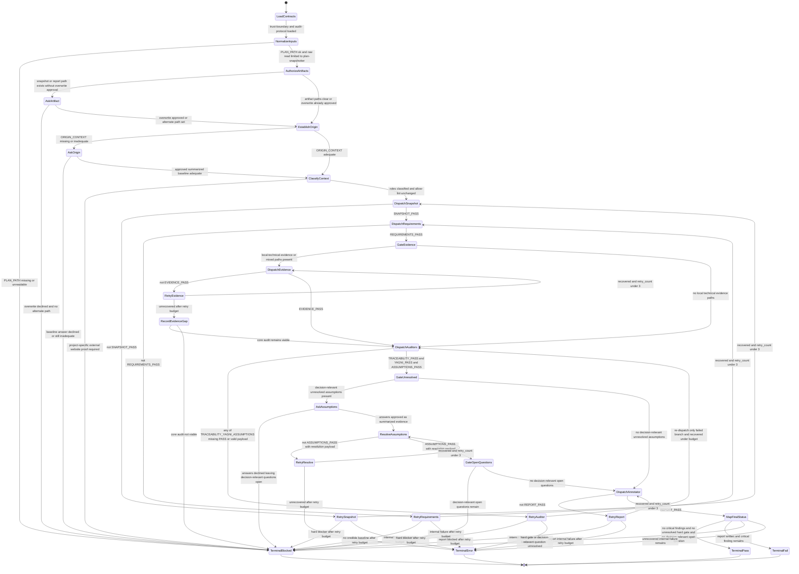

# validate-implementation-plan

Audit an implementation plan without overwriting the source plan. Execution is
a finite-state machine. Companion transition table:
[`state-machine.md`](./state-machine.md).

## Canonical rules

- Load `state-machine.md` with this diagram before the first dispatch.
- Retry: re-dispatch only the failed branch; max three cycles; same trust limits.
- Optional evidence may degrade to an evidence gap when core audit remains viable.
- Annotator success label is `REPORT: PASS`; orchestrator alone maps final `AUDIT:*`.
- Write only `SNAPSHOT_PATH` and `OUTPUT_PATH`; never overwrite `PLAN_PATH`.
