# validate-implementation-plan

Audit an implementation plan without overwriting the source plan. The
orchestrator loads trust and status contracts, classifies approved context
paths, dispatches isolated subagents, asks only decision-relevant questions, and
writes only the sanitized snapshot and standalone audit report artifacts.

```mermaid
flowchart TD
  START([Start]) --> LOAD["Load trust-boundary and audit-protocol"]

  subgraph INTAKE["Trust, Paths, And Baseline"]
    LOAD --> INPUTS["Receive PLAN_PATH, ORIGIN_CONTEXT, optional OUTPUT_PATH, optional SOURCE_CONTEXT_PATHS"]
    INPUTS --> PLAN_OK{"PLAN_PATH exists and raw read limited to plan-snapshotter?"}
    PLAN_OK -->|no| BLOCKED([AUDIT: BLOCKED])
    PLAN_OK -->|yes| DERIVE["Derive SNAPSHOT_PATH and OUTPUT_PATH when omitted"]
    DERIVE --> ARTIFACTS{"Snapshot/report paths clear or overwrite approved?"}
    ARTIFACTS -->|no| ASK_ARTIFACT["Ask for overwrite approval or alternate artifact path"]
    ASK_ARTIFACT --> ARTIFACT_ANSWER{"Approved?"}
    ARTIFACT_ANSWER -->|no| BLOCKED
    ARTIFACT_ANSWER -->|yes| ORIGIN
    ARTIFACTS -->|yes| ORIGIN{"ORIGIN_CONTEXT explicit?"}
    ORIGIN -->|no| ASK_ORIGIN["Ask one concise baseline question"]
    ASK_ORIGIN --> ORIGIN_ANSWER{"Answer approved as summarized evidence?"}
    ORIGIN_ANSWER -->|no| BLOCKED
    ORIGIN_ANSWER -->|yes| CLASSIFY_PATHS
    ORIGIN -->|yes| CLASSIFY_PATHS["Classify context paths as baseline, technical evidence, mixed, or unreadable"]
    CLASSIFY_PATHS --> EXT{"Project-specific external proof required?"}
    EXT -->|yes| BLOCKED
    EXT -->|no| SNAPSHOT
  end

  subgraph BASELINE["Sanitized Snapshot And Requirements"]
    SNAPSHOT["Dispatch plan-snapshotter with PLAN_PATH, SNAPSHOT_PATH, artifact action"] --> SNAP_STATUS{"SNAPSHOT: PASS?"}
    SNAP_STATUS -->|yes| EXTRACT["Dispatch requirements-extractor with snapshot and approved baseline context"]
    SNAP_STATUS -->|no| SNAP_RETRY["Retry snapshot branch up to 3 cycles"]
    SNAP_RETRY --> SNAP_RECOVER{"Recovered?"}
    SNAP_RECOVER -->|yes| SNAPSHOT
    SNAP_RECOVER -->|no input or artifact blocker| BLOCKED
    SNAP_RECOVER -->|no internal failure| ERROR([AUDIT: ERROR])

    EXTRACT --> REQ_STATUS{"REQUIREMENTS: PASS?"}
    REQ_STATUS -->|yes| HAS_EVIDENCE{"Any local technical evidence or mixed paths?"}
    REQ_STATUS -->|no| REQ_RETRY["Retry requirements branch up to 3 cycles"]
    REQ_RETRY --> REQ_RECOVER{"Recovered?"}
    REQ_RECOVER -->|yes| EXTRACT
    REQ_RECOVER -->|no credible baseline| BLOCKED
    REQ_RECOVER -->|no internal failure| ERROR
  end

  subgraph EVIDENCE["Optional Local Technical Evidence"]
    HAS_EVIDENCE -->|yes| TECH["Dispatch technical-researcher with approved evidence paths only"]
    HAS_EVIDENCE -->|no| SKIP_TECH["Use empty evidence findings"]
    TECH --> TECH_STATUS{"EVIDENCE: PASS?"}
    TECH_STATUS -->|yes| AUDITORS
    TECH_STATUS -->|no| TECH_RETRY["Retry evidence branch up to 3 cycles"]
    TECH_RETRY --> TECH_RECOVER{"Recovered?"}
    TECH_RECOVER -->|yes| TECH
    TECH_RECOVER -->|no| RECORD_GAP["Record technical evidence gap"]
    SKIP_TECH --> AUDITORS
    RECORD_GAP --> AUDITORS
  end

  subgraph AUDIT["Core Independent Auditors"]
    AUDITORS["Dispatch auditors with sanitized inputs only"] --> TRACE["requirements-auditor"]
    AUDITORS --> YAGNI["yagni-auditor"]
    AUDITORS --> ASSUME["assumptions-auditor discovery"]
    TRACE --> AUDIT_STATUS{"TRACEABILITY, YAGNI, and ASSUMPTIONS all PASS with valid payloads?"}
    YAGNI --> AUDIT_STATUS
    ASSUME --> AUDIT_STATUS
    AUDIT_STATUS -->|yes| UNRESOLVED{"Decision-relevant assumptions unresolved?"}
    AUDIT_STATUS -->|no| AUDIT_RETRY["Retry named failed auditor branch up to 3 cycles"]
    AUDIT_RETRY --> AUDIT_RECOVER{"Recovered?"}
    AUDIT_RECOVER -->|yes| AUDIT_STATUS
    AUDIT_RECOVER -->|no blocker| BLOCKED
    AUDIT_RECOVER -->|no internal failure| ERROR
  end

  subgraph RESOLUTION["Assumption Resolution"]
    UNRESOLVED -->|yes| ASK_ASSUMPTIONS["Ask proposed concise assumption questions"]
    ASK_ASSUMPTIONS --> ASM_ANSWER{"Answers approved as summarized evidence?"}
    ASM_ANSWER -->|no| BLOCKED
    ASM_ANSWER -->|yes| ASM_RESOLVE["Re-dispatch assumptions-auditor resolution pass only"]
    ASM_RESOLVE --> ASM_STATUS{"ASSUMPTIONS: PASS with resolved annotations?"}
    ASM_STATUS -->|yes| OPEN_Q{"Decision-relevant open questions remain?"}
    ASM_STATUS -->|no| ASM_RETRY["Retry assumptions resolution branch up to 3 cycles"]
    ASM_RETRY --> ASM_RECOVER{"Recovered?"}
    ASM_RECOVER -->|yes| ASM_RESOLVE
    ASM_RECOVER -->|no| ERROR
    OPEN_Q -->|yes| BLOCKED
    OPEN_Q -->|no| REPORT
    UNRESOLVED -->|no| REPORT
  end

  subgraph REPORTING["Report Assembly And Final Status"]
    REPORT["Dispatch plan-annotator to write OUTPUT_PATH"] --> REPORT_STATUS{"AUDIT handoff returned and required sections written?"}
    REPORT_STATUS -->|yes| FINAL{"Final status mapping"}
    REPORT_STATUS -->|blocked| BLOCKED
    REPORT_STATUS -->|fail or error| REPORT_RETRY["Retry report branch up to 3 cycles"]
    REPORT_RETRY --> REPORT_RECOVER{"Recovered?"}
    REPORT_RECOVER -->|yes| REPORT
    REPORT_RECOVER -->|no| ERROR
    FINAL -->|critical finding or disproven assumption| FAIL([AUDIT: FAIL])
    FINAL -->|no criticals, no hard gate, no decision question| PASS([AUDIT: PASS])
    FINAL -->|hard gate or decision question| BLOCKED
    FINAL -->|unrecovered internal failure| ERROR
  end

  PASS --> HANDOFF["Reply with status, output path, section count, finding counts, open-question count, and reason"]
  FAIL --> HANDOFF
  BLOCKED --> HANDOFF
  ERROR --> HANDOFF

  class PLAN_OK,ARTIFACTS,ARTIFACT_ANSWER,ORIGIN,ORIGIN_ANSWER,EXT,SNAP_STATUS,SNAP_RECOVER,REQ_STATUS,REQ_RECOVER,HAS_EVIDENCE,TECH_STATUS,TECH_RECOVER,AUDIT_STATUS,AUDIT_RECOVER,UNRESOLVED,ASM_ANSWER,ASM_STATUS,ASM_RECOVER,OPEN_Q,REPORT_STATUS,REPORT_RECOVER,FINAL decision;
  class LOAD,CLASSIFY_PATHS,SNAPSHOT,EXTRACT,TECH,AUDITORS,TRACE,YAGNI,ASSUME,ASM_RESOLVE,REPORT check;
  class ASK_ARTIFACT,ASK_ORIGIN,ASK_ASSUMPTIONS human;
  class INPUTS,DERIVE,SKIP_TECH,RECORD_GAP,HANDOFF output;
  class SNAP_RETRY,REQ_RETRY,TECH_RETRY,AUDIT_RETRY,ASM_RETRY,REPORT_RETRY guard;
  class PASS success;
  class FAIL refine;
  class BLOCKED blocked;
  class ERROR stop;

  classDef guard fill:#fff3cd,stroke:#856404,color:#000;
  classDef check fill:#e7f1ff,stroke:#0b5ed7,color:#000;
  classDef decision fill:#f8f9fa,stroke:#495057,color:#000;
  classDef human fill:#f3e8ff,stroke:#6f42c1,color:#000;
  classDef output fill:#e8f5e9,stroke:#2e7d32,color:#000;
  classDef success fill:#e8f5e9,stroke:#2e7d32,color:#000;
  classDef refine fill:#fff3cd,stroke:#856404,color:#000;
  classDef blocked fill:#fff3cd,stroke:#856404,color:#000;
  classDef stop fill:#fdecea,stroke:#b02a37,color:#000;
```

Stage status handlers:

- `PASS`: accepted output shape is present and usable; continue to the next
  stage.
- `BLOCKED`: stop as `AUDIT: BLOCKED` for hard gates; for optional local
  technical evidence, record an evidence gap and continue when the core audit
  remains viable.
- `FAIL`: the stage ran but cannot support reliable downstream use; retry the
  named failed branch only, with the same trust limits, up to three cycles.
- `ERROR`: unexpected tool, filesystem, parsing, or write failure; retry the
  named failed branch up to three cycles, then return `AUDIT: ERROR` unless the
  failed branch is optional evidence that can be recorded as a gap.
- Retry policy: one branch-local budget per failed branch, maximum three cycles,
  no widened path allow-list, no raw `PLAN_PATH` access outside
  `plan-snapshotter`, and no project-specific external website evidence.

Completion handoff must include `AUDIT: PASS | FAIL | BLOCKED | ERROR`,
`Output`, `Sections covered`, `Findings: critical=<N>, warning=<N>, info=<N>`,
`Open questions`, and one concise `Reason`.
